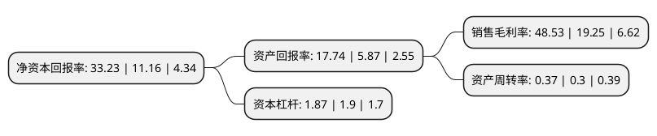

> 本页面由自动化程序生成于 2022年5月20日 01:09
> 内容可能存在错误，如有bug请提交issue至：https://github.com/Eroleice/doc-pi/issues
{.is-warning}

# 上市公司基本情况

## 基本资料

江西赣锋锂业股份有限公司（以下简称“赣锋锂业”）成立于2000年03月02日，新余市。于2010年08月10日在深交所中小板上市。

赣锋锂业注册资本143,747.888万元，主营业务为深加工锂产品的研究，开发，生产与销售。主要产品包括金属锂(工业级，电池级)，碳酸锂(电池级)，氯化锂(工业级，催化剂级)，丁基锂，氟化锂(工业级，电池级)等二十余种。以下是详细信息：

- 公司名称: 江西赣锋锂业股份有限公司
- 股票代码: 002460.SZ
- 所在地: 江西 - 新余市
- 成立日期: 2000年03月02日
- 注册资本: 143,747.888万元
- 法定代表人: 李良彬
- 主营业务: 主营业务为深加工锂产品的研究，开发，生产与销售主要产品包括金属锂(工业级，电池级)，碳酸锂(电池级)，氯化锂(工业级，催化剂级)，丁基锂，氟化锂(工业级，电池级)等二十余种
- 公司官网: www.ganfenglithium.com
- 公司介绍: 公司是全球领先的锂化合物生产商及金属锂生产商。公司的产品广泛用于众多应用领域，尤其是在电动汽车、化学品及制药方面。公司完善的产品供应组合令公司能有效处理公司客户的独特且多元的产品需求。大部分客户均为各自行业的全球领袖并设有各式各样的要求和规格。公司拥有垂直整合的业务模式，业务涵盖上游锂提取、中游锂化合物及金属锂加工以及下游锂电池生产及回收等价值链的各重要环节。公司从中游锂化合物及金属锂制造商起步，并成功扩大到产业链的上下游，以取得具竞争力的锂原材料供应、确保成本及营运效益、于各个业务线间实现协同效应、收集最新的市场信息及发展顶尖技术。

## 股东及高管情况

上市公司第一大股东为香港中央结算(代理人)有限公司，持股288,251,796股，占比20.05%，**疑似为**上市公司实际控制人。

截至2022年03月31日，上市公司的前十大股东中，共有4名自然人股东，4个产品账户，2个海外主体，其中5%以上大股东共有4名。上市公司前十大股东明细如下：

> 未能通过持股比例判定出上市公司实际控制人（持股30%以上）
> 可能存在通过间接持股、联合持股、协议控制等方式拥有实际控制权的主体，具体请参考上市公司定期公告！
{.is-warning}

> 截至2022年03月31日，上市公司前十大股东信息如下：

| 股东名称 | 持股数量（股） | 持股比例 |
| --- | --- | --- |
| 香港中央结算(代理人)有限公司 | 288,251,796 | 20.05% |
| 李良彬 | 270,269,871 | 18.8% |
| 王晓申 | 100,898,904 | 7.02% |
| 香港中央结算有限公司(陆股通) | 94,453,676 | 6.57% |
| 黄闻 | 11,678,432 | 0.81% |
| 沈海博 | 10,876,368 | 0.76% |
| 中国建设银行股份有限公司-华夏能源革新股票型证券投资基金 | 8,765,066 | 0.61% |
| 全国社保基金四一四组合 | 7,399,861 | 0.51% |
| 深圳市金汇荣盛财富管理有限公司-金汇荣盛融诚兴盛一号私募证券投资基金 | 7,154,406 | 0.5% |
| 中国工商银行股份有限公司-农银汇理新能源主题灵活配置混合型证券投资基金 | 6,738,866 | 0.47% |

## 利润表分析

上市公司2021年总收入为111.62亿元，净利润为54.16亿元，实现盈利。

## 杜邦分析

> 数据列示周期：2021年 | 2020年 | 2019年
{.is-info}

上市公司的净资产收益率在近一年有所上升，上升幅度为197.76%，其变化情况分解如下：
- 上市公司的销售毛利率在近一年上升了152.1%，可能是生产效率的提升、商品原材料价格下跌或商品价格的上涨所致。
- 上市公司的资产周转率在近一年上升了23.33%，可能是源自于更快的销售回款或库存管理效果提升。
- 上市公司的财务杠杆比率在近一年下降了-1.58%，可能是减少负债降低财务费用。

