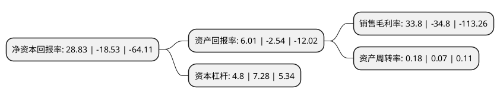

> 本页面由自动化程序生成于 2022年5月20日 01:09
> 内容可能存在错误，如有bug请提交issue至：https://github.com/Eroleice/doc-pi/issues
{.is-warning}

# 上市公司基本情况

## 基本资料

天齐锂业股份有限公司（以下简称“天齐锂业”）成立于1995年10月16日，遂宁市。于2010年08月31日在深交所中小板上市。

天齐锂业注册资本147,709.938万元，主要从事工业级碳酸锂，电池级碳酸锂，无水氯化锂，氢氧化锂等锂系列产品的研发，生产和销售。主要产品有工业级碳酸锂，电池级碳酸锂，无水氯化锂，氢氧化锂等。以下是详细信息：

- 公司名称: 天齐锂业股份有限公司
- 股票代码: 002466.SZ
- 所在地: 四川 - 遂宁市
- 成立日期: 1995年10月16日
- 注册资本: 147,709.938万元
- 法定代表人: 蒋卫平
- 主营业务: 主要从事工业级碳酸锂，电池级碳酸锂，无水氯化锂，氢氧化锂等锂系列产品的研发，生产和销售主要产品有工业级碳酸锂，电池级碳酸锂，无水氯化锂，氢氧化锂等
- 公司官网: www.tianqilithium.com
- 公司介绍: 公司是中国和全球领先、以锂为核心的新能源材料企业，业务包括锂化合物及衍生物生产与锂精矿开采及生产。在中国四川、江苏、重庆和澳大利亚等地设立生产、资源基地或分支机构，客户遍及全球。产品品种包括化学级锂精矿、技术级锂精矿、工业级碳酸锂、电池级碳酸锂、工业级氢氧化锂、电池级氢氧化锂、无水氯化锂、金属锂等锂化工产品，广泛应用于玻璃陶瓷、锂电池、润滑脂、航空航天等领域。公司先后获得国家知识产权优势培育企业、国家镁锂新材料高新技术产业化基地、四川省博士后创新实践基地、省创新型试点企业和省知识产权优势培育企业等。

## 股东及高管情况

上市公司第一大股东为成都天齐实业(集团)有限公司，持股416,316,432股，占比28.18%，**疑似为**上市公司实际控制人。

截至2022年03月31日，上市公司的前十大股东中，共有1名自然人股东，2名机构股东，7个产品账户，其中5%以上大股东共有1名。上市公司前十大股东明细如下：

> 未能通过持股比例判定出上市公司实际控制人（持股30%以上）
> 可能存在通过间接持股、联合持股、协议控制等方式拥有实际控制权的主体，具体请参考上市公司定期公告！
{.is-warning}

> 截至2022年03月31日，上市公司前十大股东信息如下：

| 股东名称 | 持股数量（股） | 持股比例 |
| --- | --- | --- |
| 成都天齐实业(集团)有限公司 | 416,316,432 | 28.18% |
| 张静 | 68,679,877 | 4.65% |
| 中国证券金融股份有限公司 | 27,853,574 | 1.89% |
| 交通银行股份有限公司-汇丰晋信低碳先锋股票型证券投资基金 | 9,347,341 | 0.63% |
| 中国邮政储蓄银行股份有限公司-东方新能源汽车主题混合型证券投资基金 | 9,127,134 | 0.62% |
| 中国银行股份有限公司-国投瑞银新能源混合型证券投资基金 | 7,983,762 | 0.54% |
| 中国工商银行股份有限公司-汇添富中证新能源汽车产业指数型发起式证券投资基金(LOF) | 7,698,869 | 0.52% |
| 前海人寿保险股份有限公司-分红保险产品 | 7,189,837 | 0.49% |
| 易方达基金-中央汇金资产管理有限责任公司-易方达基金-汇金资管单一资产管理计划 | 5,000,005 | 0.34% |
| 交通银行-汇丰晋信动态策略混合型证券投资基金 | 4,815,646 | 0.33% |

## 利润表分析

上市公司2021年总收入为76.63亿元，净利润为25.9亿元，实现盈利。

## 杜邦分析

> 数据列示周期：2021年 | 2020年 | 2019年
{.is-info}

上市公司的净资产收益率在近一年有所下降，下降幅度为-255.59%，其变化情况分解如下：
- 上市公司的销售毛利率在近一年下降了-197.13%，可能是生产效率的下降、商品原材料价格上涨或商品价格的下跌所致。
- 上市公司的资产周转率在近一年上升了157.14%，可能是源自于更快的销售回款或库存管理效果提升。
- 上市公司的财务杠杆比率在近一年下降了-34.07%，可能是减少负债降低财务费用。

