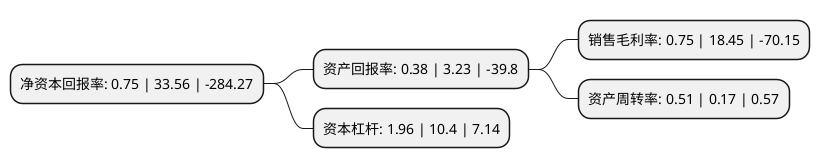

> 本页面由自动化程序生成于 2022年5月20日 01:11
> 内容可能存在错误，如有bug请提交issue至：https://github.com/Eroleice/doc-pi/issues
{.is-warning}

# 上市公司基本情况

## 基本资料

郴州市金贵银业股份有限公司（以下简称“金贵银业”）成立于2004年11月08日，郴州市。于2014年01月28日在深交所中小板上市。

金贵银业注册资本221,047.909万元，主营业务:是以白银冶炼和深加工为主，配套铅冶炼，并综合回收金，铋，锑，锌，铜，铟等有价金属。公司主要产品:白银，电解铅，黄金，高纯铋等有价金属。以下是详细信息：

- 公司名称: 郴州市金贵银业股份有限公司
- 股票代码: 002716.SZ
- 所在地: 湖南 - 郴州市
- 成立日期: 2004年11月08日
- 注册资本: 221,047.909万元
- 法定代表人: 潘郴华
- 主营业务: 主营业务:是以白银冶炼和深加工为主，配套铅冶炼，并综合回收金，铋，锑，锌，铜，铟等有价金属公司主要产品:白银，电解铅，黄金，高纯铋等有价金属
- 公司官网: www.jingui-silver.com
- 公司介绍: 公司是一家以生产经营高纯银及银深加工为主的高新技术企业。主营业务为从铅冶炼阳极泥及矿冶企业废渣废液中综合回收白银及铅、金、铋、锌、铜、铟等多种有色金属的清洁生产和销售。公司以白银冶炼及其深加工产品为核心，不断拓展白银产业链条，并同时回收铟、铜、锑、锡等贵重金属。公司通过IS09001:2000质量管理体系和IS014001:2004环境管理体系认证。“金贵”牌银锭获“湖南省出口名牌”、“湖南省国际知名品牌”称号，高纯银产品获“湖南省品牌产品”称号，“金贵”注册商标获“湖南省著名商标”称号。“高砷铅阳极泥脱砷”新工艺技术获国家环境保护科学技术奖二等奖和郴州市科技进步一等奖。

## 股东及高管情况

上市公司第一大股东为郴州市发展投资集团产业投资经营有限公司，持股210,000,000股，占比9.5%，**疑似为**上市公司实际控制人。

截至2022年03月31日，上市公司的前十大股东中，共有7名机构股东，3个产品账户，其中5%以上大股东共有3名。上市公司前十大股东明细如下：

> 未能通过持股比例判定出上市公司实际控制人（持股30%以上）
> 可能存在通过间接持股、联合持股、协议控制等方式拥有实际控制权的主体，具体请参考上市公司定期公告！
{.is-warning}

> 上市公司第一大股东持股不超过10%，请检查是否存在公司控制权风险！
{.is-danger}

> 截至2022年03月31日，上市公司前十大股东信息如下：

| 股东名称 | 持股数量（股） | 持股比例 |
| --- | --- | --- |
| 郴州市发展投资集团产业投资经营有限公司 | 210,000,000 | 9.5% |
| 中国长城资产管理股份有限公司 | 159,063,972 | 7.2% |
| 财信资产管理(郴州)有限公司 | 115,809,375 | 5.24% |
| 郴州市金贵银业股份有限公司破产企业财产处置专用账户 | 100,702,655 | 4.56% |
| 华龙证券-浦发银行-华龙证券金智汇质押宝4号集合资产管理计划 | 98,608,884 | 4.46% |
| 中融国际信托有限公司-中融-融颐6号股票收益权投资集合资金信托计划 | 95,300,000 | 4.31% |
| 中国工商银行股份有限公司湖南省分行 | 51,568,632 | 2.33% |
| 交通银行股份有限公司湖南省分行 | 41,409,576 | 1.87% |
| 平安银行股份有限公司 | 38,248,686 | 1.73% |
| 河池市交通矿业投资开发有限责任公司 | 35,504,531 | 1.61% |

## 利润表分析

上市公司2021年总收入为19.89亿元，净利润为0.14亿元，实现盈利。

## 杜邦分析

> 数据列示周期：2021年 | 2020年 | 2019年
{.is-info}

上市公司的净资产收益率在近一年有所下降，下降幅度为-97.77%，其变化情况分解如下：
- 上市公司的销售毛利率在近一年下降了-95.93%，可能是生产效率的下降、商品原材料价格上涨或商品价格的下跌所致。
- 上市公司的资产周转率在近一年上升了200%，可能是源自于更快的销售回款或库存管理效果提升。
- 上市公司的财务杠杆比率在近一年下降了-81.15%，可能是减少负债降低财务费用。

