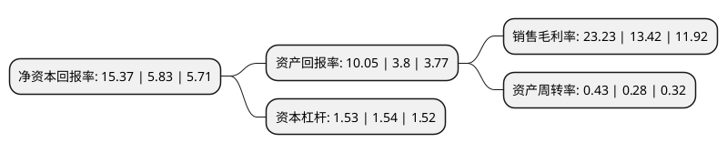

> 本页面由自动化程序生成于 2022年5月20日 01:11
> 内容可能存在错误，如有bug请提交issue至：https://github.com/Eroleice/doc-pi/issues
{.is-warning}

# 上市公司基本情况

## 基本资料

中矿资源集团股份有限公司（以下简称“中矿资源”）成立于1999年06月02日，北京市。于2014年12月30日在深交所中小板上市。

中矿资源注册资本32,526.526万元，主营业务:稀有轻金属(锂，铯，铷)资源开发与利用，固体矿产勘查技术服务及矿权投资以下是详细信息：

- 公司名称: 中矿资源集团股份有限公司
- 股票代码: 002738.SZ
- 所在地: 北京 - 北京市
- 成立日期: 1999年06月02日
- 注册资本: 32,526.526万元
- 法定代表人: 王平卫
- 主营业务: 主营业务:稀有轻金属(锂，铯，铷)资源开发与利用，固体矿产勘查技术服务及矿权投资
- 公司官网: www.sinomine.cn
- 公司介绍: 公司是一家按照现代企业制度设立的股份制综合地质勘查型矿业公司。公司主要致力于地质工程技术服务，具体包括固体矿产勘查工程技术服务和地基基础工程施工服务。公司主要为国有大型矿业公司境外找矿和生产性探矿项目提供地质勘查工程技术服务；业务领域以海外市场为主，国内市场为辅。公司为国家级高新技术企业、北京市守信用重合同企业，拥有国土资源部颁发的多项甲级资质。目前，公司已确立了海外商业性地质勘查技术服务领域的领先地位，是我国商业性地质勘查行业开拓海外的“尖兵”和中国企业开拓海外地勘市场的一面“旗帜”。被国土资源部评为“全国模范地勘单位”，第一届全国地勘钻探职业技能大赛北京赛区获奖企业，多次获北京市丰台区人民政府颁发的丰台区经济发展贡献奖。

## 股东及高管情况

上市公司第一大股东为中色矿业集团有限公司，持股52,000,000股，占比15.97%，**疑似为**上市公司实际控制人。

截至2022年03月31日，上市公司的前十大股东中，共有3名自然人股东，4名机构股东，2个产品账户，1个海外主体，其中5%以上大股东共有2名。上市公司前十大股东明细如下：

> 未能通过持股比例判定出上市公司实际控制人（持股30%以上）
> 可能存在通过间接持股、联合持股、协议控制等方式拥有实际控制权的主体，具体请参考上市公司定期公告！
{.is-warning}

> 截至2022年03月31日，上市公司前十大股东信息如下：

| 股东名称 | 持股数量（股） | 持股比例 |
| --- | --- | --- |
| 中色矿业集团有限公司 | 52,000,000 | 15.97% |
| 孙梅春 | 20,147,650 | 6.19% |
| 香港中央结算有限公司(陆股通) | 8,336,006 | 2.56% |
| 王平卫 | 4,867,000 | 1.49% |
| 钟海华 | 3,921,112 | 1.2% |
| 深圳市东方富海创业投资管理有限公司-富海股投邦(芜湖)四号股权投资合伙企业(有限合伙) | 3,776,803 | 1.16% |
| 西藏腾毅投资有限公司 | 3,698,169 | 1.14% |
| 华夏人寿保险股份有限公司-自有资金 | 3,183,857 | 0.98% |
| 中国银行股份有限公司-国投瑞银新能源混合型证券投资基金 | 2,779,130 | 0.85% |
| 中国建设银行股份有限公司-信达澳银新能源精选混合型证券投资基金 | 2,371,560 | 0.73% |

## 利润表分析

上市公司2021年总收入为23.94亿元，净利润为5.56亿元，实现盈利。

## 杜邦分析

> 数据列示周期：2021年 | 2020年 | 2019年
{.is-info}

上市公司的净资产收益率在近一年有所上升，上升幅度为163.64%，其变化情况分解如下：
- 上市公司的销售毛利率在近一年上升了73.1%，可能是生产效率的提升、商品原材料价格下跌或商品价格的上涨所致。
- 上市公司的资产周转率在近一年上升了53.57%，可能是源自于更快的销售回款或库存管理效果提升。
- 上市公司的财务杠杆比率在近一年下降了-0.65%，可能是减少负债降低财务费用。

