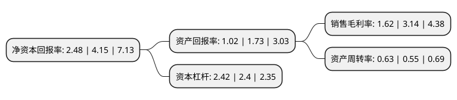

> 本页面由自动化程序生成于 2022年5月20日 01:12
> 内容可能存在错误，如有bug请提交issue至：https://github.com/Eroleice/doc-pi/issues
{.is-warning}

# 上市公司基本情况

## 基本资料

广东翔鹭钨业股份有限公司（以下简称“翔鹭钨业”）成立于1997年04月17日，潮州市。于2017年01月19日在深交所中小板上市。

翔鹭钨业注册资本27,767.165万元，主营业务:钨制品的开发，生产与销售。主要产品:各种规格的氧化钨，钨粉，碳化钨粉，钨合金粉及钨硬质合金等。以下是详细信息：

- 公司名称: 广东翔鹭钨业股份有限公司
- 股票代码: 002842.SZ
- 所在地: 广东 - 潮州市
- 成立日期: 1997年04月17日
- 注册资本: 27,767.165万元
- 法定代表人: 陈启丰
- 主营业务: 主营业务:钨制品的开发，生产与销售主要产品:各种规格的氧化钨，钨粉，碳化钨粉，钨合金粉及钨硬质合金等
- 公司官网: www.xl-tungsten.com
- 公司介绍: 公司是广东优秀民营企业。公司专注于钨制品的开发、生产和销售，经过多年的发展，公司形成了从仲钨酸铵、氧化钨、钨粉、碳化钨粉到硬质合金等为一体的产品体系。被国家商务部认定为全国钨及钨制品出口供货资格企业之一，是全国钨及钨制品国营贸易出口企业之一。公司通过多年的技术创新，在国内、外两个钨行业市场都起到举足轻重的地位。公司配备先进的生产设备和工艺，配备精密齐全的检测仪器，注重技术创新，被指定为广东省“钨新材料工程技术”研究开发中心，被国家科技部认定为“国家重点高新技术企业”。

## 股东及高管情况

上市公司第一大股东为陈启丰，持股51,836,400股，占比18.67%，**疑似为**上市公司实际控制人。

截至2022年03月31日，上市公司的前十大股东中，共有8名自然人股东，2名机构股东，其中5%以上大股东共有2名。上市公司前十大股东明细如下：

> 未能通过持股比例判定出上市公司实际控制人（持股30%以上）
> 可能存在通过间接持股、联合持股、协议控制等方式拥有实际控制权的主体，具体请参考上市公司定期公告！
{.is-warning}

> 截至2022年03月31日，上市公司前十大股东信息如下：

| 股东名称 | 持股数量（股） | 持股比例 |
| --- | --- | --- |
| 陈启丰 | 51,836,400 | 18.67% |
| 潮州启龙贸易有限公司 | 49,106,400 | 17.69% |
| 陈伟儿 | 13,682,115 | 4.93% |
| 陈伟东 | 12,562,970 | 4.52% |
| 陈伟浩 | 11,828,915 | 4.26% |
| 梁楠 | 5,460,000 | 1.97% |
| 潮州市永宣陶瓷科技有限公司 | 3,113,980 | 1.12% |
| 佘周鹏 | 2,542,000 | 0.92% |
| 江楚玲 | 1,480,000 | 0.53% |
| 卢伟丽 | 1,453,900 | 0.52% |

## 利润表分析

上市公司2021年总收入为15.24亿元，净利润为0.24亿元，实现盈利。

## 杜邦分析

> 数据列示周期：2021年 | 2020年 | 2019年
{.is-info}

上市公司的净资产收益率在近一年有所下降，下降幅度为-40.24%，其变化情况分解如下：
- 上市公司的销售毛利率在近一年下降了-48.41%，可能是生产效率的下降、商品原材料价格上涨或商品价格的下跌所致。
- 上市公司的资产周转率在近一年上升了14.55%，可能是源自于更快的销售回款或库存管理效果提升。
- 上市公司的财务杠杆比率在近一年上升了0.83%，可能是增加负债扩大生产规模。

