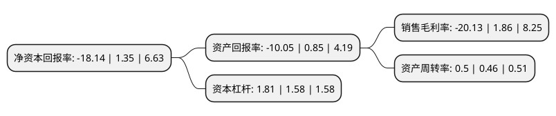

> 本页面由自动化程序生成于 2022年5月20日 01:16
> 内容可能存在错误，如有bug请提交issue至：https://github.com/Eroleice/doc-pi/issues
{.is-warning}

# 上市公司基本情况

## 基本资料

东莞宜安科技股份有限公司（以下简称“宜安科技”）成立于1993年05月27日，东莞市。于2012年06月19日在深交所创业板上市。

宜安科技注册资本69,042.36万元，主营业务为铝合金，镁合金等轻合金精密压铸件的研发，设计，生产和销售。以下是详细信息：

- 公司名称: 东莞宜安科技股份有限公司
- 股票代码: 300328.SZ
- 所在地: 广东 - 东莞市
- 成立日期: 1993年05月27日
- 注册资本: 69,042.36万元
- 法定代表人: 杨洁丹
- 主营业务: 主营业务为铝合金，镁合金等轻合金精密压铸件的研发，设计，生产和销售
- 公司官网: www.e-ande.com
- 公司介绍: 公司是一家集轻合金材料研发、生产、营销为一体的国家火炬计划重点高新技术企业，液态金属、生物可降解医用镁合金、镁铝合金汽车产品为公司三大重点板块业务。产品范围包括消费电子、高端LED幕墙、医疗器械、汽车配件、通讯设备、大型结构件(车门、电视幕墙等)等。公司先后建有“宜安科技-中科院金属所非晶态材料研究联合实验室”、“国家博士后科研工作站”、“广东省轻合金工程技术研究开发中心”、“省企业技术中心”、“广东省院士专家工作站”、“广东省企业重点试验室”、“国际科技合作基地”等多个科研机构。

## 股东及高管情况

上市公司第一大股东为株洲市国有资产投资控股集团有限公司，持股193,125,000股，占比27.97%，**疑似为**上市公司实际控制人。

截至2022年05月18日，上市公司的前十大股东中，共有4名自然人股东，5名机构股东，1个产品账户，其中5%以上大股东共有4名。上市公司前十大股东明细如下：

> 未能通过持股比例判定出上市公司实际控制人（持股30%以上）
> 可能存在通过间接持股、联合持股、协议控制等方式拥有实际控制权的主体，具体请参考上市公司定期公告！
{.is-warning}

> 截至2022年05月18日，上市公司前十大股东信息如下：

| 股东名称 | 持股数量（股） | 持股比例 |
| --- | --- | --- |
| 株洲市国有资产投资控股集团有限公司 | 193,125,000 | 27.97% |
| 株洲市国有资产投资控股集团有限公司 | 193,125,000 | 27.97% |
| 宜安实业有限公司 | 105,935,000 | 15.34% |
| 宜安实业有限公司 | 105,935,000 | 15.34% |
| 港安控股有限公司 | 4,525,000 | 0.66% |
| 中国建设银行股份有限公司-信达澳银新能源产业股票型证券投资基金 | 4,513,853 | 0.65% |
| 汤铁装 | 3,202,500 | 0.46% |
| 李卫荣 | 3,202,500 | 0.46% |
| 杨洁丹 | 3,202,500 | 0.46% |
| 余小红 | 2,571,210 | 0.37% |

## 利润表分析

上市公司2021年总收入为10.69亿元，净利润为-2.16亿元，**未实现盈利**。

## 杜邦分析

> 数据列示周期：2021年 | 2020年 | 2019年
{.is-info}

上市公司的净资产收益率在近一年有所下降，下降幅度为-1443.7%，其变化情况分解如下：
- 上市公司的销售毛利率在近一年下降了-1182.26%，可能是生产效率的下降、商品原材料价格上涨或商品价格的下跌所致。
- 上市公司的资产周转率在近一年上升了8.7%，可能是源自于更快的销售回款或库存管理效果提升。
- 上市公司的财务杠杆比率在近一年上升了14.56%，可能是增加负债扩大生产规模。

