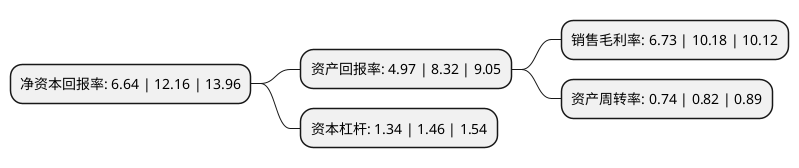

> 本页面由自动化程序生成于 2022年5月20日 01:21
> 内容可能存在错误，如有bug请提交issue至：https://github.com/Eroleice/doc-pi/issues
{.is-warning}

# 上市公司基本情况

## 基本资料

上海中洲特种合金材料股份有限公司（以下简称“中洲特材”）成立于2002年07月08日，上海市。于2021年04月09日在深交所创业板上市。

中洲特材注册资本12,000万元，主营业务:主要是以耐腐蚀，耐高温，耐磨损，抗冲击的高温耐蚀合金材料及制品的研发，生产和销售。公司主要产品有铸造高温耐蚀合金制品，变形高温耐蚀合金制品，粉末高温耐蚀合金制品等。以下是详细信息：

- 公司名称: 上海中洲特种合金材料股份有限公司
- 股票代码: 300963.SZ
- 所在地: 上海 - 上海市
- 成立日期: 2002年07月08日
- 注册资本: 12,000万元
- 法定代表人: 冯明明
- 主营业务: 主营业务:主要是以耐腐蚀，耐高温，耐磨损，抗冲击的高温耐蚀合金材料及制品的研发，生产和销售公司主要产品有铸造高温耐蚀合金制品，变形高温耐蚀合金制品，粉末高温耐蚀合金制品等
- 公司官网: www.alloy-china.com
- 公司介绍: 公司自设立以来，一直专业从事高温耐蚀合金材料及其制品研发、生产和销售。经过多年的发展和积累，公司的产品研发能力、工艺装备水平、生产经营规模、产品市场占有率等均处在行业较高水平，部分产品位于行业领先水平。公司在高温耐蚀合金制造上拥有高温合金精铸件定向快速凝固技术、大型高温耐蚀合金砂铸件防裂纹技术、铸造工艺计算机模拟技术、硅溶胶模壳快速干燥技术、超低气体含量高温耐蚀合金真空熔炼技术、高温耐蚀合金返回料回收再利用技术、大型高温耐蚀合金电渣锭电渣重熔技术、大型高温耐蚀变形合金模锻成型技术、水平连铸细直径裸焊棒生产技术、气雾化法微米级超细粉末制备技术、大型薄壁件金属表面耐蚀或硬面堆焊技术、高温耐磨耐蚀合金工业零件加工技术等十二项核心技术。公司产品牌号规格达300多种，已经形成了较为齐全的高温耐蚀合金材料体系，是国内同行业业务覆盖面最广、产品种类最齐全的企业之一。

## 股东及高管情况

上市公司第一大股东为冯明明，持股42,381,000股，占比35.32%，为上市公司实际控制人。

截至2022年03月31日，上市公司的前十大股东中，共有8名自然人股东，2名机构股东，其中5%以上大股东共有6名。上市公司前十大股东明细如下：

> 截至2022年03月31日，上市公司前十大股东信息如下：

| 股东名称 | 持股数量（股） | 持股比例 |
| --- | --- | --- |
| 冯明明 | 42,381,000 | 35.32% |
| 韩明 | 12,114,000 | 10.1% |
| 上海盾佳投资管理有限公司 | 9,711,000 | 8.09% |
| 西安航天海通创新新材料股权投资合伙企业(有限合伙) | 9,000,000 | 7.5% |
| 蒋伟 | 7,299,000 | 6.08% |
| 徐亮 | 7,299,000 | 6.08% |
| 尹海兵 | 2,196,000 | 1.83% |
| 李明 | 575,688 | 0.48% |
| 刘俊 | 189,000 | 0.16% |
| 洪德云 | 156,513 | 0.13% |

## 利润表分析

上市公司2021年总收入为6.84亿元，净利润为0.46亿元，实现盈利。

## 杜邦分析

> 数据列示周期：2021年 | 2020年 | 2019年
{.is-info}

上市公司的净资产收益率在近一年有所下降，下降幅度为-45.39%，其变化情况分解如下：
- 上市公司的销售毛利率在近一年下降了-33.89%，可能是生产效率的下降、商品原材料价格上涨或商品价格的下跌所致。
- 上市公司的资产周转率在近一年下降了-9.76%，可能是源自于更慢的销售回款或库存管理效果下降。
- 上市公司的财务杠杆比率在近一年下降了-8.22%，可能是减少负债降低财务费用。

