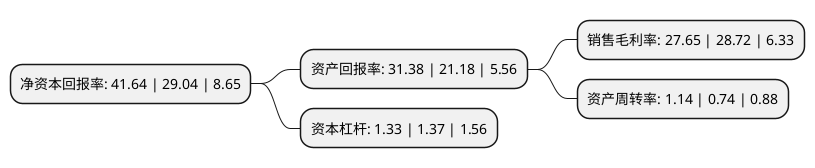

> 本页面由自动化程序生成于 2022年5月20日 01:23
> 内容可能存在错误，如有bug请提交issue至：https://github.com/Eroleice/doc-pi/issues
{.is-warning}

# 上市公司基本情况

## 基本资料

赣州腾远钴业新材料股份有限公司（以下简称“腾远钴业”）成立于2004年03月26日，赣州市。于2022年03月17日在深交所创业板上市。

腾远钴业注册资本12,594.751万元，公司主营业务为钴，铜产品的研发，生产与销售，目前公司主要产品包括氯化钴，硫酸钴，四氧化三钴及电积铜。以下是详细信息：

- 公司名称: 赣州腾远钴业新材料股份有限公司
- 股票代码: 301219.SZ
- 所在地: 江西 - 赣州市
- 成立日期: 2004年03月26日
- 注册资本: 12,594.751万元
- 法定代表人: 罗洁
- 主营业务: 公司主营业务为钴，铜产品的研发，生产与销售，目前公司主要产品包括氯化钴，硫酸钴，四氧化三钴及电积铜
- 公司官网: www.tycogz.com
- 公司介绍: 公司主要从事钴、铜产品的研发、生产与销售，为国内最具竞争力的钴盐生产企业之一。公司的核心产品为氯化钴、硫酸钴等钴盐以及四氧化三钴等钴氧化物。此外，由于铜钴伴生的特点，公司还生产电积铜。公司为技术能力突出、工艺设备先进、产品质量优异的高新技术企业，是目前国内最具规模实力和技术水平的钴盐生产行业龙头企业之一。自成立以来，公司主营业务及主要产品未发生重大变化。

## 股东及高管情况

上市公司第一大股东为罗洁，持股28,244,900股，占比22.43%，**疑似为**上市公司实际控制人。

截至2022年03月31日，上市公司的前十大股东中，共有6名自然人股东，3名机构股东，1个产品账户，其中5%以上大股东共有6名。上市公司前十大股东明细如下：

> 未能通过持股比例判定出上市公司实际控制人（持股30%以上）
> 可能存在通过间接持股、联合持股、协议控制等方式拥有实际控制权的主体，具体请参考上市公司定期公告！
{.is-warning}

> 截至2022年03月31日，上市公司前十大股东信息如下：

| 股东名称 | 持股数量（股） | 持股比例 |
| --- | --- | --- |
| 罗洁 | 28,244,900 | 22.43% |
| 谢福标 | 13,020,770 | 10.34% |
| 厦门钨业股份有限公司 | 11,400,000 | 9.05% |
| 江西赣锋锂业股份有限公司 | 6,884,110 | 5.47% |
| 宁波梅山保税港区晨道投资合伙企业(有限合伙)-长江晨道(湖北)新能源产业投资合伙企业(有限合伙) | 6,469,202 | 5.14% |
| 吴阳红 | 6,425,370 | 5.1% |
| 童高才 | 2,316,195 | 1.84% |
| 罗丽珍 | 2,280,000 | 1.81% |
| 高晋 | 2,154,965 | 1.71% |
| 安徽信安基石产业升级基金合伙企业(有限合伙) | 2,036,655 | 1.62% |

## 利润表分析

上市公司2021年总收入为41.6亿元，净利润为11.5亿元，实现盈利。

## 杜邦分析

> 数据列示周期：2021年 | 2020年 | 2019年
{.is-info}

上市公司的净资产收益率在近一年有所上升，上升幅度为43.39%，其变化情况分解如下：
- 上市公司的销售毛利率在近一年下降了-3.73%，可能是生产效率的下降、商品原材料价格上涨或商品价格的下跌所致。
- 上市公司的资产周转率在近一年上升了54.05%，可能是源自于更快的销售回款或库存管理效果提升。
- 上市公司的财务杠杆比率在近一年下降了-2.92%，可能是减少负债降低财务费用。

