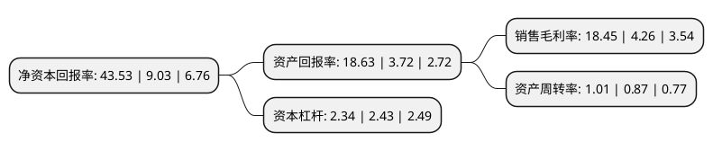

> 本页面由自动化程序生成于 2022年5月20日 01:24
> 内容可能存在错误，如有bug请提交issue至：https://github.com/Eroleice/doc-pi/issues
{.is-warning}

# 上市公司基本情况

## 基本资料

中国北方稀土(集团)高科技股份有限公司（以下简称“北方稀土”）成立于1997年09月12日，包头市。于1997年09月24日在上交所主板上市。

北方稀土注册资本363,306.6万元，主要生产经营稀土原料产品(稀土盐类，稀土氧化物及稀土金属)，稀土功能材料产品(稀土磁性材料，抛光材料，贮氢材料，发光材料，催化材料)和部分稀土应用产品(镍氢动力电池，稀土永磁磁共振仪，LED灯珠)。以下是详细信息：

- 公司名称: 中国北方稀土(集团)高科技股份有限公司
- 股票代码: 600111.SH
- 所在地: 内蒙古 - 包头市
- 成立日期: 1997年09月12日
- 注册资本: 363,306.6万元
- 法定代表人: 章智强
- 主营业务: 主要生产经营稀土原料产品(稀土盐类，稀土氧化物及稀土金属)，稀土功能材料产品(稀土磁性材料，抛光材料，贮氢材料，发光材料，催化材料)和部分稀土应用产品(镍氢动力电池，稀土永磁磁共振仪，LED灯珠)
- 公司官网: www.reht.com\www.reht.cn
- 公司介绍: 公司是我国乃至全世界最大的稀土生产、科研、贸易基地，是稀土行业的龙头企业，以开发利用举世闻名的稀土宝藏—白云鄂博稀土矿山为使命，建有稀土选矿、冶炼分离、深加工、应用产品、科研等完善的稀土工业体系，能够生产稀土原料(精矿、碳酸稀土、氧化物与盐类、金属)、稀土功能材料(抛光材料、贮氢材料、磁性材料、发光材料、催化材料)、稀土应用产品(镍氢动力电池、磁共振仪)等门类齐全的稀土产品。公司快速发展依托四大核心优势：全面掌控北方轻稀土资源，积极整合布局南方中重稀土资源；主导产品—北方轻稀土产品，具有随铁开采的成本优势，确保了公司在市场竞争中立于不败之地；旗下的稀土研究院，是全球最大的以稀土资源开发利用为宗旨的专业研究机构，辅以公司内部十多家企业技术(研发)中心，科研优势明显；稀土资源作为国家战略资源，其开发与应用得到了国家密集出台的各项政策支持，作为行业内骨干企业，公司在行业整合、发展中下游产业等方面得到了国家政策的大力支持。

## 股东及高管情况

上市公司第一大股东为包头钢铁(集团)有限责任公司，持股1,331,700,569股，占比36.66%，为上市公司实际控制人。

截至2022年03月31日，上市公司的前十大股东中，共有1名自然人股东，2名机构股东，6个产品账户，1个海外主体，其中5%以上大股东共有2名。上市公司前十大股东明细如下：

> 截至2022年03月31日，上市公司前十大股东信息如下：

| 股东名称 | 持股数量（股） | 持股比例 |
| --- | --- | --- |
| 包头钢铁(集团)有限责任公司 | 1,331,700,569 | 36.66% |
| 嘉鑫有限公司 | 201,359,020 | 5.54% |
| 香港中央结算有限公司(陆股通) | 83,801,649 | 2.31% |
| 翟烨 | 20,306,598 | 0.56% |
| 中国银行股份有限公司-国泰江源优势精选灵活配置混合型证券投资基金 | 12,776,042 | 0.35% |
| 中国邮政储蓄银行有限责任公司-东方增长中小盘混合型开放式证券投资基金 | 10,472,621 | 0.29% |
| 杭州来兴元品投资管理合伙企业(有限合伙)-来兴元品母星私募证券投资基金 | 10,240,700 | 0.28% |
| 中国银行股份有限公司-国投瑞银新能源混合型证券投资基金 | 8,891,156 | 0.24% |
| 中国银行股份有限公司-国泰致远优势混合型证券投资基金 | 8,797,365 | 0.24% |
| 中国建设银行股份有限公司-嘉实中证稀土产业交易型开放式指数证券投资基金 | 8,418,781 | 0.23% |

## 利润表分析

上市公司2021年总收入为304.08亿元，净利润为56.09亿元，实现盈利。

## 杜邦分析

> 数据列示周期：2021年 | 2020年 | 2019年
{.is-info}

上市公司的净资产收益率在近一年有所上升，上升幅度为382.06%，其变化情况分解如下：
- 上市公司的销售毛利率在近一年上升了333.1%，可能是生产效率的提升、商品原材料价格下跌或商品价格的上涨所致。
- 上市公司的资产周转率在近一年上升了16.09%，可能是源自于更快的销售回款或库存管理效果提升。
- 上市公司的财务杠杆比率在近一年下降了-3.7%，可能是减少负债降低财务费用。

