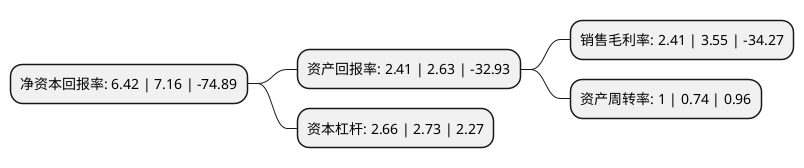

> 本页面由自动化程序生成于 2022年5月20日 01:25
> 内容可能存在错误，如有bug请提交issue至：https://github.com/Eroleice/doc-pi/issues
{.is-warning}

# 上市公司基本情况

## 基本资料

安徽鑫科新材料股份有限公司（以下简称“鑫科材料”）成立于1998年09月28日，芜湖市。于2000年11月22日在上交所主板上市。

鑫科材料注册资本179,954.356万元，主要产品:铜加工板块的主要产品有高精度铜带材，铜合金线材，光亮铜杆，电线电缆等。影视板块的主要产品有电影，电视剧等。主营业务:铜及铜合金带材，线材，辐照交联电缆，特种电缆等产品的研发，生产与销售以及影视制作和发行，版权开发与转让，影视投资，衍生品销售及再授权业务等。以下是详细信息：

- 公司名称: 安徽鑫科新材料股份有限公司
- 股票代码: 600255.SH
- 所在地: 安徽 - 芜湖市
- 成立日期: 1998年09月28日
- 注册资本: 179,954.356万元
- 法定代表人: 宋志刚
- 主营业务: 主要产品:铜加工板块的主要产品有高精度铜带材，铜合金线材，光亮铜杆，电线电缆等影视板块的主要产品有电影，电视剧等主营业务:铜及铜合金带材，线材，辐照交联电缆，特种电缆等产品的研发，生产与销售以及影视制作和发行，版权开发与转让，影视投资，衍生品销售及再授权业务等
- 公司官网: www.ahxinke.com
- 公司介绍: 公司拥有国家级企业认定技术中心和多家分公司、控股公司、参股公司，旗下产业涉及工业、新能源、地产投资、娱乐业等多重领域。2015年，集团定增收购西安梦舟，增加了电视剧的制作和发行业务，形成了铜加工和影视剧制作的双主业格局，在多元化发展道路上又迈出重要一步。公司的主营业务为铜及铜合金带材、线材、辐照交联电缆、特种电缆等产品的研发、生产与销售以及影视制作和发行、版权开发与转让、影视投资、衍生品销售及再授权业务等。其中，铜加工板块的主要产品有高精度铜带材、铜合金线材、光亮铜杆、电线电缆等。影视板块的主要产品有电影、电视剧等。

## 股东及高管情况

上市公司第一大股东为霍尔果斯船山文化传媒有限公司，持股176,959,400股，占比9.83%，**疑似为**上市公司实际控制人。

截至2022年03月31日，上市公司的前十大股东中，共有6名自然人股东，3名机构股东，1个产品账户，其中5%以上大股东共有1名。上市公司前十大股东明细如下：

> 未能通过持股比例判定出上市公司实际控制人（持股30%以上）
> 可能存在通过间接持股、联合持股、协议控制等方式拥有实际控制权的主体，具体请参考上市公司定期公告！
{.is-warning}

> 上市公司第一大股东持股不超过10%，请检查是否存在公司控制权风险！
{.is-danger}

> 截至2022年03月31日，上市公司前十大股东信息如下：

| 股东名称 | 持股数量（股） | 持股比例 |
| --- | --- | --- |
| 霍尔果斯船山文化传媒有限公司 | 176,959,400 | 9.83% |
| 芜湖恒鑫铜业集团有限公司 | 28,558,255 | 1.59% |
| 李绍君 | 11,367,400 | 0.63% |
| 周启宝 | 11,000,000 | 0.61% |
| 钱勇 | 9,070,000 | 0.5% |
| 华夏人寿保险股份有限公司-分红-个险分红 | 7,000,000 | 0.39% |
| 徐佩延 | 6,692,648 | 0.37% |
| 中国工商银行股份有限公司-国泰鑫睿混合型证券投资基金 | 5,500,000 | 0.31% |
| 李非文 | 5,238,800 | 0.29% |
| 李瑞金 | 5,075,200 | 0.28% |

## 利润表分析

上市公司2021年总收入为32.47亿元，净利润为0.78亿元，实现盈利。

## 杜邦分析

> 数据列示周期：2021年 | 2020年 | 2019年
{.is-info}

上市公司的净资产收益率在近一年有所下降，下降幅度为-10.34%，其变化情况分解如下：
- 上市公司的销售毛利率在近一年下降了-32.11%，可能是生产效率的下降、商品原材料价格上涨或商品价格的下跌所致。
- 上市公司的资产周转率在近一年上升了35.14%，可能是源自于更快的销售回款或库存管理效果提升。
- 上市公司的财务杠杆比率在近一年下降了-2.56%，可能是减少负债降低财务费用。

