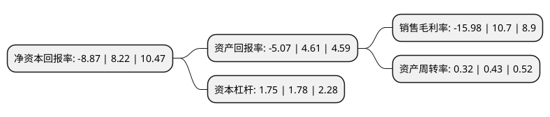

> 本页面由自动化程序生成于 2022年5月20日 01:25
> 内容可能存在错误，如有bug请提交issue至：https://github.com/Eroleice/doc-pi/issues
{.is-warning}

# 上市公司基本情况

## 基本资料

山西华阳新材料股份有限公司（以下简称“华阳新材”）成立于1999年02月26日，太原市。于2000年11月09日在上交所主板上市。

华阳新材注册资本51,440.203万元，主要产品:氯碱系列，聚氯乙烯系列，焦炭及深加工，铂网。以下是详细信息：

- 公司名称: 山西华阳新材料股份有限公司
- 股票代码: 600281.SH
- 所在地: 山西 - 太原市
- 成立日期: 1999年02月26日
- 注册资本: 51,440.203万元
- 法定代表人: 冯志武
- 主营业务: 主要产品:氯碱系列，聚氯乙烯系列，焦炭及深加工，铂网
- 公司官网: www.th600281.cn
- 公司介绍: 公司的控股股东是太原化学工业集团公司，集团公司是我国最早的三大化工基地之一。公司集生产经营、产品研发、销售服务、铁路运输为一体，是大型的综合型煤化工企业，主要生产多种化学肥料、煤焦深加工产品等多种化工产品原料。未来，公司将把握市场、调整生产经营模式、围绕对实施停产的企业、合理处置资产，继续做大非化产业，为公司特殊时期转型发展奠定基础。

## 股东及高管情况

上市公司第一大股东为太原化学工业集团有限公司，持股223,653,339股，占比43.48%，为上市公司实际控制人。

截至2022年03月31日，上市公司的前十大股东中，共有9名自然人股东，1名机构股东，其中5%以上大股东共有1名。上市公司前十大股东明细如下：

> 截至2022年03月31日，上市公司前十大股东信息如下：

| 股东名称 | 持股数量（股） | 持股比例 |
| --- | --- | --- |
| 太原化学工业集团有限公司 | 223,653,339 | 43.48% |
| 胡殿君 | 4,000,000 | 0.78% |
| 李宝奇 | 3,170,900 | 0.62% |
| 王顺东 | 2,620,500 | 0.51% |
| 吕秋白 | 2,354,600 | 0.46% |
| 吴大忠 | 2,285,893 | 0.44% |
| 唐燕 | 1,548,600 | 0.3% |
| 李少部 | 1,539,100 | 0.3% |
| 宫国翔 | 1,459,400 | 0.28% |
| 陈素芳 | 1,432,200 | 0.28% |

## 杜邦分析

> 数据列示周期：2021年 | 2020年 | 2019年
{.is-info}

上市公司的净资产收益率在近一年有所下降，下降幅度为-207.91%，其变化情况分解如下：
- 上市公司的销售毛利率在近一年下降了-249.35%，可能是生产效率的下降、商品原材料价格上涨或商品价格的下跌所致。
- 上市公司的资产周转率在近一年下降了-25.58%，可能是源自于更慢的销售回款或库存管理效果下降。
- 上市公司的财务杠杆比率在近一年下降了-1.69%，可能是减少负债降低财务费用。

