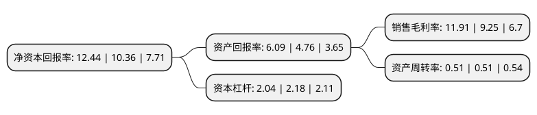

> 本页面由自动化程序生成于 2022年5月20日 01:26
> 内容可能存在错误，如有bug请提交issue至：https://github.com/Eroleice/doc-pi/issues
{.is-warning}

# 上市公司基本情况

## 基本资料

宝鸡钛业股份有限公司（以下简称“宝钛股份”）成立于1999年07月21日，宝鸡市。于2002年04月12日在上交所主板上市。

宝钛股份注册资本47,777.754万元，主要产品:各种规格的钛及钛合金板，带，箔，管，棒，线，锻件，铸件等加工材和各种金属复合材产品。主营业务:钛及钛合金的生产，加工和销售。以下是详细信息：

- 公司名称: 宝鸡钛业股份有限公司
- 股票代码: 600456.SH
- 所在地: 陕西 - 宝鸡市
- 成立日期: 1999年07月21日
- 注册资本: 47,777.754万元
- 法定代表人: 雷让岐
- 主营业务: 主要产品:各种规格的钛及钛合金板，带，箔，管，棒，线，锻件，铸件等加工材和各种金属复合材产品主营业务:钛及钛合金的生产，加工和销售
- 公司官网: www.baoti.com
- 公司介绍: 公司是中国最大的钛及钛合金生产、科研基地，是国家高新技术企业，所在地被誉为“中国钛城”、“中国钛谷”。公司主要从事钛及钛合金的生产、加工和销售，是中国最大的钛及钛合金生产、科研基地。公司拥有国际先进、完善的钛材生产体系，主要产品为各种规格的钛及钛合金板、带、箔、管、棒、线、锻件、铸件等加工材和各种金属复合材产品。公司按照市场需求，生产、加工和销售适合客户要求的钛及钛合金等产品，已形成了成熟的购、产、销一体的生产经营模式。

## 股东及高管情况

上市公司第一大股东为宝钛集团有限公司，持股228,227,298股，占比47.77%，为上市公司实际控制人。

截至2022年03月31日，上市公司的前十大股东中，共有1名自然人股东，3名机构股东，6个产品账户，其中5%以上大股东共有1名。上市公司前十大股东明细如下：

> 截至2022年03月31日，上市公司前十大股东信息如下：

| 股东名称 | 持股数量（股） | 持股比例 |
| --- | --- | --- |
| 宝钛集团有限公司 | 228,227,298 | 47.77% |
| 中国华融资产管理股份有限公司 | 7,228,176 | 1.51% |
| 前海人寿保险股份有限公司-分红保险产品华泰组合 | 7,050,000 | 1.48% |
| 中国建设银行股份有限公司-博时军工主题股票型证券投资基金 | 4,539,256 | 0.95% |
| 全国社保基金一一八组合 | 3,289,847 | 0.69% |
| 中国建设银行股份有限公司-长信国防军工量化灵活配置混合型证券投资基金 | 2,974,200 | 0.62% |
| 中国建设银行股份有限公司-国泰中证军工交易型开放式指数证券投资基金 | 2,932,107 | 0.61% |
| 基本养老保险基金八零四组合 | 2,549,429 | 0.53% |
| 华夏人寿保险股份有限公司-自有资金 | 2,536,522 | 0.53% |
| 郭永涛 | 2,500,000 | 0.52% |

## 利润表分析

上市公司2021年总收入为52.46亿元，净利润为6.24亿元，实现盈利。

## 杜邦分析

> 数据列示周期：2021年 | 2020年 | 2019年
{.is-info}

上市公司的净资产收益率在近一年有所上升，上升幅度为20.08%，其变化情况分解如下：
- 上市公司的销售毛利率在近一年上升了28.76%，可能是生产效率的提升、商品原材料价格下跌或商品价格的上涨所致。
- 上市公司的资产周转率在近一年下降了0%，可能是源自于更慢的销售回款或库存管理效果下降。
- 上市公司的财务杠杆比率在近一年下降了-6.42%，可能是减少负债降低财务费用。

