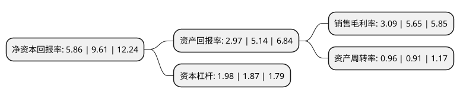

> 本页面由自动化程序生成于 2022年5月20日 01:30
> 内容可能存在错误，如有bug请提交issue至：https://github.com/Eroleice/doc-pi/issues
{.is-warning}

# 上市公司基本情况

## 基本资料

宁波博威合金材料股份有限公司（以下简称“博威合金”）成立于1994年01月22日，宁波市。于2011年01月27日在上交所主板上市。

博威合金注册资本79,004.497万元，主要产品:高性能合金材料，环保合金材料，节能合金材料和替代合金材料;多晶硅，单晶硅电池及组件。主营业务:高性能，高精度有色合金材料的研发，生产和销售;太阳能电池，组件的研发，生产和销售及光伏电站的建设运营。以下是详细信息：

- 公司名称: 宁波博威合金材料股份有限公司
- 股票代码: 601137.SH
- 所在地: 浙江 - 宁波市
- 成立日期: 1994年01月22日
- 注册资本: 79,004.497万元
- 法定代表人: 谢识才
- 主营业务: 主要产品:高性能合金材料，环保合金材料，节能合金材料和替代合金材料;多晶硅，单晶硅电池及组件主营业务:高性能，高精度有色合金材料的研发，生产和销售;太阳能电池，组件的研发，生产和销售及光伏电站的建设运营
- 公司官网: www.bowayalloy.com
- 公司介绍: 公司致力于高性能、高精度有色合金板带、棒材、线材新材料的研发、生产和销售；研发创新的功能系列合金材料、环保系列合金材料、替代系列合金材料和节能系列合金材料，应用于航空航天、高速列车、电子通讯、集成电路、汽车制造、船舶工业、工程机械、家用电器等30多个行业，为现代工业提供优质的工业粮食。公司全面继承了博威集团的研发创新实力，依托博威集团的国家首批“创新型企业”、“国家技术创新示范企业”、“国家认定企业技术中心”、国家“博士后科研工作站”、“国家认可实验室”、“国家地方联合工程研究中心”等研发创新平台，是国家“高新技术企业”、国际有色金属加工协会(IWCC)董事单位和技术委员会委员，成为高端合金材料智能制造企业。

## 股东及高管情况

上市公司第一大股东为博威集团有限公司，持股226,040,968股，占比28.61%，**疑似为**上市公司实际控制人。

截至2022年03月31日，上市公司的前十大股东中，共有2名自然人股东，5名机构股东，3个产品账户，其中5%以上大股东共有2名。上市公司前十大股东明细如下：

> 未能通过持股比例判定出上市公司实际控制人（持股30%以上）
> 可能存在通过间接持股、联合持股、协议控制等方式拥有实际控制权的主体，具体请参考上市公司定期公告！
{.is-warning}

> 截至2022年03月31日，上市公司前十大股东信息如下：

| 股东名称 | 持股数量（股） | 持股比例 |
| --- | --- | --- |
| 博威集团有限公司 | 226,040,968 | 28.61% |
| 博威亚太有限公司 | 80,000,000 | 10.13% |
| 金鹰基金-浦发银行-深圳前海金鹰资产管理有限公司 | 35,701,385 | 4.52% |
| 宁波博威金石投资有限公司 | 29,769,793 | 3.77% |
| 谢朝春 | 22,047,192 | 2.79% |
| 张东东 | 17,430,199 | 2.21% |
| 宁波梅山保税港区隽瑞投资合伙企业(有限合伙) | 15,193,179 | 1.92% |
| 宁波博威合金材料股份有限公司-2020年员工持股计划 | 13,346,334 | 1.69% |
| 宁波见睿投资咨询有限公司 | 13,034,947 | 1.65% |
| 中国农业银行股份有限公司-国泰智能汽车股票型证券投资基金 | 10,007,587 | 1.27% |

## 利润表分析

上市公司2021年总收入为100.37亿元，净利润为3.1亿元，实现盈利。

## 杜邦分析

> 数据列示周期：2021年 | 2020年 | 2019年
{.is-info}

上市公司的净资产收益率在近一年有所下降，下降幅度为-39.02%，其变化情况分解如下：
- 上市公司的销售毛利率在近一年下降了-45.31%，可能是生产效率的下降、商品原材料价格上涨或商品价格的下跌所致。
- 上市公司的资产周转率在近一年上升了5.49%，可能是源自于更快的销售回款或库存管理效果提升。
- 上市公司的财务杠杆比率在近一年上升了5.88%，可能是增加负债扩大生产规模。

