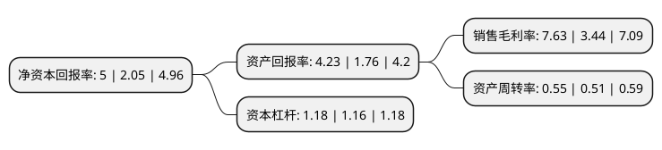

> 本页面由自动化程序生成于 2022年5月20日 01:31
> 内容可能存在错误，如有bug请提交issue至：https://github.com/Eroleice/doc-pi/issues
{.is-warning}

# 上市公司基本情况

## 基本资料

金堆城钼业股份有限公司（以下简称“金钼股份”）成立于2007年05月16日，西安市。于2008年04月17日在上交所主板上市。

金钼股份注册资本322,660.44万元，主要从事钼系列产品生产，加工，贸易，科研等业务，拥有钼采矿，选矿，焙烧，钼化工和钼金属加工上下游一体化的完整产业链条，且从事钼炉料，钼化工，钼金属产品的生产和销售，以及非钼业务，探矿业务，后勤服务业务和对外投资业务。以下是详细信息：

- 公司名称: 金堆城钼业股份有限公司
- 股票代码: 601958.SH
- 所在地: 陕西 - 西安市
- 成立日期: 2007年05月16日
- 注册资本: 322,660.44万元
- 法定代表人: 程方方
- 主营业务: 主要从事钼系列产品生产，加工，贸易，科研等业务，拥有钼采矿，选矿，焙烧，钼化工和钼金属加工上下游一体化的完整产业链条，且从事钼炉料，钼化工，钼金属产品的生产和销售，以及非钼业务，探矿业务，后勤服务业务和对外投资业务
- 公司官网: www.jdcmoly.com
- 公司介绍: 公司是世界领先、亚洲最大的钼业公司，主要从事钼系列产品生产、科研、贸易等业务，生产钼炉料、钼化工、钼金属深加工三大系列二十多种品质优良的各类产品，广泛应用于钢铁冶炼、石油化工、机械制造、航空航天、电子照明、生物医药等领域。公司拥有钼采矿、选矿、冶炼、化工和金属深加工上下游一体化的完整产业链条；拥有亚洲最大的露天钼矿山、钼选厂和冶炼厂以及先进的钼化工和钼金属深加工生产线。公司已形成完善的全球一体化营销网络，拥有面向国内和国际的专业营销机构及驻外商务代表处，与一批世界500强企业建立了长期稳定的技术交流和贸易合作关系，“JDC”品牌在行业内享誉全球。

## 股东及高管情况

上市公司第一大股东为金堆城钼业集团有限公司，持股2,387,184,040股，占比73.98%，为上市公司实际控制人。

截至2022年03月31日，上市公司的前十大股东中，共有2名自然人股东，2名机构股东，5个产品账户，1个海外主体，其中5%以上大股东共有1名。上市公司前十大股东明细如下：

> 截至2022年03月31日，上市公司前十大股东信息如下：

| 股东名称 | 持股数量（股） | 持股比例 |
| --- | --- | --- |
| 金堆城钼业集团有限公司 | 2,387,184,040 | 73.98% |
| 太原钢铁(集团)有限公司 | 17,228,152 | 0.53% |
| 莫常春 | 12,630,167 | 0.39% |
| 招商证券股份有限公司-天弘中证500指数增强型证券投资基金 | 9,343,100 | 0.29% |
| 香港中央结算有限公司(陆股通) | 7,364,650 | 0.23% |
| 全国社保基金四一三组合 | 6,817,200 | 0.21% |
| 中欧基金-农业银行-中国太平洋人寿股票相对收益型产品(保额分红)委托投资计划 | 5,789,714 | 0.18% |
| 中国农业银行股份有限公司-中证500交易型开放式指数证券投资基金 | 5,068,479 | 0.16% |
| 招商银行股份有限公司-中欧红利优享灵活配置混合型证券投资基金 | 4,933,250 | 0.15% |
| 周亚玲 | 4,585,900 | 0.14% |

## 利润表分析

上市公司2021年总收入为79.73亿元，净利润为6.08亿元，实现盈利。

## 杜邦分析

> 数据列示周期：2021年 | 2020年 | 2019年
{.is-info}

上市公司的净资产收益率在近一年有所上升，上升幅度为143.9%，其变化情况分解如下：
- 上市公司的销售毛利率在近一年上升了121.8%，可能是生产效率的提升、商品原材料价格下跌或商品价格的上涨所致。
- 上市公司的资产周转率在近一年上升了7.84%，可能是源自于更快的销售回款或库存管理效果提升。
- 上市公司的财务杠杆比率在近一年上升了1.72%，可能是增加负债扩大生产规模。

