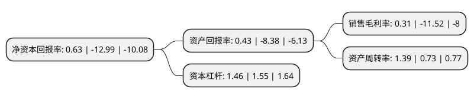

> 本页面由自动化程序生成于 2022年5月20日 01:34
> 内容可能存在错误，如有bug请提交issue至：https://github.com/Eroleice/doc-pi/issues
{.is-warning}

# 上市公司基本情况

## 基本资料

锦州吉翔钼业股份有限公司（以下简称“吉翔股份”）成立于2003年06月18日，锦州市。于2012年08月24日在上交所主板上市。

吉翔股份注册资本50,852.365万元，主要产品:焙烧钼精矿，钼铁，电影，电视剧等。主营业务:钼炉料等钼系列产品的生产，加工，销售业务，电影，电视剧的研发，投资，制作，营销与发行。以下是详细信息：

- 公司名称: 锦州吉翔钼业股份有限公司
- 股票代码: 603399.SH
- 所在地: 辽宁 - 锦州市
- 成立日期: 2003年06月18日
- 注册资本: 50,852.365万元
- 法定代表人: 杨峰
- 主营业务: 主要产品:焙烧钼精矿，钼铁，电影，电视剧等主营业务:钼炉料等钼系列产品的生产，加工，销售业务，电影，电视剧的研发，投资，制作，营销与发行
- 公司官网: www.geeimage.com
- 公司介绍: 公司为国内大型钼业企业。公司主营业务有钼产品业务和影视业务。公司的钼产品业务为钼炉料、钼化工、钼金属等钼系列产品的生产、加工、销售业务，具有焙烧、冶炼、钼化工、钼金属深加工一体化的生产能力，产品主要包括焙烧钼精矿、钼铁、钼酸铵、高纯氧化钼、钼粉、钼板、钼棒、钼顶头等。公司影视业务主要为电影、电视剧的研发、投资、制作、营销与发行，是全产业链模式下的影视制片公司。公司连续多年获得辽宁省“诚信示范企业”、“守合同重信用企业”、“民营百强企业”和“名牌产品”等称号，连续多年成为锦州市“工业十强企业”，是注册地重点骨干纳税企业。

## 股东及高管情况

上市公司第一大股东为宁波炬泰投资管理有限公司，持股173,840,117股，占比34.1853%，为上市公司实际控制人。

截至2022年04月19日，上市公司的前十大股东中，共有2名自然人股东，4名机构股东，3个产品账户，1个海外主体，其中5%以上大股东共有7名。上市公司前十大股东明细如下：

> 截至2022年04月19日，上市公司前十大股东信息如下：

| 股东名称 | 持股数量（股） | 持股比例 |
| --- | --- | --- |
| 宁波炬泰投资管理有限公司 | 173,840,117 | 34.1853% |
| 宁波炬泰投资管理有限公司 | 173,840,117 | 34.1853% |
| 上海钢石股权投资有限公司 | 53,516,410 | 10.5239% |
| 上海钢石股权投资有限公司 | 53,516,410 | 10.5239% |
| 华融融达期货-陕国投·聚宝盆66号证券投资集合资金信托计划-华信金玉一号定向资产管理计划 | 52,001,590 | 10.23% |
| 华融融达期货-陕国投·聚宝盆66号证券投资集合资金信托计划-华信金玉一号定向资产管理计划 | 46,099,390 | 9.0653% |
| 华融融达期货-陕国投·聚宝盆66号证券投资集合资金信托计划-华信金玉一号定向资产管理计划 | 40,916,590 | 8.05% |
| 陈伟浩 | 6,000,000 | 1.18% |
| JPMORGAN CHASE BANK, NATIONAL ASSOCIATION | 4,558,917 | 0.9% |
| 高冠男 | 2,998,000 | 0.59% |

## 利润表分析

上市公司2021年总收入为38.6亿元，净利润为0.12亿元，实现盈利。

## 杜邦分析

> 数据列示周期：2021年 | 2020年 | 2019年
{.is-info}

上市公司的净资产收益率在近一年有所下降，下降幅度为-104.85%，其变化情况分解如下：
- 上市公司的销售毛利率在近一年下降了-102.69%，可能是生产效率的下降、商品原材料价格上涨或商品价格的下跌所致。
- 上市公司的资产周转率在近一年上升了90.41%，可能是源自于更快的销售回款或库存管理效果提升。
- 上市公司的财务杠杆比率在近一年下降了-5.81%，可能是减少负债降低财务费用。

