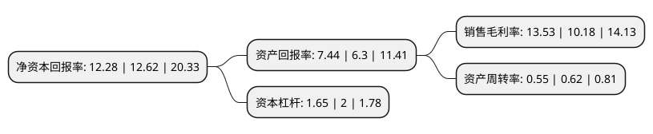

> 本页面由自动化程序生成于 2022年5月20日 01:34
> 内容可能存在错误，如有bug请提交issue至：https://github.com/Eroleice/doc-pi/issues
{.is-warning}

# 上市公司基本情况

## 基本资料

三祥新材股份有限公司（以下简称“三祥新材”）成立于1991年08月24日，宁德市。于2016年08月01日在上交所主板上市。

三祥新材注册资本21,495.216万元，主营业务:一直专注于电熔氧化锆，铸造改性材料等工业新材料的研发，生产和销售。公司主要产品一直是电熔氧化锆产品与铸造改性材料系列产品。以下是详细信息：

- 公司名称: 三祥新材股份有限公司
- 股票代码: 603663.SH
- 所在地: 福建 - 宁德市
- 成立日期: 1991年08月24日
- 注册资本: 21,495.216万元
- 法定代表人: 夏鹏
- 主营业务: 主营业务:一直专注于电熔氧化锆，铸造改性材料等工业新材料的研发，生产和销售公司主要产品一直是电熔氧化锆产品与铸造改性材料系列产品
- 公司官网: www.fjsx.com
- 公司介绍: 公司创办于1988年，于2012年3月由“福建三祥工业新材料有限公司”整体变更而成，系高新技术企业。公司成立多年来，一直坚持节能环保的绿色经营理念，依法诚信经营，专注于新材料的研发、生产和销售。主要生产电熔氧化锆、铸造改性材料、单晶电熔铝高级研磨材料三大系列产品100多个品种，产品广泛应用于航天、军工、耐火耐磨材料、陶瓷色釉料、核级锆材、先进陶瓷、铸造、高端磨料磨具等行业，业务遍及30多个国家和地区，其中电熔氧化锆提纯技术和单晶电熔铝晶粒控制比率全球领先。

## 股东及高管情况

上市公司第一大股东为日本永翔贸易株式会社，持股43,399,660股，占比20.19%，**疑似为**上市公司实际控制人。

截至2022年04月28日，上市公司的前十大股东中，共有1名自然人股东，5名机构股东，2个产品账户，2名其他股东，其中5%以上大股东共有5名。上市公司前十大股东明细如下：

> 未能通过持股比例判定出上市公司实际控制人（持股30%以上）
> 可能存在通过间接持股、联合持股、协议控制等方式拥有实际控制权的主体，具体请参考上市公司定期公告！
{.is-warning}

> 截至2022年04月28日，上市公司前十大股东信息如下：

| 股东名称 | 持股数量（股） | 持股比例 |
| --- | --- | --- |
| 日本永翔贸易株式会社 | 43,399,660 | 20.19% |
| 宁德市汇阜投资有限公司 | 35,643,651 | 16.58% |
| 宁德市汇阜投资有限公司 | 35,643,651 | 16.58% |
| 宁德市汇和投资有限公司 | 34,328,560 | 15.97% |
| 宁德市汇和投资有限公司 | 34,328,560 | 15.97% |
| 寿宁县汇祥投资有限公司 | 5,349,705 | 2.49% |
| 日本旭硝子工业陶瓷株式会社 | 4,344,480 | 2.02% |
| 夏鹏 | 3,872,891 | 1.8% |
| 上海盘京投资管理中心(有限合伙)-盛信2期私募证券投资基金 | 3,477,547 | 1.62% |
| 上海盘京投资管理中心(有限合伙)-盛信1期私募证券投资基金主基金 | 2,183,557 | 1.02% |

## 利润表分析

上市公司2021年总收入为7.89亿元，净利润为1.06亿元，实现盈利。

## 杜邦分析

> 数据列示周期：2021年 | 2020年 | 2019年
{.is-info}

上市公司的净资产收益率在近一年有所下降，下降幅度为-2.69%，其变化情况分解如下：
- 上市公司的销售毛利率在近一年上升了32.91%，可能是生产效率的提升、商品原材料价格下跌或商品价格的上涨所致。
- 上市公司的资产周转率在近一年下降了-11.29%，可能是源自于更慢的销售回款或库存管理效果下降。
- 上市公司的财务杠杆比率在近一年下降了-17.5%，可能是减少负债降低财务费用。

