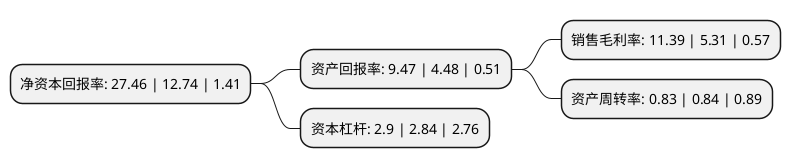

> 本页面由自动化程序生成于 2022年5月20日 01:35
> 内容可能存在错误，如有bug请提交issue至：https://github.com/Eroleice/doc-pi/issues
{.is-warning}

# 上市公司基本情况

## 基本资料

浙江华友钴业股份有限公司（以下简称“华友钴业”）成立于2002年05月22日，嘉兴市。于2015年01月29日在上交所主板上市。

华友钴业注册资本122,139.628万元，主营业务:主要从事钴，铜有色金属采，选，冶及钴新材料产品的深加工与销售。主要产品:公司主导产品为四氧化三钴，氧化钴，碳酸钴，氢氧化钴和硫酸钴等钴产品;由于矿料原料中铜钴伴生的特性及业务拓展原因，公司还生产，销售电积铜，粗铜等铜产品。以下是详细信息：

- 公司名称: 浙江华友钴业股份有限公司
- 股票代码: 603799.SH
- 所在地: 浙江 - 嘉兴市
- 成立日期: 2002年05月22日
- 注册资本: 122,139.628万元
- 法定代表人: 陈雪华
- 主营业务: 主营业务:主要从事钴，铜有色金属采，选，冶及钴新材料产品的深加工与销售主要产品:公司主导产品为四氧化三钴，氧化钴，碳酸钴，氢氧化钴和硫酸钴等钴产品;由于矿料原料中铜钴伴生的特性及业务拓展原因，公司还生产，销售电积铜，粗铜等铜产品
- 公司官网: www.huayou.com
- 公司介绍: 公司是一家专注于钴、铜有色金属冶炼及钴新材料产品深加工的高新技术企业，产品主要用于锂离子电池正极材料、航空航天高温合金、硬质合金、色釉料、磁性材料、橡胶粘合剂和石化催化剂等领域。公司始终坚持科技创新和科学管理。在钴铜湿法工艺、钴新材料、环境保护领域拥有了中国一流的自主核心技术，通过了ISO9000、ISO14000、OHSAS18000、GB/T19022和GB/T15496管理体系的认证，为公司做强做大钴产业提供了坚实保障。公司经过十多年的发展积淀，完成了总部在桐乡、资源保障在非洲、制造基地在衢州、市场在全球的空间布局。形成了自有矿产资源为保障，钴新材料为核心，铜、镍产品为辅助，集采、选、冶、新材料深加工于一体的纵向一体化产业结构。

## 股东及高管情况

上市公司第一大股东为浙江华友控股集团有限公司，持股200,241,513股，占比16.39%，**疑似为**上市公司实际控制人。

截至2022年03月31日，上市公司的前十大股东中，共有1名自然人股东，4名机构股东，4个产品账户，1个海外主体，其中5%以上大股东共有2名。上市公司前十大股东明细如下：

> 未能通过持股比例判定出上市公司实际控制人（持股30%以上）
> 可能存在通过间接持股、联合持股、协议控制等方式拥有实际控制权的主体，具体请参考上市公司定期公告！
{.is-warning}

> 截至2022年03月31日，上市公司前十大股东信息如下：

| 股东名称 | 持股数量（股） | 持股比例 |
| --- | --- | --- |
| 浙江华友控股集团有限公司 | 200,241,513 | 16.39% |
| 陈雪华 | 84,620,355 | 6.93% |
| 杭州佑友企业管理合伙企业(有限合伙) | 60,243,710 | 4.93% |
| 香港中央结算有限公司(陆股通) | 49,897,550 | 4.09% |
| 信达资本管理有限公司-芜湖信达新能一号投资合伙企业(有限合伙) | 18,207,918 | 1.49% |
| 中国建设银行股份有限公司-华夏能源革新股票型证券投资基金 | 17,201,711 | 1.41% |
| 中国邮政储蓄银行有限责任公司-东方增长中小盘混合型开放式证券投资基金 | 8,464,096 | 0.69% |
| 中国工商银行股份有限公司-汇添富中证新能源汽车产业指数型发起式证券投资基金(LOF) | 7,341,455 | 0.6% |
| 招商银行股份有限公司-兴全合泰混合型证券投资基金 | 7,193,795 | 0.59% |
| 桐乡华幸贸易有限公司 | 6,952,700 | 0.57% |

## 利润表分析

上市公司2021年总收入为353.16亿元，净利润为40.23亿元，实现盈利。

## 杜邦分析

> 数据列示周期：2021年 | 2020年 | 2019年
{.is-info}

上市公司的净资产收益率在近一年有所上升，上升幅度为115.54%，其变化情况分解如下：
- 上市公司的销售毛利率在近一年上升了114.5%，可能是生产效率的提升、商品原材料价格下跌或商品价格的上涨所致。
- 上市公司的资产周转率在近一年下降了-1.19%，可能是源自于更慢的销售回款或库存管理效果下降。
- 上市公司的财务杠杆比率在近一年上升了2.11%，可能是增加负债扩大生产规模。

