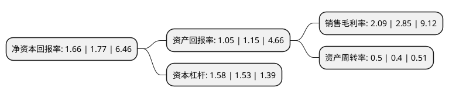

> 本页面由自动化程序生成于 2022年5月20日 01:36
> 内容可能存在错误，如有bug请提交issue至：https://github.com/Eroleice/doc-pi/issues
{.is-warning}

# 上市公司基本情况

## 基本资料

深圳市新星轻合金材料股份有限公司（以下简称“深圳新星”）成立于1992年07月23日，深圳市。于2017年08月07日在上交所主板上市。

深圳新星注册资本16,593.948万元，主要从事铝晶粒细化剂的研发，生产和销售。铝晶粒细化剂作为重要添加剂，广泛应用于航空航天，轨道交通，军工，航海，建筑，机械制造，化学工业等各种领域用的铝材制造加工。以下是详细信息：

- 公司名称: 深圳市新星轻合金材料股份有限公司
- 股票代码: 603978.SH
- 所在地: 广东 - 深圳市
- 成立日期: 1992年07月23日
- 注册资本: 16,593.948万元
- 法定代表人: 陈学敏
- 主营业务: 主要从事铝晶粒细化剂的研发，生产和销售铝晶粒细化剂作为重要添加剂，广泛应用于航空航天，轨道交通，军工，航海，建筑，机械制造，化学工业等各种领域用的铝材制造加工
- 公司官网: www.stalloys.com
- 公司介绍: 公司主要从事铝晶粒细化剂的研发、生产和销售。铝晶粒细化剂作为重要添加剂，广泛应用于航空航天、轨道交通、军工、航海、建筑、机械制造、化学工业等各种领域用的铝材制造加工。通过添加细化铝坯锭结晶颗粒，可以确保加工成型后的铝材具有良好的塑性、强度和韧性。公司生产的高性能母铝合金是改变铝材组织结构、提升待加工铝材塑性和强度的母体合金，是目前世界上改变和提升铝合金材料性能最好的母体合金。公司生产的钛基合金是国家重要战略物资，广泛应用于军工、航空、航天、航海、轨道交通等高尖端领域，是我国大型军工企业必须的轻质合金材料。公司生产的铝电解节能新材料是一种提高铝电解电流效率、降低电解温度、降低铝电解电耗的新型节能材料。

## 股东及高管情况

上市公司第一大股东为陈学敏，持股43,409,400股，占比26.16%，**疑似为**上市公司实际控制人。

截至2022年03月31日，上市公司的前十大股东中，共有3名自然人股东，3名机构股东，4个产品账户，其中5%以上大股东共有3名。上市公司前十大股东明细如下：

> 未能通过持股比例判定出上市公司实际控制人（持股30%以上）
> 可能存在通过间接持股、联合持股、协议控制等方式拥有实际控制权的主体，具体请参考上市公司定期公告！
{.is-warning}

> 截至2022年03月31日，上市公司前十大股东信息如下：

| 股东名称 | 持股数量（股） | 持股比例 |
| --- | --- | --- |
| 陈学敏 | 43,409,400 | 26.16% |
| 深圳市岩代投资有限公司 | 25,262,280 | 15.22% |
| 深圳市辉科轻金属研发管理有限公司 | 15,206,640 | 9.16% |
| 联领信息技术(深圳)有限公司 | 3,492,760 | 2.1% |
| 深圳综彩投资管理有限公司-综彩1号私募基金 | 2,490,026 | 1.5% |
| 夏勇强 | 2,453,120 | 1.48% |
| 林晓茵 | 2,387,300 | 1.44% |
| 中国建设银行股份有限公司-信达澳银新能源产业股票型证券投资基金 | 1,799,682 | 1.08% |
| 中国工商银行股份有限公司-信达澳银智远三年持有期混合型证券投资基金 | 1,213,401 | 0.73% |
| 北京华鼎新基石股权投资基金(有限合伙) | 1,132,000 | 0.68% |

## 利润表分析

上市公司2021年总收入为13.75亿元，净利润为0.28亿元，实现盈利。

## 杜邦分析

> 数据列示周期：2021年 | 2020年 | 2019年
{.is-info}

上市公司的净资产收益率在近一年有所下降，下降幅度为-6.21%，其变化情况分解如下：
- 上市公司的销售毛利率在近一年下降了-26.67%，可能是生产效率的下降、商品原材料价格上涨或商品价格的下跌所致。
- 上市公司的资产周转率在近一年上升了25%，可能是源自于更快的销售回款或库存管理效果提升。
- 上市公司的财务杠杆比率在近一年上升了3.27%，可能是增加负债扩大生产规模。

