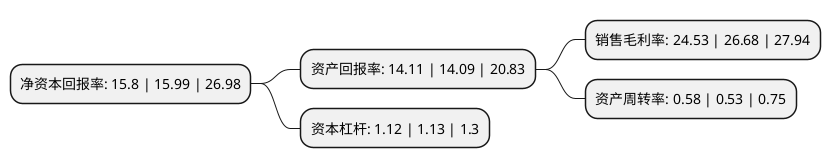

> 本页面由自动化程序生成于 2022年5月20日 01:37
> 内容可能存在错误，如有bug请提交issue至：https://github.com/Eroleice/doc-pi/issues
{.is-warning}

# 上市公司基本情况

## 基本资料

江苏博迁新材料股份有限公司（以下简称“博迁新材”）成立于2010年11月05日，宿迁市。于2020年12月08日在上交所主板上市。

博迁新材注册资本26,160万元，公司的主营业务为电子专用高端金属粉体材料的研发，生产和销售。产品主要包括纳米级，亚微米级镍粉和微米级，亚微米级铜粉，银粉，合金粉。以下是详细信息：

- 公司名称: 江苏博迁新材料股份有限公司
- 股票代码: 605376.SH
- 所在地: 江苏 - 宿迁市
- 成立日期: 2010年11月05日
- 注册资本: 26,160万元
- 法定代表人: 王利平
- 主营业务: 公司的主营业务为电子专用高端金属粉体材料的研发，生产和销售产品主要包括纳米级，亚微米级镍粉和微米级，亚微米级铜粉，银粉，合金粉
- 公司官网: www.boqianpvm.com
- 公司介绍: 公司是国内产业化使用常压下等离子体加热气相冷凝法制备技术生产电子专用高端金属粉体材料的企业，一直致力于电子专用高端金属粉体材料的前瞻性研发和市场化推广，是目前全球领先的实现纳米级电子专用高端金属粉体材料规模化量产及商业销售的企业。公司的主营业务为电子专用高端金属粉体材料的研发、生产和销售。目前公司产品主要包括纳米级、亚微米级镍粉和微米级、亚微米级铜粉、银粉、合金粉。公司产品是电子信息产业的基础材料，主要用于电子元器件制造，其中镍粉、铜粉主要应用于MLCC的生产，并广泛应用到消费电子、汽车电子、通信以及工业自动化、航空航天等其他工业领域当中。自成立以来，公司一直专注于电子专用高端金属粉体材料的研发、生产与销售，拥有物理气相法金属粉体生产线九十余条，并具备完善的质量保障体系。公司于2013年12月通过高新技术企业认证，取得《高新技术企业证书》，并于2016年11月通过高新技术企业认证复审。

## 股东及高管情况

上市公司第一大股东为宁波广弘元创业投资合伙企业(有限合伙)，持股51,553,800股，占比19.71%，**疑似为**上市公司实际控制人。

截至2022年03月31日，上市公司的前十大股东中，共有1名自然人股东，7名机构股东，1个产品账户，1个海外主体，其中5%以上大股东共有5名。上市公司前十大股东明细如下：

> 未能通过持股比例判定出上市公司实际控制人（持股30%以上）
> 可能存在通过间接持股、联合持股、协议控制等方式拥有实际控制权的主体，具体请参考上市公司定期公告！
{.is-warning}

> 截至2022年03月31日，上市公司前十大股东信息如下：

| 股东名称 | 持股数量（股） | 持股比例 |
| --- | --- | --- |
| 宁波广弘元创业投资合伙企业(有限合伙) | 51,553,800 | 19.71% |
| 宁波众智聚成创业投资合伙企业(有限合伙) | 22,029,000 | 8.42% |
| 新辉投资控股有限公司 | 21,768,000 | 8.32% |
| 宁波申扬创业投资合伙企业(有限合伙) | 18,000,000 | 6.88% |
| 陈钢强 | 16,999,200 | 6.5% |
| 雅戈尔投资有限公司 | 7,200,000 | 2.75% |
| 尚融宝盈(宁波)投资中心(有限合伙) | 6,714,000 | 2.57% |
| 招商银行股份有限公司-睿远成长价值混合型证券投资基金 | 6,030,700 | 2.31% |
| 宁波辰智卓新股权投资合伙企业(有限合伙) | 5,239,000 | 2% |
| 香港中央结算有限公司(陆股通) | 5,061,631 | 1.93% |

## 利润表分析

上市公司2021年总收入为9.69亿元，净利润为2.37亿元，实现盈利。

## 杜邦分析

> 数据列示周期：2021年 | 2020年 | 2019年
{.is-info}

上市公司的净资产收益率在近一年有所下降，下降幅度为-1.19%，其变化情况分解如下：
- 上市公司的销售毛利率在近一年下降了-8.06%，可能是生产效率的下降、商品原材料价格上涨或商品价格的下跌所致。
- 上市公司的资产周转率在近一年上升了9.43%，可能是源自于更快的销售回款或库存管理效果提升。
- 上市公司的财务杠杆比率在近一年下降了-0.88%，可能是减少负债降低财务费用。

