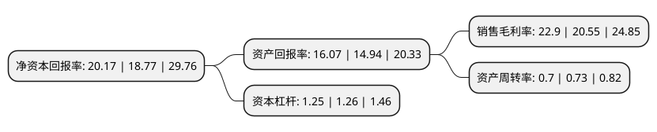

> 本页面由自动化程序生成于 2022年5月20日 01:40
> 内容可能存在错误，如有bug请提交issue至：https://github.com/Eroleice/doc-pi/issues
{.is-warning}

# 上市公司基本情况

## 基本资料

江西悦安新材料股份有限公司（以下简称“悦安新材”）成立于2004年11月10日，赣州市。于2021年08月26日在上交所科创板上市。

悦安新材注册资本8,544.08万元，产品为超细金属粉末及相关深加工制品，主要包括羰基铁粉系列产品，雾化合金粉系列产品，软磁粉系列产品，金属注射成型喂料系列产品，吸波材料系列产品等。主要从事羰基铁粉，雾化合金粉及相关粉体深加工产品的研发，生产与销售。以下是详细信息：

- 公司名称: 江西悦安新材料股份有限公司
- 股票代码: 688786.SH
- 所在地: 江西 - 赣州市
- 成立日期: 2004年11月10日
- 注册资本: 8,544.08万元
- 法定代表人: 李上奎
- 主营业务: 产品为超细金属粉末及相关深加工制品，主要包括羰基铁粉系列产品，雾化合金粉系列产品，软磁粉系列产品，金属注射成型喂料系列产品，吸波材料系列产品等主要从事羰基铁粉，雾化合金粉及相关粉体深加工产品的研发，生产与销售
- 公司官网: www.yueanmetal.com
- 公司介绍: 公司是中国钢结构协会粉末冶金分会理事单位、粉末冶金产业技术创新战略联盟理事单位、中国3D打印技术产业联盟理事单位、中国电子材料行业协会磁性材料分会会员单位、欧洲联盟粉末冶金联合会会员单位。公司一贯重视人才储备、人才梯队培养和团队建设，拥有较强的研发队伍以及快速高效的研发能力，公司2016年即已获得“江西省知识产权优势企业”称号。目前，公司拥有省级企业技术中心和省级羰基金属粉体材料工程研究中心，并先后参与制定了《微米级羰基铁粉》等国家标准。公司的微米级羰基铁粉被评为“江西省自主创新产品”，高压循环法制备羰基铁粉技术荣获江西省科技进步奖三等奖。

## 股东及高管情况

上市公司第一大股东为李上奎，持股22,746,250股，占比26.62%，**疑似为**上市公司实际控制人。

截至2022年03月31日，上市公司的前十大股东中，共有6名自然人股东，3名机构股东，1个产品账户，其中5%以上大股东共有3名。上市公司前十大股东明细如下：

> 未能通过持股比例判定出上市公司实际控制人（持股30%以上）
> 可能存在通过间接持股、联合持股、协议控制等方式拥有实际控制权的主体，具体请参考上市公司定期公告！
{.is-warning}

> 截至2022年03月31日，上市公司前十大股东信息如下：

| 股东名称 | 持股数量（股） | 持股比例 |
| --- | --- | --- |
| 李上奎 | 22,746,250 | 26.62% |
| 于缘宝 | 9,345,000 | 10.94% |
| 赣州瑞和股权投资合伙企业(有限合伙) | 4,600,000 | 5.38% |
| 王兵 | 3,388,125 | 3.97% |
| 吴天娇 | 2,944,500 | 3.45% |
| 李博 | 2,905,000 | 3.4% |
| 赣州岳龙投资有限公司 | 2,905,000 | 3.4% |
| 赣州岳龙企业管理合伙企业(有限合伙) | 2,750,000 | 3.22% |
| 周伟明 | 2,679,375 | 3.14% |
| 江西百富源新材料创业投资基金(有限合伙) | 2,563,100 | 3% |

## 利润表分析

上市公司2021年总收入为4.01亿元，净利润为0.91亿元，实现盈利。

## 杜邦分析

> 数据列示周期：2021年 | 2020年 | 2019年
{.is-info}

上市公司的净资产收益率在近一年有所上升，上升幅度为7.46%，其变化情况分解如下：
- 上市公司的销售毛利率在近一年上升了11.44%，可能是生产效率的提升、商品原材料价格下跌或商品价格的上涨所致。
- 上市公司的资产周转率在近一年下降了-4.11%，可能是源自于更慢的销售回款或库存管理效果下降。
- 上市公司的财务杠杆比率在近一年下降了-0.79%，可能是减少负债降低财务费用。

