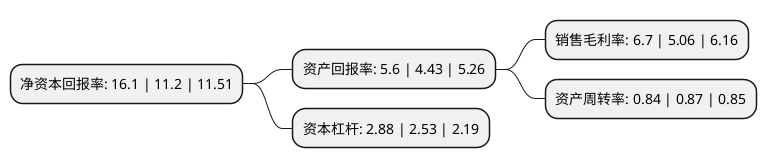

> 本页面由自动化程序生成于 2022年5月20日 01:01
> 内容可能存在错误，如有bug请提交issue至：https://github.com/Eroleice/doc-pi/issues
{.is-warning}

# 上市公司基本情况

## 基本资料

徐工集团工程机械股份有限公司（以下简称“徐工机械”）成立于1993年12月15日，徐州市。于1996年08月28日在深交所主板上市。

徐工机械注册资本783,366.843万元，主要产品:压实机械，铲运机械，路面机械，筑路机械。以下是详细信息：

- 公司名称: 徐工集团工程机械股份有限公司
- 股票代码: 000425.SZ
- 所在地: 江苏 - 徐州市
- 成立日期: 1993年12月15日
- 注册资本: 783,366.843万元
- 法定代表人: 王民
- 主营业务: 主要产品:压实机械，铲运机械，路面机械，筑路机械
- 公司官网: www.xgjx.xcmg.com
- 公司介绍: 公司是集筑路机械、铲运机械、路面机械等工程机械的开发、制造与销售为一体的专业公司，产品品种齐全，主要应用于高速公路、机场港口、铁路桥梁、水电能源设施等基础设施的建设与养护。公司将技术创新融入发展血脉，诞生了一批代表中国乃至全球先进水平的产品。公司主导产品徐工牌装载机获得了“中国名牌产品”称号，徐工牌压路机、装载机荣获“全国用户满意产品”称号。公司大力发展外向型经济，实施以产品出口为支撑的国际化战略，工程机械产品远销欧美、日韩、东南亚、非洲等国际市场。公司先后获得过中国工业领域最高奖“中国工业大奖”和“全国五一劳动奖状”，以及“国家技术中心成就奖”，“国家科学技术进步奖”，“第十四届全国质量奖”，国家首批、江苏省首个“国家技术创新示范企业”，“全国先进基层党组织”和“装备中国功勋企业”等荣誉称号。

## 股东及高管情况

上市公司第一大股东为徐工集团工程机械有限公司，持股2,985,547,134股，占比38.11%，为上市公司实际控制人。

截至2022年03月31日，上市公司的前十大股东中，共有1名自然人股东，8名机构股东，1个海外主体，其中5%以上大股东共有1名。上市公司前十大股东明细如下：

> 截至2022年03月31日，上市公司前十大股东信息如下：

| 股东名称 | 持股数量（股） | 持股比例 |
| --- | --- | --- |
| 徐工集团工程机械有限公司 | 2,985,547,134 | 38.11% |
| 湖州盈灿投资合伙企业(有限合伙) | 367,957,139 | 4.7% |
| 香港中央结算有限公司(陆股通) | 304,901,050 | 3.89% |
| 中国证券金融股份有限公司 | 166,923,243 | 2.13% |
| 珠海融诚投资中心(有限合伙) | 140,102,920 | 1.79% |
| 湖州泰元投资合伙企业(有限合伙) | 138,188,217 | 1.76% |
| 湖州泰熙投资合伙企业(有限合伙) | 67,193,067 | 0.86% |
| 王广鹏 | 26,000,000 | 0.33% |
| 上海杰雍建设咨询有限公司 | 16,660,728 | 0.21% |
| 宁波梅山保税港区融轩股权投资中心(有限合伙) | 16,467,365 | 0.21% |

## 利润表分析

上市公司2021年总收入为843.27亿元，净利润为56.47亿元，实现盈利。

## 杜邦分析

> 数据列示周期：2021年 | 2020年 | 2019年
{.is-info}

上市公司的净资产收益率在近一年有所上升，上升幅度为43.75%，其变化情况分解如下：
- 上市公司的销售毛利率在近一年上升了32.41%，可能是生产效率的提升、商品原材料价格下跌或商品价格的上涨所致。
- 上市公司的资产周转率在近一年下降了-3.45%，可能是源自于更慢的销售回款或库存管理效果下降。
- 上市公司的财务杠杆比率在近一年上升了13.83%，可能是增加负债扩大生产规模。

