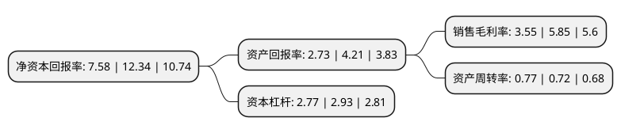

> 本页面由自动化程序生成于 2022年5月20日 01:02
> 内容可能存在错误，如有bug请提交issue至：https://github.com/Eroleice/doc-pi/issues
{.is-warning}

# 上市公司基本情况

## 基本资料

广西柳工机械股份有限公司（以下简称“柳工”）成立于1993年11月08日，柳州市。于1993年11月18日在深交所主板上市。

柳工注册资本195,501.999万元，主营业务:装载机，挖掘机，起重机，压路机，叉车，平地机，推土机，铣刨机，摊铺机，滑移装载机，挖掘装载机，矿用卡车等工程机械及配件的生产，销售，以及融资租赁业务等以下是详细信息：

- 公司名称: 广西柳工机械股份有限公司
- 股票代码: 000528.SZ
- 所在地: 广西 - 柳州市
- 成立日期: 1993年11月08日
- 注册资本: 195,501.999万元
- 法定代表人: 曾光安
- 主营业务: 主营业务:装载机，挖掘机，起重机，压路机，叉车，平地机，推土机，铣刨机，摊铺机，滑移装载机，挖掘装载机，矿用卡车等工程机械及配件的生产，销售，以及融资租赁业务等
- 公司官网: www.liugong.com
- 公司介绍: 公司是从事工程机械研发、生产、销售的行业大型骨干企业，是中国工程机械第一家上市公司。主营业务为工程机械及相关业务。产品有装载机、挖掘机、起重机、压路机、推土机、叉车、平地机、铣刨机、摊铺机、滑移装载机、挖掘装载机、吊管机、矿用卡车等。公司的主导产品为1.5t-10t(额定载重)轮式装载机、0.11-1.2立方米(斗容规格)履带式液压挖掘机、10-25吨(工作质量)压路机，以及全新系列的路面机械产品如沥青摊铺机和平地机，亦可根据用户需求进行工程机械产品及变形产品的设计、生产。公司具有强大的生产各类工程机械整机制造能力，多种型号的产品荣获机械部和国家级多项奖励和荣誉称号。公司近年喜获“全国文明单位”荣誉等称号。

## 股东及高管情况

上市公司第一大股东为广西柳工集团有限公司，持股505,809,038股，占比25.87%，**疑似为**上市公司实际控制人。

截至2022年03月31日，上市公司的前十大股东中，共有5名机构股东，4个产品账户，1个海外主体，其中5%以上大股东共有3名。上市公司前十大股东明细如下：

> 未能通过持股比例判定出上市公司实际控制人（持股30%以上）
> 可能存在通过间接持股、联合持股、协议控制等方式拥有实际控制权的主体，具体请参考上市公司定期公告！
{.is-warning}

> 截至2022年03月31日，上市公司前十大股东信息如下：

| 股东名称 | 持股数量（股） | 持股比例 |
| --- | --- | --- |
| 广西柳工集团有限公司 | 505,809,038 | 25.87% |
| 广西招工服贸投资合伙企业(有限合伙) | 150,867,425 | 7.72% |
| 国新双百壹号(杭州)股权投资合伙企业(有限合伙) | 99,845,895 | 5.11% |
| 香港中央结算有限公司(陆股通) | 62,372,049 | 3.19% |
| 国家制造业转型升级基金股份有限公司 | 54,084,549 | 2.77% |
| 工银资本管理有限公司-北京诚通工银股权投资基金(有限合伙) | 51,949,632 | 2.66% |
| 建信金融资产投资有限公司 | 49,814,716 | 2.55% |
| 广西宏桂汇智基金管理有限公司-广西国有企业改革发展一期基金合伙企业(有限合伙) | 43,409,966 | 2.22% |
| 常州嘉佑企业管理合伙企业(有限合伙) | 31,731,224 | 1.62% |
| 广发基金-农业银行-广发中证金融资产管理计划 | 9,095,060 | 0.47% |

## 利润表分析

上市公司2021年总收入为287亿元，净利润为10.17亿元，实现盈利。

## 杜邦分析

> 数据列示周期：2021年 | 2020年 | 2019年
{.is-info}

上市公司的净资产收益率在近一年有所下降，下降幅度为-38.57%，其变化情况分解如下：
- 上市公司的销售毛利率在近一年下降了-39.32%，可能是生产效率的下降、商品原材料价格上涨或商品价格的下跌所致。
- 上市公司的资产周转率在近一年上升了6.94%，可能是源自于更快的销售回款或库存管理效果提升。
- 上市公司的财务杠杆比率在近一年下降了-5.46%，可能是减少负债降低财务费用。

