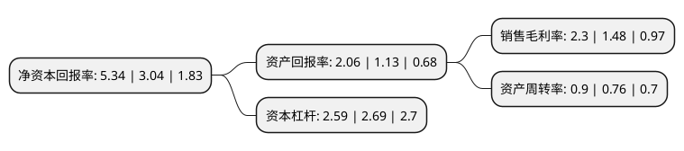

> 本页面由自动化程序生成于 2022年5月20日 01:03
> 内容可能存在错误，如有bug请提交issue至：https://github.com/Eroleice/doc-pi/issues
{.is-warning}

# 上市公司基本情况

## 基本资料

山推工程机械股份有限公司（以下简称“山推股份”）成立于1993年12月14日，济宁市。于1997年01月22日在深交所主板上市。

山推股份注册资本150,185.321万元，主要产品:推土机，挖掘机，压路机，配件。以下是详细信息：

- 公司名称: 山推工程机械股份有限公司
- 股票代码: 000680.SZ
- 所在地: 山东 - 济宁市
- 成立日期: 1993年12月14日
- 注册资本: 150,185.321万元
- 法定代表人: 刘会胜
- 主营业务: 主要产品:推土机，挖掘机，压路机，配件
- 公司官网: www.shantui.com
- 公司介绍: 公司是中国生产、销售铲土运输机械、压实机械、路面机械、建筑机械、工程起重机械等主机及工程机械关键零部件的国家大型一类骨干企业。公司始终以科技创新实现可持续发展。研发能力、制造能力、产品质量均处于国内领先和贴近国际先进水平。拥有国家级技术中心、山东省工程技术研究中心和博士后科研工作站等创新平台。以智能制造为核心，推进信息技术与工业化深度融合。已覆盖推土机系列、道路机械系列、混凝土机械系列、装载机系列、挖掘机系列等多类主机产品和底盘件、传动部件、结构件、铸造件、液压油缸等工程机械配套件。公司是中国机械工业效益百强企业、国家“一级”安全质量标准化企业、山东省高新技术企业、山东省制造业信息化示范企业，山东省企业文化建设示范单位。公司通过ISO14001环境管理体系认证、ISO9001质量体系认证，主要产品通过CE认证和EPA认证，部分产品通过TUV认证。

## 股东及高管情况

上市公司第一大股东为山东重工集团有限公司，持股364,399,684股，占比24.26%，**疑似为**上市公司实际控制人。

截至2022年03月31日，上市公司的前十大股东中，共有5名自然人股东，2名机构股东，2个产品账户，1个海外主体，其中5%以上大股东共有2名。上市公司前十大股东明细如下：

> 未能通过持股比例判定出上市公司实际控制人（持股30%以上）
> 可能存在通过间接持股、联合持股、协议控制等方式拥有实际控制权的主体，具体请参考上市公司定期公告！
{.is-warning}

> 截至2022年03月31日，上市公司前十大股东信息如下：

| 股东名称 | 持股数量（股） | 持股比例 |
| --- | --- | --- |
| 山东重工集团有限公司 | 364,399,684 | 24.26% |
| 潍柴动力股份有限公司 | 236,705,601 | 15.76% |
| 香港中央结算有限公司(陆股通) | 9,605,831 | 0.64% |
| 李彧 | 7,099,971 | 0.47% |
| 东莞市万葵资产管理有限公司-万葵稳健18号私募证券投资基金 | 4,400,000 | 0.29% |
| 陈初文 | 2,700,000 | 0.18% |
| 邴建林 | 2,488,800 | 0.17% |
| 赵焕刚 | 2,437,000 | 0.16% |
| 江苏银创资本管理有限公司-银创混合策略7号私募证券投资基金 | 2,080,000 | 0.14% |
| 谢奇 | 2,076,500 | 0.14% |

## 利润表分析

上市公司2021年总收入为91.59亿元，净利润为2.1亿元，实现盈利。

## 杜邦分析

> 数据列示周期：2021年 | 2020年 | 2019年
{.is-info}

上市公司的净资产收益率在近一年有所上升，上升幅度为75.66%，其变化情况分解如下：
- 上市公司的销售毛利率在近一年上升了55.41%，可能是生产效率的提升、商品原材料价格下跌或商品价格的上涨所致。
- 上市公司的资产周转率在近一年上升了18.42%，可能是源自于更快的销售回款或库存管理效果提升。
- 上市公司的财务杠杆比率在近一年下降了-3.72%，可能是减少负债降低财务费用。

