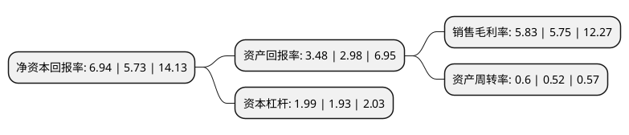

> 本页面由自动化程序生成于 2022年5月20日 01:03
> 内容可能存在错误，如有bug请提交issue至：https://github.com/Eroleice/doc-pi/issues
{.is-warning}

# 上市公司基本情况

## 基本资料

冰轮环境技术股份有限公司（以下简称“冰轮环境”）成立于1989年05月18日，烟台市。于1998年05月28日在深交所主板上市。

冰轮环境注册资本74,583.78万元，主要业务:工商制冷空调设备制造，工程设计，安装调试，技术咨询服务。以下是详细信息：

- 公司名称: 冰轮环境技术股份有限公司
- 股票代码: 000811.SZ
- 所在地: 山东 - 烟台市
- 成立日期: 1989年05月18日
- 注册资本: 74,583.78万元
- 法定代表人: 李增群
- 主营业务: 工商制冷空调设备制造，工程设计，安装调试，技术咨询服务
- 公司官网: www.moon-tech.com
- 公司介绍: 公司致力于在气温控制领域为客户提供系统解决方案，主要从事低温冷冻设备、中央空调设备、节能制热设备及应用系统集成、工程成套服务，广泛服务于食品冷链、物流、石化、医药、能源、轨道交通等城市公用设施等行业。公司是中国机械工业百家最大企业、最佳经济效益企业、核心竞争力30佳企业之一；主导产品螺杆压缩机获得国家科技进步二等奖，并荣膺首批中国名牌产品称号；冰轮商标被认定为中国驰名商标；“冰轮”品牌入选商务部首批最具市场竞争力品牌。

## 股东及高管情况

上市公司第一大股东为烟台冰轮控股有限公司，持股102,790,679股，占比13.78%，**疑似为**上市公司实际控制人。

截至2022年03月31日，上市公司的前十大股东中，共有1名自然人股东，4名机构股东，5个产品账户，其中5%以上大股东共有4名。上市公司前十大股东明细如下：

> 未能通过持股比例判定出上市公司实际控制人（持股30%以上）
> 可能存在通过间接持股、联合持股、协议控制等方式拥有实际控制权的主体，具体请参考上市公司定期公告！
{.is-warning}

> 截至2022年03月31日，上市公司前十大股东信息如下：

| 股东名称 | 持股数量（股） | 持股比例 |
| --- | --- | --- |
| 烟台冰轮控股有限公司 | 102,790,679 | 13.78% |
| 烟台冰轮投资有限公司 | 94,883,703 | 12.72% |
| 烟台国盛投资控股有限公司 | 71,386,983 | 9.57% |
| 红塔创新投资股份有限公司 | 40,720,000 | 5.46% |
| 中国农业银行股份有限公司-大成新锐产业混合型证券投资基金 | 13,265,433 | 1.78% |
| 广发证券股份有限公司-大成睿景灵活配置混合型证券投资基金 | 8,129,418 | 1.09% |
| 朱雀基金-陕西煤业股份有限公司-陕煤朱雀新材料产业2期单一资产管理计划 | 7,333,200 | 0.98% |
| 全国社保基金一一二组合 | 5,723,899 | 0.77% |
| 中国银行股份有限公司-大成景气精选六个月持有期混合型证券投资基金 | 5,442,971 | 0.73% |
| 孙根 | 5,212,363 | 0.7% |

## 利润表分析

上市公司2021年总收入为53.83亿元，净利润为3.14亿元，实现盈利。

## 杜邦分析

> 数据列示周期：2021年 | 2020年 | 2019年
{.is-info}

上市公司的净资产收益率在近一年有所上升，上升幅度为21.12%，其变化情况分解如下：
- 上市公司的销售毛利率在近一年上升了1.39%，可能是生产效率的提升、商品原材料价格下跌或商品价格的上涨所致。
- 上市公司的资产周转率在近一年上升了15.38%，可能是源自于更快的销售回款或库存管理效果提升。
- 上市公司的财务杠杆比率在近一年上升了3.11%，可能是增加负债扩大生产规模。

