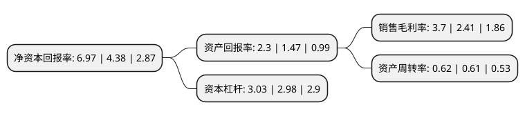

> 本页面由自动化程序生成于 2022年5月20日 01:05
> 内容可能存在错误，如有bug请提交issue至：https://github.com/Eroleice/doc-pi/issues
{.is-warning}

# 上市公司基本情况

## 基本资料

天奇自动化工程股份有限公司（以下简称“天奇股份”）成立于1997年11月18日，无锡市。于2004年06月29日在深交所中小板上市。

天奇股份注册资本37,929.943万元，自动化输送，仓储系统工程以下是详细信息：

- 公司名称: 天奇自动化工程股份有限公司
- 股票代码: 002009.SZ
- 所在地: 江苏 - 无锡市
- 成立日期: 1997年11月18日
- 注册资本: 37,929.943万元
- 法定代表人: 黄斌
- 主营业务: 自动化输送，仓储系统工程
- 公司官网: www.chinaconveyor.com
- 公司介绍: 公司是一家致力于为规模化产品的全生命周期提供智能化装备解决方案及服务的企业。公司产品涉及汽车总装物流自动化系统、汽车焊装物流自动化系统、车身储存物流自动化系统、汽车涂装物流自动化系统、基于工业4.0技术的远程诊断技术的智能装备系统等。产品技术还涉及内燃机制造、轮胎制造、机床制造、家电、冶金等行业。公司是国家级高新技术企业、国家知识产权试点单位，在全国拥有数十家分支机构，并建有国家级企业技术中心，是全球现代制造业物流自动化技术装备知名供应商。

## 股东及高管情况

上市公司第一大股东为黄伟兴，持股62,389,317股，占比16.45%，**疑似为**上市公司实际控制人。

截至2022年03月31日，上市公司的前十大股东中，共有3名自然人股东，2名机构股东，5个产品账户，其中5%以上大股东共有2名。上市公司前十大股东明细如下：

> 未能通过持股比例判定出上市公司实际控制人（持股30%以上）
> 可能存在通过间接持股、联合持股、协议控制等方式拥有实际控制权的主体，具体请参考上市公司定期公告！
{.is-warning}

> 截至2022年03月31日，上市公司前十大股东信息如下：

| 股东名称 | 持股数量（股） | 持股比例 |
| --- | --- | --- |
| 黄伟兴 | 62,389,317 | 16.45% |
| 无锡天奇投资控股有限公司 | 42,465,172 | 11.2% |
| 中国银行股份有限公司-国投瑞银新能源混合型证券投资基金 | 5,120,719 | 1.35% |
| 白开军 | 5,013,252 | 1.32% |
| 中国工商银行股份有限公司-华安安康灵活配置混合型证券投资基金 | 4,911,401 | 1.29% |
| 无锡威孚高科技集团股份有限公司 | 4,710,000 | 1.24% |
| 程永峰 | 4,296,355 | 1.13% |
| 中国建设银行股份有限公司-国投瑞银先进制造混合型证券投资基金 | 4,033,000 | 1.06% |
| 太平人寿保险有限公司-传统-普通保险产品-022L-CT001深 | 3,800,000 | 1% |
| 中国银行股份有限公司-国投瑞银产业趋势混合型证券投资基金 | 3,783,300 | 1% |

## 杜邦分析

> 数据列示周期：2021年 | 2020年 | 2019年
{.is-info}

上市公司的净资产收益率在近一年有所上升，上升幅度为59.13%，其变化情况分解如下：
- 上市公司的销售毛利率在近一年上升了53.53%，可能是生产效率的提升、商品原材料价格下跌或商品价格的上涨所致。
- 上市公司的资产周转率在近一年上升了1.64%，可能是源自于更快的销售回款或库存管理效果提升。
- 上市公司的财务杠杆比率在近一年上升了1.68%，可能是增加负债扩大生产规模。

