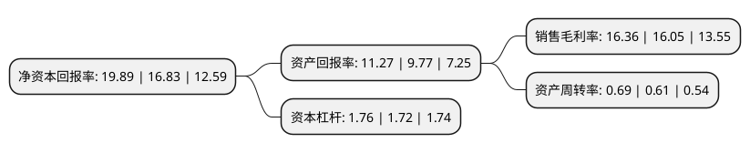

> 本页面由自动化程序生成于 2022年5月20日 01:06
> 内容可能存在错误，如有bug请提交issue至：https://github.com/Eroleice/doc-pi/issues
{.is-warning}

# 上市公司基本情况

## 基本资料

上海汉钟精机股份有限公司（以下简称“汉钟精机”）成立于1998年01月07日，上海市。于2007年08月17日在深交所中小板上市。

汉钟精机注册资本53,472.414万元，主营业务为从事螺杆式压缩机应用技术的研制开发，生产销售及售后服务，主要产品有螺杆式制冷压缩机和螺杆式空气压缩机。以下是详细信息：

- 公司名称: 上海汉钟精机股份有限公司
- 股票代码: 002158.SZ
- 所在地: 上海 - 上海市
- 成立日期: 1998年01月07日
- 注册资本: 53,472.414万元
- 法定代表人: 余昱暄
- 主营业务: 主营业务为从事螺杆式压缩机应用技术的研制开发，生产销售及售后服务，主要产品有螺杆式制冷压缩机和螺杆式空气压缩机
- 公司官网: www.hanbell.com.cn
- 公司介绍: 公司专门从事螺杆式压缩机相应技术的研制开发、生产销售及售后服务，主要产品有螺杆式制冷压缩机和螺杆式空气压缩机，其中螺杆式制冷压缩机主要应用于制冷工业中的大型商用中央空调设备和冷冻冷藏设备，螺杆式空气压缩机主要应用在工业自动化领域。经过多年的发展，已成为集压缩机的设计研发、生产制造、品质保证、销售服务各系统于一体的，在中国大陆颇有实力的压缩机生产厂家。公司经过多年的发展，在螺杆式压缩机领域拥有雄厚的技术实力。公司将螺杆式压缩技术应用于不同的工作工质，如空气、真空、制冷剂、特殊气体等，成为全球应用工质最多的螺杆式压缩机生产企业之一。

## 股东及高管情况

上市公司第一大股东为巴拿马海尔梅斯公司，持股174,857,799股，占比32.7%，为上市公司实际控制人。

截至2022年03月31日，上市公司的前十大股东中，共有1名自然人股东，1名机构股东，6个产品账户，2个海外主体，其中5%以上大股东共有2名。上市公司前十大股东明细如下：

> 截至2022年03月31日，上市公司前十大股东信息如下：

| 股东名称 | 持股数量（股） | 持股比例 |
| --- | --- | --- |
| 巴拿马海尔梅斯公司 | 174,857,799 | 32.7% |
| CAPITAL HARVEST TECHNOLOGY LIMITED | 153,119,691 | 28.64% |
| 香港中央结算有限公司(陆股通) | 10,820,336 | 2.02% |
| 中国光大银行股份有限公司-兴全商业模式优选混合型证券投资基金(LOF) | 10,553,576 | 1.97% |
| 中国工商银行股份有限公司-富国天惠精选成长混合型证券投资基金(LOF) | 5,305,800 | 0.99% |
| 道明资产管理有限公司-道明中国收入成长基金(交易所) | 4,212,000 | 0.79% |
| 中金公司-建设银行-中金新锐股票型集合资产管理计划 | 2,536,324 | 0.47% |
| 傅丽真 | 2,489,972 | 0.47% |
| 中信证券股份有限公司-社保基金1106组合 | 2,317,053 | 0.43% |
| 中国工商银行股份有限公司-富国稳健增强债券型证券投资基金 | 1,603,716 | 0.3% |

## 利润表分析

上市公司2021年总收入为29.81亿元，净利润为4.87亿元，实现盈利。

## 杜邦分析

> 数据列示周期：2021年 | 2020年 | 2019年
{.is-info}

上市公司的净资产收益率在近一年有所上升，上升幅度为18.18%，其变化情况分解如下：
- 上市公司的销售毛利率在近一年上升了1.93%，可能是生产效率的提升、商品原材料价格下跌或商品价格的上涨所致。
- 上市公司的资产周转率在近一年上升了13.11%，可能是源自于更快的销售回款或库存管理效果提升。
- 上市公司的财务杠杆比率在近一年上升了2.33%，可能是增加负债扩大生产规模。

