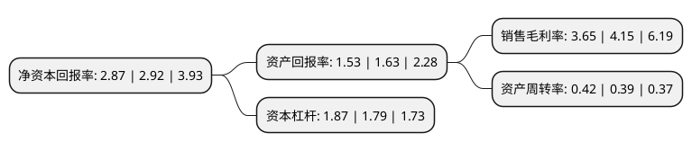

> 本页面由自动化程序生成于 2022年5月20日 01:09
> 内容可能存在错误，如有bug请提交issue至：https://github.com/Eroleice/doc-pi/issues
{.is-warning}

# 上市公司基本情况

## 基本资料

株洲天桥起重机股份有限公司（以下简称“天桥起重”）成立于1999年11月26日，株洲市。于2010年12月10日在深交所中小板上市。

天桥起重注册资本141,664.08万元，主要从事各种起重设备的研发，制造和销售;主导产品为钢铁冶炼和铝冶炼专用起重设备。以下是详细信息：

- 公司名称: 株洲天桥起重机股份有限公司
- 股票代码: 002523.SZ
- 所在地: 湖南 - 株洲市
- 成立日期: 1999年11月26日
- 注册资本: 141,664.08万元
- 法定代表人: 龙九文
- 主营业务: 主要从事各种起重设备的研发，制造和销售;主导产品为钢铁冶炼和铝冶炼专用起重设备
- 公司官网: www.tqcc.cn
- 公司介绍: 公司是一家业务范围涵盖物料搬运装备、有色冶炼智能装备、选煤机械等于一体的企业集团。在机遇与挑战共存的市场背景下，公司强练内功，以“产品、质量、效益”为核心，整合公司、子公司各业务板块的优势资源，致力为客户提供物料搬运装备、有色冶炼智能装备、选煤机械研发、设计、制造、销售、维保等整体解决方案，公司产品的销售市场和工业服务范围覆盖亚洲、欧洲、美洲和非洲等多个国家和地区。2014年以来，公司先后切入风能发电和新能源电动汽车领域，逐步实现公司业务的横向拓展和产业的升级转型，为公司在新经济、新常态下的发展注入了新活力。面向未来，公司将以高擎中国重装先进制造的旗帜为己任，秉承“诚信、敬业、自强、卓越”的企业精神，坚持“顾客至上、诚信为本、规范管理、精心运作、持续改进、开拓创新”的质量方针，突出创新驱动，加快智能化、信息化融合，实现从产品输出向技术输出的转变，努力把公司打造成为以物料搬运装备为核心的重装高端智能装备系统解决方案最值信赖的供应商。

## 股东及高管情况

上市公司第一大股东为株洲市国有资产投资控股集团有限公司，持股341,071,926股，占比24.08%，**疑似为**上市公司实际控制人。

截至2022年03月31日，上市公司的前十大股东中，共有6名自然人股东，4名机构股东，其中5%以上大股东共有1名。上市公司前十大股东明细如下：

> 未能通过持股比例判定出上市公司实际控制人（持股30%以上）
> 可能存在通过间接持股、联合持股、协议控制等方式拥有实际控制权的主体，具体请参考上市公司定期公告！
{.is-warning}

> 截至2022年03月31日，上市公司前十大股东信息如下：

| 股东名称 | 持股数量（股） | 持股比例 |
| --- | --- | --- |
| 株洲市国有资产投资控股集团有限公司 | 341,071,926 | 24.08% |
| 中车产业投资有限公司 | 70,832,040 | 5% |
| 中铝国际工程股份有限公司 | 53,866,933 | 3.8% |
| 华电电力科学研究院有限公司 | 47,144,362 | 3.33% |
| 高健 | 30,606,486 | 2.16% |
| 刘建胜 | 15,416,810 | 1.09% |
| 成固平 | 14,553,945 | 1.03% |
| 张素芬 | 13,920,000 | 0.98% |
| 邓乐安 | 13,785,864 | 0.97% |
| 付绍敏 | 12,284,060 | 0.87% |

## 利润表分析

上市公司2021年总收入为17.74亿元，净利润为0.64亿元，实现盈利。

## 杜邦分析

> 数据列示周期：2021年 | 2020年 | 2019年
{.is-info}

上市公司的净资产收益率在近一年有所下降，下降幅度为-1.71%，其变化情况分解如下：
- 上市公司的销售毛利率在近一年下降了-12.05%，可能是生产效率的下降、商品原材料价格上涨或商品价格的下跌所致。
- 上市公司的资产周转率在近一年上升了7.69%，可能是源自于更快的销售回款或库存管理效果提升。
- 上市公司的财务杠杆比率在近一年上升了4.47%，可能是增加负债扩大生产规模。

