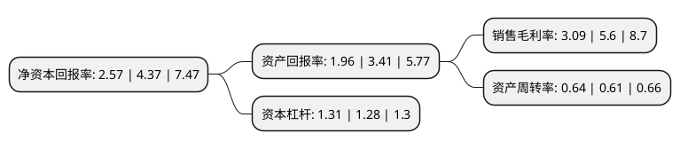

> 本页面由自动化程序生成于 2022年5月20日 01:09
> 内容可能存在错误，如有bug请提交issue至：https://github.com/Eroleice/doc-pi/issues
{.is-warning}

# 上市公司基本情况

## 基本资料

山东矿机集团股份有限公司（以下简称“山东矿机”）成立于1999年12月03日，潍坊市。于2010年12月17日在深交所中小板上市。

山东矿机注册资本178,279.384万元，主营业务为煤机生产，煤炭销售及采煤服务和网络游戏及互联网服务。以下是详细信息：

- 公司名称: 山东矿机集团股份有限公司
- 股票代码: 002526.SZ
- 所在地: 山东 - 潍坊市
- 成立日期: 1999年12月03日
- 注册资本: 178,279.384万元
- 法定代表人: 赵华涛
- 主营业务: 主营业务为煤机生产，煤炭销售及采煤服务和网络游戏及互联网服务
- 公司官网: www.sdkjjt.com
- 公司介绍: 公司是我国煤炭机械制造业骨干企业，在山东省煤炭机械工程技术研究中心，企业规模、市场占有率、产品技术水平均处于行业领先地位。公司主营业务为煤炭机械设备开发、生产、销售及服务和网络游戏及互联网服务。公司下设四大业务板块，分别是以煤矿综采成套设备及配件产品为主的煤机制造板块；以北京麟游互动科技有限公司为主的游戏运营板块；以榆林市天宁矿业服务有限公司为主的采煤服务板块；及以无人机、航空发动机、建材机械、包装机械为主的智能制造板块。实现了传统业务与新兴业务的多元化经营战略布局。公司具有独立的进出口经营自主权，产品出口越南、土耳其、马来西亚、俄罗斯等国家。企业获得ISO9001：2008标准质量管理体系认证，是山东省高新技术企业，并具有自营进出口权,主导产品全部具有国家安监局颁发的煤矿安全标志证书，荣获“中国煤炭工业协会AAA级信用企业”、“全国煤炭机械工业优秀企业”、“全国煤炭机械工业双十佳企业”等等荣誉称号。

## 股东及高管情况

上市公司第一大股东为赵笃学，持股370,632,922股，占比20.79%，**疑似为**上市公司实际控制人。

截至2022年03月31日，上市公司的前十大股东中，共有9名自然人股东，1名机构股东，其中5%以上大股东共有1名。上市公司前十大股东明细如下：

> 未能通过持股比例判定出上市公司实际控制人（持股30%以上）
> 可能存在通过间接持股、联合持股、协议控制等方式拥有实际控制权的主体，具体请参考上市公司定期公告！
{.is-warning}

> 截至2022年03月31日，上市公司前十大股东信息如下：

| 股东名称 | 持股数量（股） | 持股比例 |
| --- | --- | --- |
| 赵笃学 | 370,632,922 | 20.79% |
| 周利飞 | 45,237,000 | 2.54% |
| 张义贞 | 24,492,000 | 1.37% |
| 杨成三 | 13,570,070 | 0.76% |
| 吉峰 | 8,438,878 | 0.47% |
| 王子刚 | 7,173,654 | 0.4% |
| 苏怡煜 | 6,555,900 | 0.37% |
| 刘振君 | 6,478,605 | 0.36% |
| 桐庐岩长投资管理合伙企业(有限合伙) | 5,751,100 | 0.32% |
| 赵中亚 | 5,010,000 | 0.28% |

## 利润表分析

上市公司2021年总收入为22.85亿元，净利润为0.7亿元，实现盈利。

## 杜邦分析

> 数据列示周期：2021年 | 2020年 | 2019年
{.is-info}

上市公司的净资产收益率在近一年有所下降，下降幅度为-41.19%，其变化情况分解如下：
- 上市公司的销售毛利率在近一年下降了-44.82%，可能是生产效率的下降、商品原材料价格上涨或商品价格的下跌所致。
- 上市公司的资产周转率在近一年上升了4.92%，可能是源自于更快的销售回款或库存管理效果提升。
- 上市公司的财务杠杆比率在近一年上升了2.34%，可能是增加负债扩大生产规模。

