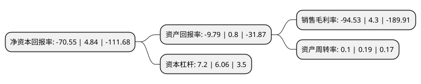

> 本页面由自动化程序生成于 2022年5月20日 01:10
> 内容可能存在错误，如有bug请提交issue至：https://github.com/Eroleice/doc-pi/issues
{.is-warning}

# 上市公司基本情况

## 基本资料

林州重机集团股份有限公司（以下简称“ST林重”）成立于2002年05月08日，安阳市。于2011年01月11日在深交所中小板上市。

ST林重注册资本80,168.307万元，主营业务为液压支架等煤炭综采支护设备的设计，研发，制造，销售及技术服务。。主要产品是煤炭综采液压支架，并为客户配套生产单体液压支柱，刮板输送机，偶合器，带式输送机等煤炭综采机械设备，主要应用于煤炭井下综采中的工作面支护，开采及煤炭运输。以下是详细信息：

- 公司名称: 林州重机集团股份有限公司
- 股票代码: 002535.SZ
- 所在地: 河南 - 安阳市
- 成立日期: 2002年05月08日
- 注册资本: 80,168.307万元
- 法定代表人: 郭现生
- 主营业务: 主营业务为液压支架等煤炭综采支护设备的设计，研发，制造，销售及技术服务主要产品是煤炭综采液压支架，并为客户配套生产单体液压支柱，刮板输送机，偶合器，带式输送机等煤炭综采机械设备，主要应用于煤炭井下综采中的工作面支护，开采及煤炭运输
- 公司官网: www.lzzj.com
- 公司介绍: 公司已发展成为国内集钢铁铸锻、能源装备、高新技术装备、矿井建设与运营、金融租赁服务于一体的能源装备综合服务商。主营业务为煤矿机械、防爆电器、机器人产品制造、销售、维修及租赁服务；煤炭矿井运营服务业务；铸造生铁业务；煤炭销售；商业保理业务等。公司在北京设有新产品研发机构，先后与中国科学院自动化研究所、中国矿业大学、中国科学院空间应用工程与技术中心等科研院所、高校建立了科研研发及战略合作关系。并与中国科学院自动化研究所共同组建了“工业机器人技术工程中心”。公司综合实力居全国同行业前列，通过了ISO9001质量管理体系认证，获得河南省质量管理先进企业、“河南省高成长型民营企业”、河南省诚信民营企业、“河南省优秀博士后研发基地”、“博士后科研工作站”等荣誉称号。

## 股东及高管情况

上市公司第一大股东为郭现生，持股236,852,214股，占比29.54%，**疑似为**上市公司实际控制人。

截至2022年03月31日，上市公司的前十大股东中，共有10名自然人股东，其中5%以上大股东共有2名。上市公司前十大股东明细如下：

> 未能通过持股比例判定出上市公司实际控制人（持股30%以上）
> 可能存在通过间接持股、联合持股、协议控制等方式拥有实际控制权的主体，具体请参考上市公司定期公告！
{.is-warning}

> 截至2022年03月31日，上市公司前十大股东信息如下：

| 股东名称 | 持股数量（股） | 持股比例 |
| --- | --- | --- |
| 郭现生 | 236,852,214 | 29.54% |
| 韩录云 | 70,550,740 | 8.8% |
| 毛路平 | 11,100,000 | 1.38% |
| 郭书生 | 10,741,965 | 1.34% |
| 宋全启 | 8,007,778 | 1% |
| 郭浩 | 6,475,200 | 0.81% |
| 陶文涛 | 5,432,348 | 0.68% |
| 王经文 | 3,992,226 | 0.5% |
| 曾立新 | 3,207,000 | 0.4% |
| 方敏 | 2,989,155 | 0.37% |

## 利润表分析

上市公司2021年总收入为4.54亿元，净利润为-4.3亿元，**未实现盈利**。

## 杜邦分析

> 数据列示周期：2021年 | 2020年 | 2019年
{.is-info}

上市公司的净资产收益率在近一年有所下降，下降幅度为-1557.64%，其变化情况分解如下：
- 上市公司的销售毛利率在近一年下降了-2298.37%，可能是生产效率的下降、商品原材料价格上涨或商品价格的下跌所致。
- 上市公司的资产周转率在近一年下降了-47.37%，可能是源自于更慢的销售回款或库存管理效果下降。
- 上市公司的财务杠杆比率在近一年上升了18.81%，可能是增加负债扩大生产规模。

