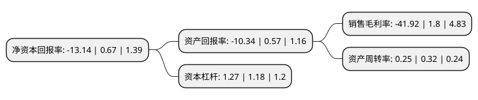

> 本页面由自动化程序生成于 2022年5月20日 01:11
> 内容可能存在错误，如有bug请提交issue至：https://github.com/Eroleice/doc-pi/issues
{.is-warning}

# 上市公司基本情况

## 基本资料

鞍山重型矿山机器股份有限公司（以下简称“鞍重股份”）成立于1994年10月13日，鞍山市。于2012年03月29日在深交所中小板上市。

鞍重股份注册资本23,113.2万元，主营业务为主要从事工矿用振动筛等机器设备的研究，设计，制造和销售，主要产品为大型直线振动筛，圆振动筛，温热物料振动筛，多单元组合振动筛及其他各种选矿设备，拌合站，配件等。以下是详细信息：

- 公司名称: 鞍山重型矿山机器股份有限公司
- 股票代码: 002667.SZ
- 所在地: 辽宁 - 鞍山市
- 成立日期: 1994年10月13日
- 注册资本: 23,113.2万元
- 法定代表人: 何凯
- 主营业务: 主营业务为主要从事工矿用振动筛等机器设备的研究，设计，制造和销售，主要产品为大型直线振动筛，圆振动筛，温热物料振动筛，多单元组合振动筛及其他各种选矿设备，拌合站，配件等
- 公司官网: www.anheavy.com
- 公司介绍: 公司是中国专业研制振动筛产品的大型基地，主要产品有大型直线振动筛、圆振动筛、高频振动细筛、温热物料振动筛、多单元组合振动筛及其他洗选设备等多个系列、规格，在煤炭、冶金矿山、筑路等领域中占有明显的优势地位。公司拥有国际先进的加工设备、高精度专用工艺装备、现代化的振动测试分析系统和检测检验仪器。实现了设计现代化、产品模块化、加工程序化、检测数字化。公司为客户提供包括整体规划设计、设备制造、技术服务、BIM深化设计、模具设计制造在内的建筑产业化全套解决方案，公司技术研发中心为省级企业技术中心，拥有国际先进的加工设备、高精度专用工艺装备、现代化的测试分析系统和检测检验仪器等，实现了设计现代化、产品模块化、加工程序化、检测数字化。全部设计采用计算机设计并使用有限元分析法，经过反复研究，掌握了混凝土预制件工厂成套设备设计及制造能力。至今已与中铁集团、中天集团、中建集团、美好集团等多家大型集团企业合作，为包括中铁十四局在内的多家企业提供PC生产线上全部生产设备并投以生产使用，以性能稳定、质量可靠的综合实力得到PC领域企业的认可，以自身技术研发与制造实力积极推动建筑产业转型升级。

## 股东及高管情况

上市公司第一大股东为上海领亿新材料有限公司，持股55,309,888股，占比23.93%，**疑似为**上市公司实际控制人。

截至2022年05月11日，上市公司的前十大股东中，共有6名自然人股东，3名机构股东，1个海外主体，其中5%以上大股东共有5名。上市公司前十大股东明细如下：

> 未能通过持股比例判定出上市公司实际控制人（持股30%以上）
> 可能存在通过间接持股、联合持股、协议控制等方式拥有实际控制权的主体，具体请参考上市公司定期公告！
{.is-warning}

> 截至2022年05月11日，上市公司前十大股东信息如下：

| 股东名称 | 持股数量（股） | 持股比例 |
| --- | --- | --- |
| 上海领亿新材料有限公司 | 55,309,888 | 23.93% |
| 杨永柱 | 21,159,068 | 9.15% |
| 杨永柱 | 20,299,068 | 8.7825% |
| 共青城强强投资合伙企业(有限合伙) | 16,320,000 | 7.06% |
| 共青城强强投资合伙企业(有限合伙) | 16,320,000 | 7.06% |
| 温萍 | 11,568,044 | 5% |
| 高华-汇丰-GOLDMAN, SACHS & CO.LLC | 1,499,200 | 0.65% |
| 胡珊华 | 1,436,950 | 0.62% |
| 刘炎伟 | 1,169,000 | 0.51% |
| 高永春 | 1,070,000 | 0.46% |

## 利润表分析

上市公司2021年总收入为2.28亿元，净利润为-0.96亿元，**未实现盈利**。

## 杜邦分析

> 数据列示周期：2021年 | 2020年 | 2019年
{.is-info}

上市公司的净资产收益率在近一年有所下降，下降幅度为-2061.19%，其变化情况分解如下：
- 上市公司的销售毛利率在近一年下降了-2428.89%，可能是生产效率的下降、商品原材料价格上涨或商品价格的下跌所致。
- 上市公司的资产周转率在近一年下降了-21.87%，可能是源自于更慢的销售回款或库存管理效果下降。
- 上市公司的财务杠杆比率在近一年上升了7.63%，可能是增加负债扩大生产规模。

