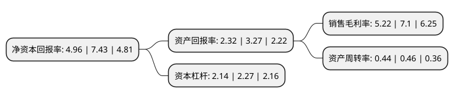

> 本页面由自动化程序生成于 2022年5月20日 01:15
> 内容可能存在错误，如有bug请提交issue至：https://github.com/Eroleice/doc-pi/issues
{.is-warning}

# 上市公司基本情况

## 基本资料

通裕重工股份有限公司（以下简称“通裕重工”）成立于2002年05月25日，德州市。于2011年03月08日在深交所创业板上市。

通裕重工注册资本389,678.322万元，主营业务:主要从事DN50-1600mm球墨铸铁管管模和MW级风力发电机主轴等大型锻件产品的研发，制造及销售，主要产品:为MW级风力发电机主轴和DN50-1600mm球墨铸铁管管模等大型锻件。以下是详细信息：

- 公司名称: 通裕重工股份有限公司
- 股票代码: 300185.SZ
- 所在地: 山东 - 德州市
- 成立日期: 2002年05月25日
- 注册资本: 389,678.322万元
- 法定代表人: 欧辉生
- 主营业务: 主营业务:主要从事DN50-1600mm球墨铸铁管管模和MW级风力发电机主轴等大型锻件产品的研发，制造及销售，主要产品:为MW级风力发电机主轴和DN50-1600mm球墨铸铁管管模等大型锻件
- 公司官网: www.tongyuheavy.com
- 公司介绍: 公司长期从事大型铸锻件产品的研发、制造及销售，技术研发实力雄厚，质量控制体系运转良好，公司技术中心被认定为国家级企业技术中心，检测中心通过了国家实验室认证。公司已通过美国ASME核级MO认证，系中核集团合格供应商，已获得军工二级保密资格和武器装备质量管理体系认证，取得了锅炉压力容器锻件安全注册证书、压力管道元件制造许可证书和CCS、BV、DNV-GL、RINA、ABS、NK、LR、KR、RS九家船级社认证。经过多年发展，现已形成集大型铸锻坯料制备、铸锻造、热处理、机加工、大型成套设备设计制造于一体的完整产业链，并可为能源电力(含风电、水电、火电、核电)、矿山、石化、海工装备、压力容器、机械、军工、航空航天等行业提供大型铸锻件及核心部件，现已成为国家经济建设和国防建设所需核心产品和大型高新技术重大装备的研发、制造基地。凭借过硬的产品质量，与美国GE、德国恩德、西班牙安信能、丹麦维斯塔斯等国内外众多高端客户建立了长期稳定的合作关系。公司荣获中国工业行业排头兵企业、中国机械工业优秀企业、山东省环境友好企业、山东省节能先进企业等多项荣誉称号。

## 股东及高管情况

上市公司第一大股东为珠海港控股集团有限公司，持股792,427,590股，占比20.34%，**疑似为**上市公司实际控制人。

截至2022年03月31日，上市公司的前十大股东中，共有7名自然人股东，2名机构股东，1个海外主体，其中5%以上大股东共有2名。上市公司前十大股东明细如下：

> 未能通过持股比例判定出上市公司实际控制人（持股30%以上）
> 可能存在通过间接持股、联合持股、协议控制等方式拥有实际控制权的主体，具体请参考上市公司定期公告！
{.is-warning}

> 截至2022年03月31日，上市公司前十大股东信息如下：

| 股东名称 | 持股数量（股） | 持股比例 |
| --- | --- | --- |
| 珠海港控股集团有限公司 | 792,427,590 | 20.34% |
| 司兴奎 | 241,512,891 | 6.2% |
| 朱金枝 | 101,066,890 | 2.59% |
| 杨建峰 | 47,686,900 | 1.22% |
| 香港中央结算有限公司(陆股通) | 19,604,449 | 0.5% |
| 山东省高新技术创业投资有限公司 | 16,208,932 | 0.42% |
| 杨兴厚 | 11,625,678 | 0.3% |
| 杨钧 | 10,650,000 | 0.27% |
| 秦吉水 | 9,580,000 | 0.25% |
| 叶安秀 | 9,464,400 | 0.24% |

## 杜邦分析

> 数据列示周期：2021年 | 2020年 | 2019年
{.is-info}

上市公司的净资产收益率在近一年有所下降，下降幅度为-33.24%，其变化情况分解如下：
- 上市公司的销售毛利率在近一年下降了-26.48%，可能是生产效率的下降、商品原材料价格上涨或商品价格的下跌所致。
- 上市公司的资产周转率在近一年下降了-4.35%，可能是源自于更慢的销售回款或库存管理效果下降。
- 上市公司的财务杠杆比率在近一年下降了-5.73%，可能是减少负债降低财务费用。

