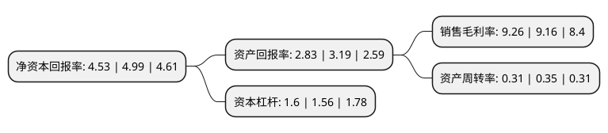

> 本页面由自动化程序生成于 2022年5月20日 01:16
> 内容可能存在错误，如有bug请提交issue至：https://github.com/Eroleice/doc-pi/issues
{.is-warning}

# 上市公司基本情况

## 基本资料

重庆梅安森科技股份有限公司（以下简称“梅安森”）成立于2003年05月21日，重庆市。于2011年11月02日在深交所创业板上市。

梅安森注册资本18,822.076万元，主营业务是煤矿安全生产监测监控设备及成套安全保障系统的研发，设计，生产和销售。主要产品为:煤矿安全监控系统，煤矿人员定位管理系统，煤矿瓦斯抽放及综合利用自动控制系统，煤与瓦斯突出实时诊断系统，各类监控设备及零部件;上述产品由硬件和监控系统软件及嵌入式软件构成。以下是详细信息：

- 公司名称: 重庆梅安森科技股份有限公司
- 股票代码: 300275.SZ
- 所在地: 重庆 - 重庆市
- 成立日期: 2003年05月21日
- 注册资本: 18,822.076万元
- 法定代表人: 马焰
- 主营业务: 主营业务是煤矿安全生产监测监控设备及成套安全保障系统的研发，设计，生产和销售主要产品为:煤矿安全监控系统，煤矿人员定位管理系统，煤矿瓦斯抽放及综合利用自动控制系统，煤与瓦斯突出实时诊断系统，各类监控设备及零部件;上述产品由硬件和监控系统软件及嵌入式软件构成
- 公司官网: www.cqmas.com
- 公司介绍: 公司是一家在大安全领域内拥有技术、产品、数据处理与应用服务完整技术链和产品链、具备ITSS(信息技术服务标准)运维服务能力的高新技术企业。公司基于智能感知、位置服务(2D/3DGIS)、虚拟现实(VR/AR/MR)、大数据、云计算技术，以矿山安全、智慧城市、环保三大板块为重点，聚焦于矿山安全监测监控、城市地下管线/综合管廊智能化、城市市政全息管理、环保应急监测监控、污水治理等领域，在同一技术链上，打造相关多元化产业链，已经成为“物联网+安全智能服务”整体解决方案提供商和运维服务商。公司先后承担并完成多项国家安监总局安全生产重大事故防治关键技术重点科技项目、科技部中小企业创新基金项目等国家级项目和重庆市科技攻关计划项目，是重庆市煤矿安全专业技术协会副理事长单位。

## 股东及高管情况

上市公司第一大股东为马焰，持股39,104,800股，占比20.78%，**疑似为**上市公司实际控制人。

截至2022年03月31日，上市公司的前十大股东中，共有6名自然人股东，4个产品账户，其中5%以上大股东共有6名。上市公司前十大股东明细如下：

> 未能通过持股比例判定出上市公司实际控制人（持股30%以上）
> 可能存在通过间接持股、联合持股、协议控制等方式拥有实际控制权的主体，具体请参考上市公司定期公告！
{.is-warning}

> 截至2022年03月31日，上市公司前十大股东信息如下：

| 股东名称 | 持股数量（股） | 持股比例 |
| --- | --- | --- |
| 马焰 | 39,104,800 | 20.78% |
| 马焰 | 29,334,800 | 15.59% |
| 叶立胜 | 10,550,000 | 5.61% |
| 叶立胜 | 10,550,000 | 5.61% |
| 长城资本管理有限公司-长城资本瑞鑫5号集合资产管理计划 | 9,770,000 | 5.19% |
| 长城资本管理有限公司—长城资本瑞鑫5号集合资产管理计划 | 9,770,000 | 5.19% |
| 招商银行股份有限公司-交银施罗德产业机遇混合型证券投资基金 | 2,953,124 | 1.57% |
| 招商银行股份有限公司-华夏经典配置混合型证券投资基金 | 1,995,500 | 1.06% |
| 隋启海 | 1,973,116 | 1.05% |
| 葛牛庚 | 1,822,000 | 0.97% |

## 利润表分析

上市公司2021年总收入为3.09亿元，净利润为0.28亿元，实现盈利。

## 杜邦分析

> 数据列示周期：2021年 | 2020年 | 2019年
{.is-info}

上市公司的净资产收益率在近一年有所下降，下降幅度为-9.22%，其变化情况分解如下：
- 上市公司的销售毛利率在近一年上升了1.09%，可能是生产效率的提升、商品原材料价格下跌或商品价格的上涨所致。
- 上市公司的资产周转率在近一年下降了-11.43%，可能是源自于更慢的销售回款或库存管理效果下降。
- 上市公司的财务杠杆比率在近一年上升了2.56%，可能是增加负债扩大生产规模。

