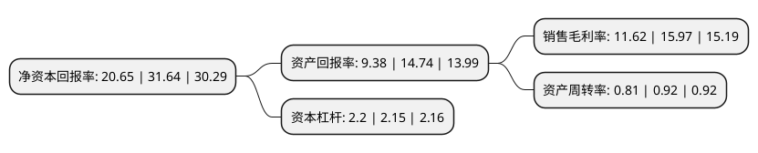

> 本页面由自动化程序生成于 2022年5月20日 01:23
> 内容可能存在错误，如有bug请提交issue至：https://github.com/Eroleice/doc-pi/issues
{.is-warning}

# 上市公司基本情况

## 基本资料

三一重工股份有限公司（以下简称“三一重工”）成立于1994年11月22日，北京市。于2003年07月03日在上交所主板上市。

三一重工注册资本849,258.783万元，主要业务:拖式混凝土输送泵，混凝土泵车等混凝土施工机械，全液压振动压路机，摊铺机等高等级路面施工机械的制造及销售。以下是详细信息：

- 公司名称: 三一重工股份有限公司
- 股票代码: 600031.SH
- 所在地: 北京 - 北京市
- 成立日期: 1994年11月22日
- 注册资本: 849,258.783万元
- 法定代表人: 向文波
- 主营业务: 拖式混凝土输送泵，混凝土泵车等混凝土施工机械，全液压振动压路机，摊铺机等高等级路面施工机械的制造及销售
- 公司官网: www.sanyhi.com
- 公司介绍: 公司是全球装备制造业领先企业之一。公司产品包括混凝土机械、挖掘机械、起重机械、桩工机械、筑路机械、建筑装配式预制结构构件。公司拥有ISO9000质量体系认证、ISO14001环境管理体系认证、GB/T28001职业健康安全管理体系认证和中国CCC认证、美国UL认证、德国TUV认证、欧盟CE认证等国际认证。公司凭借技术创新实力，先后三次荣获“国家科技进步奖”，两次荣获“国家技术发明奖”。通过自主创新，三一混凝土泵车三次刷新长臂架泵车世界纪录，三一高压力混凝土输送泵多次创造世界单泵垂直泵送世界新高。

## 股东及高管情况

上市公司第一大股东为三一集团有限公司，持股2,480,088,257股，占比29.2%，**疑似为**上市公司实际控制人。

截至2022年03月31日，上市公司的前十大股东中，共有3名自然人股东，3名机构股东，3个产品账户，1个海外主体，其中5%以上大股东共有2名。上市公司前十大股东明细如下：

> 未能通过持股比例判定出上市公司实际控制人（持股30%以上）
> 可能存在通过间接持股、联合持股、协议控制等方式拥有实际控制权的主体，具体请参考上市公司定期公告！
{.is-warning}

> 截至2022年03月31日，上市公司前十大股东信息如下：

| 股东名称 | 持股数量（股） | 持股比例 |
| --- | --- | --- |
| 三一集团有限公司 | 2,480,088,257 | 29.2% |
| 香港中央结算有限公司(陆股通) | 570,003,645 | 6.71% |
| 梁稳根 | 235,840,517 | 2.78% |
| 中国证券金融股份有限公司 | 233,349,259 | 2.75% |
| 上海高毅资产管理合伙企业(有限合伙)-高毅邻山1号远望基金 | 185,000,000 | 2.18% |
| 中央汇金资产管理有限责任公司 | 64,238,946 | 0.76% |
| 全国社保基金一零三组合 | 54,000,000 | 0.64% |
| 中国工商银行-上证50交易型开放式指数证券投资基金 | 33,064,969 | 0.39% |
| 向文波 | 31,593,189 | 0.37% |
| 唐修国 | 28,777,150 | 0.34% |

## 利润表分析

上市公司2021年总收入为1,068.73亿元，净利润为123.25亿元，实现盈利。

## 杜邦分析

> 数据列示周期：2021年 | 2020年 | 2019年
{.is-info}

上市公司的净资产收益率在近一年有所下降，下降幅度为-34.73%，其变化情况分解如下：
- 上市公司的销售毛利率在近一年下降了-27.24%，可能是生产效率的下降、商品原材料价格上涨或商品价格的下跌所致。
- 上市公司的资产周转率在近一年下降了-11.96%，可能是源自于更慢的销售回款或库存管理效果下降。
- 上市公司的财务杠杆比率在近一年上升了2.33%，可能是增加负债扩大生产规模。

