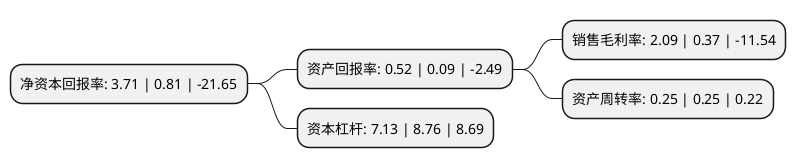

> 本页面由自动化程序生成于 2022年5月20日 01:24
> 内容可能存在错误，如有bug请提交issue至：https://github.com/Eroleice/doc-pi/issues
{.is-warning}

# 上市公司基本情况

## 基本资料

太原重工股份有限公司（以下简称“太原重工”）成立于1998年07月06日，太原市。于1998年09月04日在上交所主板上市。

太原重工注册资本333,314.15万元，主要产品:起重机，挖掘机，轧锻设备，汽车变速箱，油膜轴承。以下是详细信息：

- 公司名称: 太原重工股份有限公司
- 股票代码: 600169.SH
- 所在地: 山西 - 太原市
- 成立日期: 1998年07月06日
- 注册资本: 333,314.15万元
- 法定代表人: 韩珍堂
- 主营业务: 主要产品:起重机，挖掘机，轧锻设备，汽车变速箱，油膜轴承
- 公司官网: www.tyhi.com.cn
- 公司介绍: 公司主营轨道交通设备、起重设备、风力发电设备、挖掘设备、海洋工程装备、焦炉设备、齿轮传动、轧钢设备、锻压设备、煤化工设备、工程机械、港口机械、油膜轴承、铸锻件等产品及工程项目的总承包，产品广泛应用于冶金、矿山、能源、交通、海工、航天、化工、铁路、造船、环保等行业。曾荣获“山西省五一劳动奖状”、“全国质量标杆企业”、“全国机械工业质量奖”和“山西资本市场优秀上市公司”等荣誉称号。

## 股东及高管情况

上市公司第一大股东为太原重型机械集团有限公司，持股967,603,515股，占比29.03%，**疑似为**上市公司实际控制人。

截至2022年03月31日，上市公司的前十大股东中，共有3名自然人股东，4名机构股东，3个产品账户，其中5%以上大股东共有2名。上市公司前十大股东明细如下：

> 未能通过持股比例判定出上市公司实际控制人（持股30%以上）
> 可能存在通过间接持股、联合持股、协议控制等方式拥有实际控制权的主体，具体请参考上市公司定期公告！
{.is-warning}

> 截至2022年03月31日，上市公司前十大股东信息如下：

| 股东名称 | 持股数量（股） | 持股比例 |
| --- | --- | --- |
| 太原重型机械集团有限公司 | 967,603,515 | 29.03% |
| 太原重型机械(集团)制造有限公司 | 662,650,710 | 19.88% |
| 山西省旅游投资控股集团有限公司 | 32,723,400 | 0.98% |
| 河南省兆腾投资集团有限公司 | 18,603,089 | 0.56% |
| 庞宪珍 | 13,684,539 | 0.41% |
| 广发基金-农业银行-广发中证金融资产管理计划 | 12,612,600 | 0.38% |
| 银华基金-农业银行-银华中证金融资产管理计划 | 11,807,202 | 0.35% |
| 赵书莲 | 10,667,800 | 0.32% |
| 党芙蓉 | 9,650,000 | 0.29% |
| 嘉实基金-农业银行-嘉实中证金融资产管理计划 | 7,365,200 | 0.22% |

## 利润表分析

上市公司2021年总收入为83.2亿元，净利润为1.73亿元，实现盈利。

## 杜邦分析

> 数据列示周期：2021年 | 2020年 | 2019年
{.is-info}

上市公司的净资产收益率在近一年有所上升，上升幅度为358.02%，其变化情况分解如下：
- 上市公司的销售毛利率在近一年上升了464.86%，可能是生产效率的提升、商品原材料价格下跌或商品价格的上涨所致。
- 上市公司的资产周转率在近一年下降了0%，可能是源自于更慢的销售回款或库存管理效果下降。
- 上市公司的财务杠杆比率在近一年下降了-18.61%，可能是减少负债降低财务费用。

