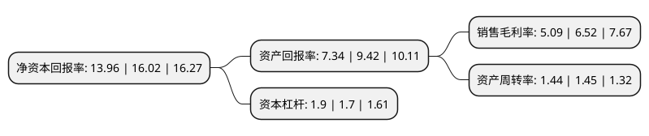

> 本页面由自动化程序生成于 2022年5月20日 01:28
> 内容可能存在错误，如有bug请提交issue至：https://github.com/Eroleice/doc-pi/issues
{.is-warning}

# 上市公司基本情况

## 基本资料

安徽合力股份有限公司（以下简称“安徽合力”）成立于1993年09月30日，合肥市。于1996年10月09日在上交所主板上市。

安徽合力注册资本74,018.08万元，叉车产品。以下是详细信息：

- 公司名称: 安徽合力股份有限公司
- 股票代码: 600761.SH
- 所在地: 安徽 - 合肥市
- 成立日期: 1993年09月30日
- 注册资本: 74,018.08万元
- 法定代表人: 杨安国
- 主营业务: 叉车产品
- 公司官网: www.helichina.com
- 公司介绍: 公司主要经营叉车、装载机、工程机械、矿山起重运输机械、铸锻件、热处理件制造及产品销售；金属材料、化工原料、电子产品、电器机械、橡胶产品销售；机械行业科技咨询、信息服务等业务。公司的主导产品“合力”牌叉车及各类仓储机械广泛的应用于工矿企业、交通运输、仓储物流等行业的装卸及短距离搬运作业。公司拥有国内同行业完整的产业体系，拥有国内叉车行业消失模铸件生产基地、油缸生产基地、转向桥生产基地公司，具备国内领先的叉车设计开发生产制造和试验检测能力。公司通过ISO9001(2000)质量体系认证，进出口商品CE认证、ISO14001环境管理体系认证，被安徽省科技厅评定为国家高新技术园区内“高新技术企业”。

## 股东及高管情况

上市公司第一大股东为安徽叉车集团有限责任公司，持股283,154,535股，占比38.25%，为上市公司实际控制人。

截至2022年03月31日，上市公司的前十大股东中，共有2名自然人股东，2名机构股东，3个产品账户，3个海外主体，其中5%以上大股东共有1名。上市公司前十大股东明细如下：

> 截至2022年03月31日，上市公司前十大股东信息如下：

| 股东名称 | 持股数量（股） | 持股比例 |
| --- | --- | --- |
| 安徽叉车集团有限责任公司 | 283,154,535 | 38.25% |
| 洪泽君 | 36,500,000 | 4.93% |
| 中央汇金资产管理有限责任公司 | 21,269,960 | 2.87% |
| MERRILL LYNCH INTERNATIONAL | 9,127,821 | 1.23% |
| MORGAN STANLEY & CO. INTERNATIONAL PLC. | 8,144,768 | 1.1% |
| MORGAN STANLEY & CO.  INTERNATIONAL PLC. | 8,144,768 | 1.1% |
| 富达基金(香港)有限公司-客户资金 | 7,612,090 | 1.03% |
| 中欧基金-农业银行-中欧中证金融资产管理计划 | 6,440,160 | 0.87% |
| 银华基金-农业银行-银华中证金融资产管理计划 | 6,172,680 | 0.83% |
| 洪涛 | 6,130,000 | 0.83% |

## 利润表分析

上市公司2021年总收入为154.16亿元，净利润为7.85亿元，实现盈利。

## 杜邦分析

> 数据列示周期：2021年 | 2020年 | 2019年
{.is-info}

上市公司的净资产收益率在近一年有所下降，下降幅度为-12.86%，其变化情况分解如下：
- 上市公司的销售毛利率在近一年下降了-21.93%，可能是生产效率的下降、商品原材料价格上涨或商品价格的下跌所致。
- 上市公司的资产周转率在近一年下降了-0.69%，可能是源自于更慢的销售回款或库存管理效果下降。
- 上市公司的财务杠杆比率在近一年上升了11.76%，可能是增加负债扩大生产规模。

