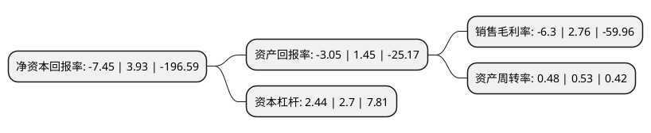

> 本页面由自动化程序生成于 2022年5月20日 01:29
> 内容可能存在错误，如有bug请提交issue至：https://github.com/Eroleice/doc-pi/issues
{.is-warning}

# 上市公司基本情况

## 基本资料

厦门厦工机械股份有限公司（以下简称“厦工股份”）成立于1997年02月26日，厦门市。于1994年01月28日在上交所主板上市。

厦工股份注册资本177,409.448万元，主营业务:装载机，挖掘机和小型工程机械等工程机械产品及其配件的制造，加工和销售。以下是详细信息：

- 公司名称: 厦门厦工机械股份有限公司
- 股票代码: 600815.SH
- 所在地: 福建 - 厦门市
- 成立日期: 1997年02月26日
- 注册资本: 177,409.448万元
- 法定代表人: 谷涛
- 主营业务: 主营业务:装载机，挖掘机和小型工程机械等工程机械产品及其配件的制造，加工和销售
- 公司官网: www.xiagong.com\www.xgma.com.cn
- 公司介绍: 公司是国家重点生产装载机、挖掘机、叉车、道路机械、小型机械、环保机械、混凝土机械、桩工机械、起重机械、隧道掘进机械等产品的骨干大型一类企业，是当今中国最大的工程机械制造基地之一。公司作为中国人民解放军总装备部、总后勤部、武警总队、驻港澳部队、维和部队的军品承制单位，产品始终战斗在国防建设一线，曾随中国维和部队先后赴柬埔寨、刚果等地，参与世界维和行动。公司产品高效灵活、智能可靠、舒适安全，广泛运用于冶金采矿、仓储物流、农林水利、基础设施、市政环保、地下空间开发等综合工况。公司的城市地下开发系统，能够为客户量身定制系统建设方案，为构建新型海绵城市提供有力支持，助力创造优质生活环境。当前，公司正不断加大技术研发和改造投入，提升产品竞争力，实施国际化战略，完善工程机械产业链，旨在建立高效的企业运营机制、管理机制和人才机制，塑身成为中国领先、国际一流的工程机械企业。

## 股东及高管情况

上市公司第一大股东为厦门海翼集团有限公司，持股734,789,208股，占比41.42%，为上市公司实际控制人。

截至2022年03月31日，上市公司的前十大股东中，共有8名机构股东，1个产品账户，1名其他股东，其中5%以上大股东共有2名。上市公司前十大股东明细如下：

> 截至2022年03月31日，上市公司前十大股东信息如下：

| 股东名称 | 持股数量（股） | 持股比例 |
| --- | --- | --- |
| 厦门海翼集团有限公司 | 734,789,208 | 41.42% |
| 中国进出口银行厦门分行 | 120,363,088 | 6.78% |
| 中国建设银行股份有限公司厦门市分行 | 80,429,700 | 4.53% |
| 厦门厦工重工有限公司 | 72,750,834 | 4.1% |
| 中国农业银行股份有限公司厦门市分行 | 70,116,812 | 3.95% |
| 中国工商银行股份有限公司厦门市分行 | 56,831,048 | 3.2% |
| 第一创业投资管理有限公司-金砖一创(厦门)智能制造产业股权投资基金合伙企业(有限合伙) | 46,322,240 | 2.61% |
| 厦门市育明工程机械有限公司 | 14,343,159 | 0.81% |
| 泉州银行股份有限公司厦门分行 | 9,392,443 | 0.53% |
| 厦门创程资产管理有限公司 | 7,053,768 | 0.4% |

## 利润表分析

上市公司2021年总收入为15.51亿元，净利润为-0.98亿元，**未实现盈利**。

## 杜邦分析

> 数据列示周期：2021年 | 2020年 | 2019年
{.is-info}

上市公司的净资产收益率在近一年有所下降，下降幅度为-289.57%，其变化情况分解如下：
- 上市公司的销售毛利率在近一年下降了-328.26%，可能是生产效率的下降、商品原材料价格上涨或商品价格的下跌所致。
- 上市公司的资产周转率在近一年下降了-9.43%，可能是源自于更慢的销售回款或库存管理效果下降。
- 上市公司的财务杠杆比率在近一年下降了-9.63%，可能是减少负债降低财务费用。

