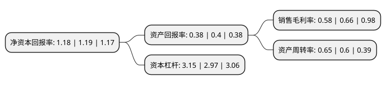

> 本页面由自动化程序生成于 2022年5月20日 01:30
> 内容可能存在错误，如有bug请提交issue至：https://github.com/Eroleice/doc-pi/issues
{.is-warning}

# 上市公司基本情况

## 基本资料

中国第一重型机械股份公司（以下简称“中国一重”）成立于2008年12月25日，齐齐哈尔市。于2010年02月09日在上交所主板上市。

中国一重注册资本685,778.293万元，主要产品:轧制，冶炼设备为主的冶金成套设备;以大型热壁加氢反应器为主的石化，煤液化重型压力容器;以各类冶金轧辊为主的工矿配件;为大型水电，火电机组配套的大型铸锻件;以民用核电反应堆压力容器和核岛成套铸锻件为主的核能设备;以各类液压机，热模锻压力机，机械压力机为代表的锻压设备;以重型矿用挖掘机为代表的重型矿山设备等重型机械装备。主营业务:重型机械制造业务，为冶金，电力，能源，交通运输，矿山，石化等行业及国防建设提供重大成套技术装备，高新产品和技术服务，并开展相关的国际贸易。以下是详细信息：

- 公司名称: 中国第一重型机械股份公司
- 股票代码: 601106.SH
- 所在地: 黑龙江 - 齐齐哈尔市
- 成立日期: 2008年12月25日
- 注册资本: 685,778.293万元
- 法定代表人: 陆文俊
- 主营业务: 主要产品:轧制，冶炼设备为主的冶金成套设备;以大型热壁加氢反应器为主的石化，煤液化重型压力容器;以各类冶金轧辊为主的工矿配件;为大型水电，火电机组配套的大型铸锻件;以民用核电反应堆压力容器和核岛成套铸锻件为主的核能设备;以各类液压机，热模锻压力机，机械压力机为代表的锻压设备;以重型矿用挖掘机为代表的重型矿山设备等重型机械装备主营业务:重型机械制造业务，为冶金，电力，能源，交通运输，矿山，石化等行业及国防建设提供重大成套技术装备，高新产品和技术服务，并开展相关的国际贸易
- 公司官网: www.cfhi.com
- 公司介绍: 公司是中央管理的涉及国家安全和国民经济命脉的国有重要骨干企业之一，是国家创新型试点企业、国家高新技术企业，拥有国家级企业技术中心、重型技术装备国家工程研究中心、国家能源重大装备材料研发中心。公司主要为钢铁、有色、电力、能源、汽车、矿山、石油、化工、交通运输等行业及国防军工提供重大成套技术装备、高新技术产品和服务，并开展相关的国际贸易。主要产品有核岛设备、重型容器、大型铸锻件、专项产品、冶金设备、重型锻压设备、矿山设备和工矿配件等。公司高度重视产品质量，建立了科学的质量保障体系并拥有先进的产品质量检测手段，先后取得了ASMEUU2、ASMENNPT、压力容器、民用核承压设备、70型船用曲轴锻件及英国LR、美国ABS、挪威DNV、中国CCS船级社等多项制造资质证书，通过了GB/T19001-2000及GJB9001A—2001质量体系认证，产品质量始终保持国内领先水平，部分产品质量达到国际先进水平。

## 股东及高管情况

上市公司第一大股东为中国一重集团有限公司，持股4,380,563,888股，占比63.88%，为上市公司实际控制人。

截至2022年03月31日，上市公司的前十大股东中，共有8名自然人股东，1名机构股东，1个产品账户，其中5%以上大股东共有1名。上市公司前十大股东明细如下：

> 截至2022年03月31日，上市公司前十大股东信息如下：

| 股东名称 | 持股数量（股） | 持股比例 |
| --- | --- | --- |
| 中国一重集团有限公司 | 4,380,563,888 | 63.88% |
| 薛卓丹 | 26,718,901 | 0.39% |
| 林富英 | 18,270,205 | 0.27% |
| 杨春芳 | 17,414,100 | 0.25% |
| 黄世鑫 | 14,600,000 | 0.21% |
| 中国农业银行股份有限公司-中证500交易型开放式指数证券投资基金 | 13,453,300 | 0.2% |
| 张志团 | 11,973,400 | 0.17% |
| 许锡龙 | 11,936,491 | 0.17% |
| 陈英毫 | 9,102,700 | 0.13% |
| 张双喜 | 8,882,400 | 0.13% |

## 利润表分析

上市公司2021年总收入为231.28亿元，净利润为1.33亿元，实现盈利。

## 杜邦分析

> 数据列示周期：2021年 | 2020年 | 2019年
{.is-info}

上市公司的净资产收益率在近一年有所下降，下降幅度为-0.84%，其变化情况分解如下：
- 上市公司的销售毛利率在近一年下降了-12.12%，可能是生产效率的下降、商品原材料价格上涨或商品价格的下跌所致。
- 上市公司的资产周转率在近一年上升了8.33%，可能是源自于更快的销售回款或库存管理效果提升。
- 上市公司的财务杠杆比率在近一年上升了6.06%，可能是增加负债扩大生产规模。

