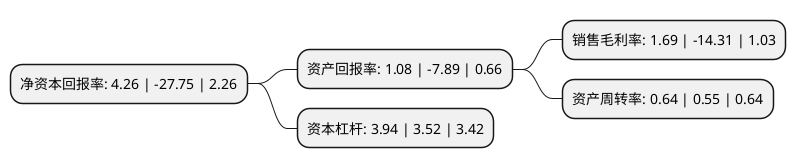

> 本页面由自动化程序生成于 2022年5月20日 01:02
> 内容可能存在错误，如有bug请提交issue至：https://github.com/Eroleice/doc-pi/issues
{.is-warning}

# 上市公司基本情况

## 基本资料

珠海中富实业股份有限公司（以下简称“珠海中富”）成立于1985年12月18日，珠海市。于1996年12月03日在深交所主板上市。

珠海中富注册资本128,570.252万元，主要业务:PET瓶，瓶胚及其配套产品的生产和销售。主要产品:饮料包装制品，饮料加工，PET原料。以下是详细信息：

- 公司名称: 珠海中富实业股份有限公司
- 股票代码: 000659.SZ
- 所在地: 广东 - 珠海市
- 成立日期: 1985年12月18日
- 注册资本: 128,570.252万元
- 法定代表人: 俞磊
- 主营业务: PET瓶，瓶胚及其配套产品的生产和销售主要产品:饮料包装制品，饮料加工，PET原料
- 公司官网: www.zhongfu.com.cn
- 公司介绍: 公司为广东省高新技术企业，为美国“可口可乐”、“百事可乐”两大国际饮料公司在中国的灌装厂，以及国内名牌饮料厂家提供食品饮料容器包装，是目前中国生产设备最齐全、技术最先进、规模最大的PET瓶专业生产企业。公司产品有各种款式的PET汽水，矿泉水，纯净水，蒸馏水瓶和PET热灌装(茶、果汁)饮料瓶与PET防爆啤酒瓶及系列瓶胚，PVC热收缩型与OPP粘贴型彩印标签，PVC、LDPE、LLDPE热收缩膜(套)，HDPE、LDPE、LLDPE薄膜与各种规格的塑料袋，高级优质包装纸箱等。公司被国务院发展研究中心市场经济研究所认定为全国最大的饮料瓶生产基地。

## 股东及高管情况

上市公司第一大股东为陕西新丝路进取一号投资合伙企业(有限合伙)，持股201,961,208股，占比15.71%，**疑似为**上市公司实际控制人。

截至2022年03月31日，上市公司的前十大股东中，共有7名自然人股东，3名机构股东，其中5%以上大股东共有2名。上市公司前十大股东明细如下：

> 未能通过持股比例判定出上市公司实际控制人（持股30%以上）
> 可能存在通过间接持股、联合持股、协议控制等方式拥有实际控制权的主体，具体请参考上市公司定期公告！
{.is-warning}

> 截至2022年03月31日，上市公司前十大股东信息如下：

| 股东名称 | 持股数量（股） | 持股比例 |
| --- | --- | --- |
| 陕西新丝路进取一号投资合伙企业(有限合伙) | 201,961,208 | 15.71% |
| 深圳市国青科技有限公司 | 146,473,200 | 11.39% |
| 北京元和盛德投资有限责任公司 | 9,500,000 | 0.74% |
| 孙钱 | 8,915,621 | 0.69% |
| 王采勇 | 8,308,520 | 0.65% |
| 刘芳 | 7,472,794 | 0.58% |
| 史哲夫 | 4,100,000 | 0.32% |
| 白雪峰 | 4,027,300 | 0.31% |
| 杨晓军 | 3,895,700 | 0.3% |
| 林彬 | 3,736,000 | 0.29% |

## 利润表分析

上市公司2021年总收入为14.46亿元，净利润为0.24亿元，实现盈利。

## 杜邦分析

> 数据列示周期：2021年 | 2020年 | 2019年
{.is-info}

上市公司的净资产收益率在近一年有所下降，下降幅度为-115.35%，其变化情况分解如下：
- 上市公司的销售毛利率在近一年下降了-111.81%，可能是生产效率的下降、商品原材料价格上涨或商品价格的下跌所致。
- 上市公司的资产周转率在近一年上升了16.36%，可能是源自于更快的销售回款或库存管理效果提升。
- 上市公司的财务杠杆比率在近一年上升了11.93%，可能是增加负债扩大生产规模。

