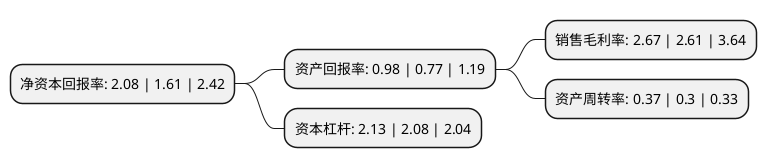

> 本页面由自动化程序生成于 2022年5月20日 01:03
> 内容可能存在错误，如有bug请提交issue至：https://github.com/Eroleice/doc-pi/issues
{.is-warning}

# 上市公司基本情况

## 基本资料

陕西金叶科教集团股份有限公司（以下简称“陕西金叶”）成立于1994年01月06日，西安市。于1998年06月23日在深交所主板上市。

陕西金叶注册资本76,869.261万元，主要产品:印刷，商品流通，烟用丝束，滤嘴棒。以下是详细信息：

- 公司名称: 陕西金叶科教集团股份有限公司
- 股票代码: 000812.SZ
- 所在地: 陕西 - 西安市
- 成立日期: 1994年01月06日
- 注册资本: 76,869.261万元
- 法定代表人: 袁汉源
- 主营业务: 主要产品:印刷，商品流通，烟用丝束，滤嘴棒
- 公司官网: www.jinyegroup.cn
- 公司介绍: 公司是全国仅有的几家烟草配套概念的上市企业之一，已成长为横跨烟草配套产品研发生产、教育产业、房地产业和互联网新兴产业的多元化、多业态的大型上市公司。2017年，金叶集团兼并重组取得重大突破，成功并购昆明瑞丰印刷有限公司，烟草配套主业实力和行业地位进一步凸显。主营中高档烟包印刷、烟用滤棒生产、高等教育、房地产及“智慧校园”无线网络新兴产业。烟配板块具备凹印、胶印、丝印等所有印刷工艺，拥有省级企业技术中心3个，国家级检测中心1个。公司先后斩获“北京国际包装博览会高新技术创新奖”、“湖北省中小企业创新奖”、“中国印刷企业100强”、“国家高新技术企业”等称号。西北工业大学明德学院荣膺“中国最具品牌影响力独立院校”、“全国综合实力十强独立院校”。

## 股东及高管情况

上市公司第一大股东为万裕文化产业有限公司，持股106,910,140股，占比13.91%，**疑似为**上市公司实际控制人。

截至2022年04月08日，上市公司的前十大股东中，共有4名自然人股东，6名机构股东，其中5%以上大股东共有4名。上市公司前十大股东明细如下：

> 未能通过持股比例判定出上市公司实际控制人（持股30%以上）
> 可能存在通过间接持股、联合持股、协议控制等方式拥有实际控制权的主体，具体请参考上市公司定期公告！
{.is-warning}

> 截至2022年04月08日，上市公司前十大股东信息如下：

| 股东名称 | 持股数量（股） | 持股比例 |
| --- | --- | --- |
| 万裕文化产业有限公司 | 106,910,140 | 13.91% |
| 万裕文化产业有限公司 | 106,910,140 | 13.91% |
| 重庆金嘉兴实业有限公司 | 68,213,217 | 8.87% |
| 重庆金嘉兴实业有限公司 | 65,772,417 | 8.5564% |
| 陕西烟草投资管理有限公司 | 36,179,415 | 4.71% |
| 陕西中烟投资管理有限公司 | 23,405,740 | 3.04% |
| 袁伍妹 | 8,151,921 | 1.06% |
| 齐培旺 | 6,700,000 | 0.87% |
| 宋传学 | 3,500,000 | 0.46% |
| 杨朝伟 | 3,400,000 | 0.44% |

## 利润表分析

上市公司2021年总收入为12.83亿元，净利润为0.34亿元，实现盈利。

## 杜邦分析

> 数据列示周期：2021年 | 2020年 | 2019年
{.is-info}

上市公司的净资产收益率在近一年有所上升，上升幅度为29.19%，其变化情况分解如下：
- 上市公司的销售毛利率在近一年上升了2.3%，可能是生产效率的提升、商品原材料价格下跌或商品价格的上涨所致。
- 上市公司的资产周转率在近一年上升了23.33%，可能是源自于更快的销售回款或库存管理效果提升。
- 上市公司的财务杠杆比率在近一年上升了2.4%，可能是增加负债扩大生产规模。

