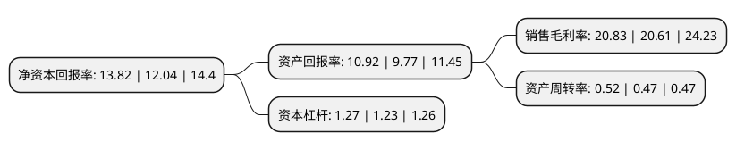

> 本页面由自动化程序生成于 2022年5月20日 01:07
> 内容可能存在错误，如有bug请提交issue至：https://github.com/Eroleice/doc-pi/issues
{.is-warning}

# 上市公司基本情况

## 基本资料

深圳劲嘉集团股份有限公司（以下简称“劲嘉股份”）成立于1996年10月14日，深圳市。于2007年12月05日在深交所中小板上市。

劲嘉股份注册资本147,088.755万元，主要产品为烟标，俗称“烟盒”。主营业务:烟标印制及相关包装材料的生产经营。以下是详细信息：

- 公司名称: 深圳劲嘉集团股份有限公司
- 股票代码: 002191.SZ
- 所在地: 广东 - 深圳市
- 成立日期: 1996年10月14日
- 注册资本: 147,088.755万元
- 法定代表人: 乔鲁予
- 主营业务: 主要产品为烟标，俗称“烟盒”主营业务:烟标印制及相关包装材料的生产经营
- 公司官网: www.jinjia.com
- 公司介绍: 公司是中国卷烟包装领军企业，主营业务定位为高端包装印刷品和包装材料的研究生产,主要产品是高技术和高附加值的烟标、高端知名消费品牌包装及相关镭射包装材料镭射膜和镭射纸。公司已形成了从行业标准制定、包装材料镭射膜、镭射纸到烟标印制包装的完整产业链，具有我国最大连线复合转移凹印机群，同时还引进了系列德国海德堡速霸印刷机群、日本高精度全自动模切机群等包装印刷设备，具备了生产规模上的优势，能快速满足不同卷烟客户对烟标生产的需求。公司荣膺多项荣誉称号：中国包装龙头企业、外商投资先进技术企业、全国诚信印刷企业、深圳市高新技术企业、深圳市工业百强企业。

## 股东及高管情况

上市公司第一大股东为深圳市劲嘉创业投资有限公司，持股463,089,709股，占比31.48%，为上市公司实际控制人。

截至2022年04月18日，上市公司的前十大股东中，共有2名自然人股东，5名机构股东，1个产品账户，2个海外主体，其中5%以上大股东共有1名。上市公司前十大股东明细如下：

> 截至2022年04月18日，上市公司前十大股东信息如下：

| 股东名称 | 持股数量（股） | 持股比例 |
| --- | --- | --- |
| 深圳市劲嘉创业投资有限公司 | 463,089,709 | 31.48% |
| 潘文雄 | 66,099,900 | 4.49% |
| 济南泰汇顺企业管理合伙企业(有限合伙) | 58,597,379 | 3.98% |
| 新疆世纪运通股权投资合伙企业(有限合伙) | 39,450,000 | 2.68% |
| 香港中央结算有限公司(陆股通) | 35,679,352 | 2.43% |
| JPMORGAN CHASE BANK,NATIONAL ASSOCIATION | 22,066,970 | 1.5% |
| 十堰启韵致恒企业管理合伙企业(有限合伙) | 20,508,186 | 1.39% |
| 中信证券股份有限公司 | 16,785,188 | 1.14% |
| 黄华 | 15,634,141 | 1.06% |
| 中国工商银行股份有限公司-广发多因子灵活配置混合型证券投资基金 | 14,278,181 | 0.97% |

## 利润表分析

上市公司2021年总收入为50.67亿元，净利润为10.55亿元，实现盈利。

## 杜邦分析

> 数据列示周期：2021年 | 2020年 | 2019年
{.is-info}

上市公司的净资产收益率在近一年有所上升，上升幅度为14.78%，其变化情况分解如下：
- 上市公司的销售毛利率在近一年上升了1.07%，可能是生产效率的提升、商品原材料价格下跌或商品价格的上涨所致。
- 上市公司的资产周转率在近一年上升了10.64%，可能是源自于更快的销售回款或库存管理效果提升。
- 上市公司的财务杠杆比率在近一年上升了3.25%，可能是增加负债扩大生产规模。

