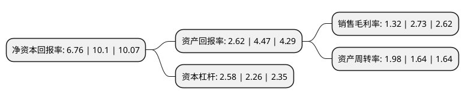

> 本页面由自动化程序生成于 2022年5月20日 01:07
> 内容可能存在错误，如有bug请提交issue至：https://github.com/Eroleice/doc-pi/issues
{.is-warning}

# 上市公司基本情况

## 基本资料

厦门合兴包装印刷股份有限公司（以下简称“合兴包装”）成立于1993年05月17日，厦门市。于2008年05月08日在深交所中小板上市。

合兴包装注册资本123,863.102万元，中高档瓦楞纸箱及瓦楞纸板，缓冲包装材料(EPE，EPS)。上述主营业务和产品自公司成立以来没有发生变化。以下是详细信息：

- 公司名称: 厦门合兴包装印刷股份有限公司
- 股票代码: 002228.SZ
- 所在地: 福建 - 厦门市
- 成立日期: 1993年05月17日
- 注册资本: 123,863.102万元
- 法定代表人: 许晓光
- 主营业务: 中高档瓦楞纸箱及瓦楞纸板，缓冲包装材料(EPE，EPS)上述主营业务和产品自公司成立以来没有发生变化
- 公司官网: www.hxpp.com.cn
- 公司介绍: 公司是瓦楞纸箱的三项国家标准的主要修订单位，多年来专注于瓦楞纸箱包装行业发展，已经建立起满足客户对于质量、环保、安全的包装需求，“合兴”的品牌效应在公司与其他企业的竞争过程中已成为重要的优势之一。在多年的经营中，公司一直注重企业的技术开发和创新能力，已陆续通过了ISO9001(质量)体系认证、ISO14001(环境)体系认证、OHSAS18001(健康安全)体系认证。同时公司先后获得了“中国包装龙头企业”、“先进技术企业”、“AAA级资信企业”、“超千万元纳税大户”、“守合同重信用企业”等荣誉称号，是中国包装联合会的副会长单位。

## 股东及高管情况

上市公司第一大股东为新疆兴汇聚股权投资管理有限合伙企业，持股397,173,280股，占比32.07%，为上市公司实际控制人。

截至2022年03月31日，上市公司的前十大股东中，共有7名自然人股东，2名机构股东，1个产品账户，其中5%以上大股东共有2名。上市公司前十大股东明细如下：

> 截至2022年03月31日，上市公司前十大股东信息如下：

| 股东名称 | 持股数量（股） | 持股比例 |
| --- | --- | --- |
| 新疆兴汇聚股权投资管理有限合伙企业 | 397,173,280 | 32.07% |
| 宏立投资有限公司 | 124,703,040 | 10.07% |
| 徐勇 | 16,905,463 | 1.36% |
| 夏平 | 14,914,597 | 1.2% |
| 张季平 | 13,762,341 | 1.11% |
| 夏光淳 | 13,571,180 | 1.1% |
| 兴证证券资管-浦发银行-兴证资管鑫众15号集合资产管理计划 | 12,482,291 | 1.01% |
| 王静 | 11,662,960 | 0.94% |
| 孙长根 | 11,589,400 | 0.94% |
| 沈素芳 | 11,459,470 | 0.93% |

## 杜邦分析

> 数据列示周期：2021年 | 2020年 | 2019年
{.is-info}

上市公司的净资产收益率在近一年有所下降，下降幅度为-33.07%，其变化情况分解如下：
- 上市公司的销售毛利率在近一年下降了-51.65%，可能是生产效率的下降、商品原材料价格上涨或商品价格的下跌所致。
- 上市公司的资产周转率在近一年上升了20.73%，可能是源自于更快的销售回款或库存管理效果提升。
- 上市公司的财务杠杆比率在近一年上升了14.16%，可能是增加负债扩大生产规模。

