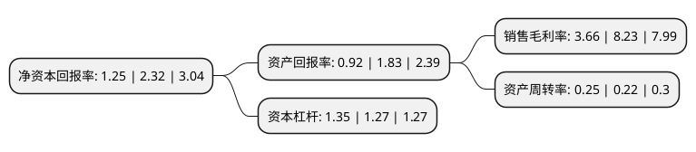

> 本页面由自动化程序生成于 2022年5月20日 01:07
> 内容可能存在错误，如有bug请提交issue至：https://github.com/Eroleice/doc-pi/issues
{.is-warning}

# 上市公司基本情况

## 基本资料

鸿博股份有限公司（以下简称“鸿博股份”）成立于1999年06月15日，福州市。于2008年05月08日在深交所中小板上市。

鸿博股份注册资本49,834.426万元，主要从事商业票据印刷，具有集卷式彩票，电脑票据，金融票证，胶式标签，数码防伪，信封，证书证件等多种业务。以下是详细信息：

- 公司名称: 鸿博股份有限公司
- 股票代码: 002229.SZ
- 所在地: 福建 - 福州市
- 成立日期: 1999年06月15日
- 注册资本: 49,834.426万元
- 法定代表人: 毛伟
- 主营业务: 主要从事商业票据印刷，具有集卷式彩票，电脑票据，金融票证，胶式标签，数码防伪，信封，证书证件等多种业务
- 公司官网: www.hb-print.com.cn
- 公司介绍: 公司以安全印务为主营业务，是中国彩票印刷行业的龙头企业之一。上市以来，公司业务布局由单一安全印务发展为多种业务协同发展，完成了布局全国的战略格局。目前公司业务涵盖(1)彩票产业；(2)安全印务；(3)包装产业；(4)彩印产业；(5)物联网产业；(6)商贸及互动娱乐产业等领域。公司是“全国巾帼文明示范岗”和“福建省重合同守信用单位”、“高新技术企业”、“福建省省级企业技术中心”，并先后获得“中国印刷复制示范企业”、“中国绿色印刷工程示范单位”、“中国印刷行业3A信用等级企业”、首批福州市“文化企业十强”等荣誉称号。

## 股东及高管情况

上市公司第一大股东为河南寓泰控股有限公司，持股71,263,785股，占比14.3%，**疑似为**上市公司实际控制人。

截至2022年03月31日，上市公司的前十大股东中，共有7名自然人股东，3名机构股东，其中5%以上大股东共有2名。上市公司前十大股东明细如下：

> 未能通过持股比例判定出上市公司实际控制人（持股30%以上）
> 可能存在通过间接持股、联合持股、协议控制等方式拥有实际控制权的主体，具体请参考上市公司定期公告！
{.is-warning}

> 截至2022年03月31日，上市公司前十大股东信息如下：

| 股东名称 | 持股数量（股） | 持股比例 |
| --- | --- | --- |
| 河南寓泰控股有限公司 | 71,263,785 | 14.3% |
| 河南辉熠贸易有限公司 | 40,000,000 | 8.03% |
| 上海征士博企业管理合伙企业(有限合伙) | 24,917,115 | 5% |
| 源鸿 | 6,883,406 | 1.38% |
| 尤丽娟 | 6,203,135 | 1.24% |
| 陈家强 | 5,082,285 | 1.02% |
| 傅永 | 3,423,442 | 0.69% |
| 刘春 | 3,074,800 | 0.62% |
| 殷伟民 | 3,036,115 | 0.61% |
| 周克明 | 2,478,100 | 0.5% |

## 利润表分析

上市公司2021年总收入为5.74亿元，净利润为0.21亿元，实现盈利。

## 杜邦分析

> 数据列示周期：2021年 | 2020年 | 2019年
{.is-info}

上市公司的净资产收益率在近一年有所下降，下降幅度为-46.12%，其变化情况分解如下：
- 上市公司的销售毛利率在近一年下降了-55.53%，可能是生产效率的下降、商品原材料价格上涨或商品价格的下跌所致。
- 上市公司的资产周转率在近一年上升了13.64%，可能是源自于更快的销售回款或库存管理效果提升。
- 上市公司的财务杠杆比率在近一年上升了6.3%，可能是增加负债扩大生产规模。

