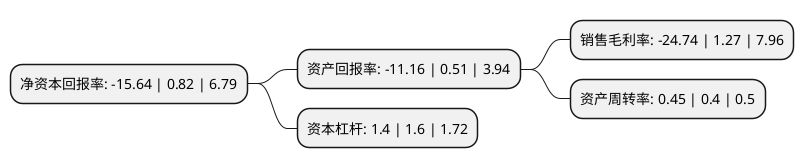

> 本页面由自动化程序生成于 2022年5月20日 01:07
> 内容可能存在错误，如有bug请提交issue至：https://github.com/Eroleice/doc-pi/issues
{.is-warning}

# 上市公司基本情况

## 基本资料

星期六股份有限公司（以下简称“星期六”）成立于2002年07月25日，佛山市。于2009年09月03日在深交所中小板上市。

星期六注册资本90,974.978万元，生产经营皮鞋，皮革制品(国家有特殊规定的按规定办理)及售后服务。以下是详细信息：

- 公司名称: 星期六股份有限公司
- 股票代码: 002291.SZ
- 所在地: 广东 - 佛山市
- 成立日期: 2002年07月25日
- 注册资本: 90,974.978万元
- 法定代表人: 于洪涛
- 主营业务: 生产经营皮鞋，皮革制品(国家有特殊规定的按规定办理)及售后服务
- 公司官网: www.st-sat.com
- 公司介绍: 公司为国内领先的鞋业品牌运营商，是深圳A股第一家上市的国内女鞋企业。公司的主营业务为时尚皮鞋的生产和销售，并批发、零售多元化的时尚产品，公司拥有规范化的销售网络和专业化的品牌运营团队、设计研发中心及制造工厂；在中国大陆设有各类品牌形象专卖店，公司以“引领时尚生活”为使命，逐步发展为国内领先的中高端时尚品牌运营商之一。目前公司拥有“ST&SAT(星期六)”、“D:FUSE(迪芙斯)”、“SAFIYA(索菲娅)”、“SATURDAY MODE”、“FONDBERYL”(菲伯丽尔)等自有品牌。公司采用多品牌全产业链纵向一体化的运营模式，通过构建不用消费细分、不同风格的多品牌组合，满足各类时尚消费者不同生活阅历和价值取向的装扮需求。

## 股东及高管情况

上市公司第一大股东为云南兆隆企业管理有限公司，持股88,137,541股，占比9.69%，**疑似为**上市公司实际控制人。

截至2022年04月25日，上市公司的前十大股东中，共有2名自然人股东，3名机构股东，4个产品账户，1个海外主体，其中5%以上大股东共有3名。上市公司前十大股东明细如下：

> 未能通过持股比例判定出上市公司实际控制人（持股30%以上）
> 可能存在通过间接持股、联合持股、协议控制等方式拥有实际控制权的主体，具体请参考上市公司定期公告！
{.is-warning}

> 上市公司第一大股东持股不超过10%，请检查是否存在公司控制权风险！
{.is-danger}

> 截至2022年04月25日，上市公司前十大股东信息如下：

| 股东名称 | 持股数量（股） | 持股比例 |
| --- | --- | --- |
| 云南兆隆企业管理有限公司 | 88,137,541 | 9.69% |
| 谢如栋 | 86,736,007 | 9.53% |
| LYONE GROUP PTE. LTD. | 72,691,390 | 7.99% |
| 方剑 | 36,074,169 | 3.97% |
| 中信证券股份有限公司 | 31,359,458 | 3.45% |
| 银河德睿资本管理有限公司 | 25,182,953 | 2.77% |
| 中国建设银行股份有限公司-国泰大健康股票型证券投资基金 | 18,828,232 | 2.07% |
| 深圳前海泽源私募证券基金管理有限公司-泽源利旺田1号私募证券投资基金 | 18,100,556 | 1.99% |
| 上海浦东发展银行股份有限公司-华夏创新未来18个月封闭运作混合型证券投资基金 | 17,327,358 | 1.9% |
| 中国工商银行股份有限公司-广发多因子灵活配置混合型证券投资基金 | 13,338,807 | 1.47% |

## 利润表分析

上市公司2021年总收入为28.11亿元，净利润为-6.96亿元，**未实现盈利**。

## 杜邦分析

> 数据列示周期：2021年 | 2020年 | 2019年
{.is-info}

上市公司的净资产收益率在近一年有所下降，下降幅度为-2007.32%，其变化情况分解如下：
- 上市公司的销售毛利率在近一年下降了-2048.03%，可能是生产效率的下降、商品原材料价格上涨或商品价格的下跌所致。
- 上市公司的资产周转率在近一年上升了12.5%，可能是源自于更快的销售回款或库存管理效果提升。
- 上市公司的财务杠杆比率在近一年下降了-12.5%，可能是减少负债降低财务费用。

