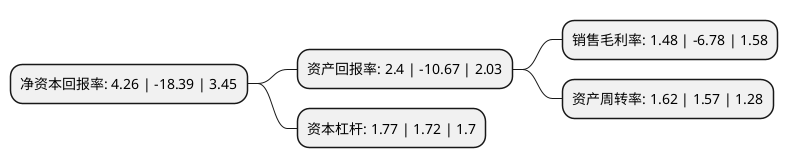

> 本页面由自动化程序生成于 2022年5月20日 01:08
> 内容可能存在错误，如有bug请提交issue至：https://github.com/Eroleice/doc-pi/issues
{.is-warning}

# 上市公司基本情况

## 基本资料

广东省广告集团股份有限公司（以下简称“省广集团”）成立于1981年05月11日，广州市。于2010年05月06日在深交所中小板上市。

省广集团注册资本174,333.713万元，主营业务:从事品牌管理，媒介代理和自有媒体等业务。以下是详细信息：

- 公司名称: 广东省广告集团股份有限公司
- 股票代码: 002400.SZ
- 所在地: 广东 - 广州市
- 成立日期: 1981年05月11日
- 注册资本: 174,333.713万元
- 法定代表人: 陈钿隆
- 主营业务: 主营业务:从事品牌管理，媒介代理和自有媒体等业务
- 公司官网: www.gimc.cn
- 公司介绍: 公司是中国本土最优秀的大型综合性广告公司之一、国家一级广告企业。主营为客户提供整合营销传播服务，具体包括品牌管理、媒介代理和自有媒体等业务。公司是我国最早一批成立的广告公司，广告策划创意能力业内领先。公司多次参加国内外各类广告大赛，获得了包括美国莫比广告金奖、中国广告节金奖在内的各类奖项多项。公司拥有国内领先的广告专业人才团队，设有北京、上海、成都、中国香港、福州等多个分公司，并与世界排名前列的跨国公司博报堂、旭通合资成立广旭、广博广告公司，其服务的客户数不胜数，包括中国联能、中国电信、广州本田、水井坊、华晨汽车等等，创造了一个又一个的品牌神话。

## 股东及高管情况

上市公司第一大股东为广东省广新控股集团有限公司，持股326,794,235股，占比18.75%，**疑似为**上市公司实际控制人。

截至2022年03月31日，上市公司的前十大股东中，共有6名自然人股东，2名机构股东，1个产品账户，1个海外主体，其中5%以上大股东共有1名。上市公司前十大股东明细如下：

> 未能通过持股比例判定出上市公司实际控制人（持股30%以上）
> 可能存在通过间接持股、联合持股、协议控制等方式拥有实际控制权的主体，具体请参考上市公司定期公告！
{.is-warning}

> 截至2022年03月31日，上市公司前十大股东信息如下：

| 股东名称 | 持股数量（股） | 持股比例 |
| --- | --- | --- |
| 广东省广新控股集团有限公司 | 326,794,235 | 18.75% |
| 香港中央结算有限公司(陆股通) | 35,628,606 | 2.04% |
| 陈钿隆 | 35,392,882 | 2.03% |
| 祝卫东 | 17,169,195 | 0.98% |
| 何滨 | 16,574,501 | 0.95% |
| 张源 | 15,602,200 | 0.89% |
| 中国工商银行股份有限公司-广发中证传媒交易型开放式指数证券投资基金 | 13,063,500 | 0.75% |
| 万国鹏 | 11,210,445 | 0.64% |
| 赵章财 | 7,277,800 | 0.42% |
| 长城国融投资管理有限公司 | 6,498,888 | 0.37% |

## 利润表分析

上市公司2021年总收入为130.03亿元，净利润为1.92亿元，实现盈利。

## 杜邦分析

> 数据列示周期：2021年 | 2020年 | 2019年
{.is-info}

上市公司的净资产收益率在近一年有所下降，下降幅度为-123.16%，其变化情况分解如下：
- 上市公司的销售毛利率在近一年下降了-121.83%，可能是生产效率的下降、商品原材料价格上涨或商品价格的下跌所致。
- 上市公司的资产周转率在近一年上升了3.18%，可能是源自于更快的销售回款或库存管理效果提升。
- 上市公司的财务杠杆比率在近一年上升了2.91%，可能是增加负债扩大生产规模。

