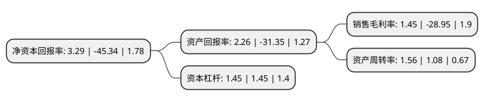

> 本页面由自动化程序生成于 2022年5月20日 01:11
> 内容可能存在错误，如有bug请提交issue至：https://github.com/Eroleice/doc-pi/issues
{.is-warning}

# 上市公司基本情况

## 基本资料

思美传媒股份有限公司（以下简称“思美传媒”）成立于2000年08月09日，杭州市。于2014年01月23日在深交所中小板上市。

思美传媒注册资本58,120.249万元，媒介代理及品牌管理。以下是详细信息：

- 公司名称: 思美传媒股份有限公司
- 股票代码: 002712.SZ
- 所在地: 浙江 - 杭州市
- 成立日期: 2000年08月09日
- 注册资本: 58,120.249万元
- 法定代表人: 任丁
- 主营业务: 媒介代理及品牌管理
- 公司官网: www.simei.cc
- 公司介绍: 公司是一家为客户提供从市场调研、品牌策划、广告创意、广告设计到媒介策划、监测评估等服务的综合服务类广告公司。公司拥有完备的研究中心为客户提供卓越的行业、媒体、消费者趋势研究和洞察，并以专业的资源中心统筹，通过数字、内容、媒介三大引擎驱动资源高效整合，实现互联网及移动端全景化精准营销、“IP源头+内容制作+营销宣发”的内容产业化运营和优质的媒介运营服务，构建产品化平台，提供全产业链整合营销服务，全方位提升客户的品牌价值。2017年，公司完成了对掌维科技100%股份、观达影视100%股份、科翼传播剩余20%股份的收购，掌维科技的主营业务为数字阅读业务，观达影视的主营业务为电视剧的策划、制作和发行，科翼传播的主营业务为综艺节目及影视剧宣发、商业品牌整合营销和内容制作。

## 股东及高管情况

上市公司第一大股东为四川省旅游投资集团有限责任公司，持股174,302,626股，占比29.99%，**疑似为**上市公司实际控制人。

截至2022年03月31日，上市公司的前十大股东中，共有5名自然人股东，2名机构股东，3个产品账户，其中5%以上大股东共有2名。上市公司前十大股东明细如下：

> 未能通过持股比例判定出上市公司实际控制人（持股30%以上）
> 可能存在通过间接持股、联合持股、协议控制等方式拥有实际控制权的主体，具体请参考上市公司定期公告！
{.is-warning}

> 截至2022年03月31日，上市公司前十大股东信息如下：

| 股东名称 | 持股数量（股） | 持股比例 |
| --- | --- | --- |
| 四川省旅游投资集团有限责任公司 | 174,302,626 | 29.99% |
| 朱明虬 | 53,852,263 | 9.27% |
| 深圳悟空投资管理有限公司-悟空蓝海源饶14号私募证券投资基金 | 15,500,000 | 2.67% |
| 陈巍 | 15,261,800 | 2.63% |
| 周丹 | 8,400,000 | 1.45% |
| 沈璐 | 6,300,000 | 1.08% |
| 严俊杰 | 6,300,000 | 1.08% |
| 金鹰基金-浙商银行-西藏信托-西藏信托-瑞新9号单一资金信托 | 4,918,022 | 0.85% |
| 浙商产融(武汉)投资有限公司 | 4,195,490 | 0.72% |
| 金元顺安基金-浙商银行-爱建信托-爱建信托欣欣15号事务管理类单一资金信托 | 3,639,978 | 0.63% |

## 利润表分析

上市公司2021年总收入为44.5亿元，净利润为0.64亿元，实现盈利。

## 杜邦分析

> 数据列示周期：2021年 | 2020年 | 2019年
{.is-info}

上市公司的净资产收益率在近一年有所下降，下降幅度为-107.26%，其变化情况分解如下：
- 上市公司的销售毛利率在近一年下降了-105.01%，可能是生产效率的下降、商品原材料价格上涨或商品价格的下跌所致。
- 上市公司的资产周转率在近一年上升了44.44%，可能是源自于更快的销售回款或库存管理效果提升。
- 上市公司的财务杠杆比率在近一年下降了0%，可能是减少负债降低财务费用。

