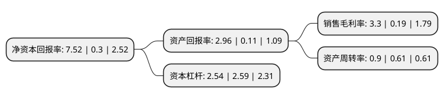

> 本页面由自动化程序生成于 2022年5月20日 01:11
> 内容可能存在错误，如有bug请提交issue至：https://github.com/Eroleice/doc-pi/issues
{.is-warning}

# 上市公司基本情况

## 基本资料

昇兴集团股份有限公司（以下简称“昇兴股份”）成立于1992年12月04日，福州市。于2015年04月22日在深交所中小板上市。

昇兴股份注册资本97,691.847万元，公司主要从事用于食品，饮料等包装所使用的金属容器的生产和销售。主要产品为马口铁三片罐，铝质两片罐。以下是详细信息：

- 公司名称: 昇兴集团股份有限公司
- 股票代码: 002752.SZ
- 所在地: 福建 - 福州市
- 成立日期: 1992年12月04日
- 注册资本: 97,691.847万元
- 法定代表人: 林永贤
- 主营业务: 公司主要从事用于食品，饮料等包装所使用的金属容器的生产和销售主要产品为马口铁三片罐，铝质两片罐
- 公司官网: www.shengxingholdings.com
- 公司介绍: 公司是易拉罐等金属包装容器专业生产厂商。公司主要业务为食品饮料金属包装产品的研发、设计、生产和销售，主要产品为饮料罐和食品罐，包括三片罐、二片罐、铝瓶产品，为食品、饮料及啤酒行业企业提供从研发、设计、晒版、印刷、生产、配送、灌装、二维码云数据服务的一整套服务，是提供包装设计与制造、灌装服务、信息化服务的一体化、多元化、智能化服务的综合性服务供应商。为向客户提供更多优质产品与增值服务，公司正逐步实施‘一物一码’大数据营销，IP化营销模式及供应链管控系统等项目的开拓。多元化的发展将实现从原金属包装行业的制造型企业，转变为一家综合了包装、游戏、IP传媒、大数据、互联网的产业服务生态型企业。

## 股东及高管情况

上市公司第一大股东为昇兴控股有限公司，持股543,416,873股，占比55.63%，为上市公司实际控制人。

截至2022年03月31日，上市公司的前十大股东中，共有2名自然人股东，4名机构股东，2个产品账户，1个海外主体，1名其他股东，其中5%以上大股东共有2名。上市公司前十大股东明细如下：

> 截至2022年03月31日，上市公司前十大股东信息如下：

| 股东名称 | 持股数量（股） | 持股比例 |
| --- | --- | --- |
| 昇兴控股有限公司 | 543,416,873 | 55.63% |
| 福州昇洋发展有限公司 | 80,000,000 | 8.19% |
| 中国工商银行股份有限公司-前海开源新经济灵活配置混合型证券投资基金 | 18,614,095 | 1.91% |
| 睿士控股有限公司 | 18,447,079 | 1.89% |
| 高华-汇丰-GOLDMAN SACHS & CO.LLC | 9,469,811 | 0.97% |
| 关海果 | 7,055,100 | 0.72% |
| 曜尊饮料(上海)有限公司 | 4,000,000 | 0.41% |
| 法国兴业银行 | 2,339,400 | 0.24% |
| 王栋 | 2,297,400 | 0.24% |
| 昇兴集团股份有限公司-第一期员工持股计划 | 1,864,700 | 0.19% |

## 利润表分析

上市公司2021年总收入为51.66亿元，净利润为1.7亿元，实现盈利。

## 杜邦分析

> 数据列示周期：2021年 | 2020年 | 2019年
{.is-info}

上市公司的净资产收益率在近一年有所上升，上升幅度为2406.67%，其变化情况分解如下：
- 上市公司的销售毛利率在近一年上升了1636.84%，可能是生产效率的提升、商品原材料价格下跌或商品价格的上涨所致。
- 上市公司的资产周转率在近一年上升了47.54%，可能是源自于更快的销售回款或库存管理效果提升。
- 上市公司的财务杠杆比率在近一年下降了-1.93%，可能是减少负债降低财务费用。

