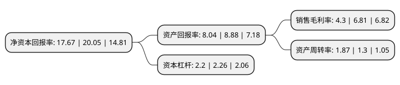

> 本页面由自动化程序生成于 2022年5月20日 01:12
> 内容可能存在错误，如有bug请提交issue至：https://github.com/Eroleice/doc-pi/issues
{.is-warning}

# 上市公司基本情况

## 基本资料

西安环球印务股份有限公司（以下简称“环球印务”）成立于2001年06月28日，西安市。于2016年06月08日在深交所中小板上市。

环球印务注册资本25,200万元，主营业务为医药纸盒包装产品的设计，生产及销售，并兼营酒类，食品彩盒和瓦楞纸箱业务。公司主要产品为供高速自动包装线使用的，含药品电子监管码的高品质药品包装折叠纸盒。以下是详细信息：

- 公司名称: 西安环球印务股份有限公司
- 股票代码: 002799.SZ
- 所在地: 陕西 - 西安市
- 成立日期: 2001年06月28日
- 注册资本: 25,200万元
- 法定代表人: 李移岭
- 主营业务: 主营业务为医药纸盒包装产品的设计，生产及销售，并兼营酒类，食品彩盒和瓦楞纸箱业务公司主要产品为供高速自动包装线使用的，含药品电子监管码的高品质药品包装折叠纸盒
- 公司官网: www.globalprinting.cn
- 公司介绍: 公司是国内领先的医药纸盒包装产品独立供应商。主营业务为医药纸盒包装产品的设计、生产及销售，并兼营酒类、食品彩盒和瓦楞纸箱业务。公司品广泛应用于OTC药品、处方药品以及保健食品，包括化学制剂、生物药品和草本药品等。公司是中国医药包装协会标准《药品包装用卡纸折叠纸盒》的牵头制订者，陕西省首批认定的高新技术企业。公司先后取得钱夹式智能药品包装盒、一种瓶装药品机用包装盒、一种瓶装药品防震包装盒、冻干粉针瓶高速机用包装盒等实用新型专利，以及药品包装盒和包装盒等外观设计专利。公司更是突破以往印刷企业的传统纯加工以及技术运用模式，在折叠纸盒技术领域不断探索，持续推出应用于自动高速包装的各种盒型，从客户依从性出发，研发应用于儿童用药安全、老年友好包装、隐私保护、防伪、防混淆等功能的多项技术。

## 股东及高管情况

上市公司第一大股东为陕西医药控股集团有限责任公司，持股116,550,000股，占比46.25%，为上市公司实际控制人。

截至2022年03月31日，上市公司的前十大股东中，共有8名自然人股东，2名机构股东，其中5%以上大股东共有2名。上市公司前十大股东明细如下：

> 截至2022年03月31日，上市公司前十大股东信息如下：

| 股东名称 | 持股数量（股） | 持股比例 |
| --- | --- | --- |
| 陕西医药控股集团有限责任公司 | 116,550,000 | 46.25% |
| 香港原石国际有限公司 | 40,704,440 | 16.15% |
| 吴从文 | 1,400,000 | 0.56% |
| 刘彬 | 1,157,211 | 0.46% |
| 徐天平 | 937,972 | 0.37% |
| 吴从柱 | 796,700 | 0.32% |
| 冯玉霞 | 791,200 | 0.31% |
| 李玲玲 | 730,192 | 0.29% |
| 陈洛颖 | 714,100 | 0.28% |
| 孙锡林 | 710,000 | 0.28% |

## 杜邦分析

> 数据列示周期：2021年 | 2020年 | 2019年
{.is-info}

上市公司的净资产收益率在近一年有所下降，下降幅度为-11.87%，其变化情况分解如下：
- 上市公司的销售毛利率在近一年下降了-36.86%，可能是生产效率的下降、商品原材料价格上涨或商品价格的下跌所致。
- 上市公司的资产周转率在近一年上升了43.85%，可能是源自于更快的销售回款或库存管理效果提升。
- 上市公司的财务杠杆比率在近一年下降了-2.65%，可能是减少负债降低财务费用。

