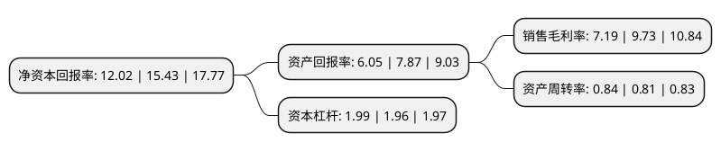

> 本页面由自动化程序生成于 2022年5月20日 01:12
> 内容可能存在错误，如有bug请提交issue至：https://github.com/Eroleice/doc-pi/issues
{.is-warning}

# 上市公司基本情况

## 基本资料

深圳市裕同包装科技股份有限公司（以下简称“裕同科技”）成立于2002年01月15日，深圳市。于2016年12月16日在深交所中小板上市。

裕同科技注册资本93,051.355万元，主营业务:纸质印刷包装产品的研发，设计，生产和销售。产品覆盖彩盒(含精品盒)，说明书，纸箱，不干胶贴纸等全系列高端纸质包装印刷产品。以下是详细信息：

- 公司名称: 深圳市裕同包装科技股份有限公司
- 股票代码: 002831.SZ
- 所在地: 广东 - 深圳市
- 成立日期: 2002年01月15日
- 注册资本: 93,051.355万元
- 法定代表人: 王华君
- 主营业务: 主营业务:纸质印刷包装产品的研发，设计，生产和销售产品覆盖彩盒(含精品盒)，说明书，纸箱，不干胶贴纸等全系列高端纸质包装印刷产品
- 公司官网: www.szyuto.com
- 公司介绍: 公司作为高端品牌包装整体解决方案提供商，为客户提供“一体化产品制造和供应解决方案、创意设计与研发创新解决方案、全球化运营及服务解决方案”。公司在专注消费类电子产品纸质包装的同时，积极开展业务多元化，拓展高档烟酒、化妆品及高端奢侈品等行业包装业务。公司立足国内，并积极拓展海外市场，终端客户包括华为、联想、三星、索尼、雀巢等国内外知名品牌企业，并为仁宝、富士康等知名代工厂商提供产品和服务。

## 股东及高管情况

上市公司第一大股东为吴兰兰，持股446,655,169股，占比48%，为上市公司实际控制人。

截至2022年03月31日，上市公司的前十大股东中，共有2名自然人股东，2名机构股东，5个产品账户，1个海外主体，其中5%以上大股东共有3名。上市公司前十大股东明细如下：

> 截至2022年03月31日，上市公司前十大股东信息如下：

| 股东名称 | 持股数量（股） | 持股比例 |
| --- | --- | --- |
| 吴兰兰 | 446,655,169 | 48% |
| 王华君 | 97,603,051 | 10.49% |
| 香港中央结算有限公司(陆股通) | 71,564,751 | 7.69% |
| 鸿富锦精密工业(深圳)有限公司 | 20,944,400 | 2.25% |
| 陕西省国际信托股份有限公司-陕国投·裕同科技第二期员工持股集合资金信托计划 | 19,023,277 | 2.04% |
| 深圳市裕同电子科技合伙企业(有限合伙) | 18,336,780 | 1.97% |
| 上海君和立成投资管理中心(有限合伙)-上海申创股权投资基金合伙企业(有限合伙) | 10,970,957 | 1.18% |
| 招商银行股份有限公司-兴全合泰混合型证券投资基金 | 10,173,044 | 1.09% |
| 全国社保基金一一四组合 | 9,508,433 | 1.02% |
| 上海君和立成投资管理中心(有限合伙)-上海申创浦江股权投资基金合伙企业(有限合伙) | 8,295,086 | 0.89% |

## 利润表分析

上市公司2021年总收入为148.5亿元，净利润为10.67亿元，实现盈利。

## 杜邦分析

> 数据列示周期：2021年 | 2020年 | 2019年
{.is-info}

上市公司的净资产收益率在近一年有所下降，下降幅度为-22.1%，其变化情况分解如下：
- 上市公司的销售毛利率在近一年下降了-26.1%，可能是生产效率的下降、商品原材料价格上涨或商品价格的下跌所致。
- 上市公司的资产周转率在近一年上升了3.7%，可能是源自于更快的销售回款或库存管理效果提升。
- 上市公司的财务杠杆比率在近一年上升了1.53%，可能是增加负债扩大生产规模。

