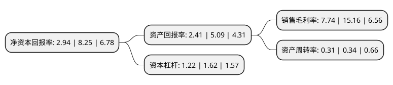

> 本页面由自动化程序生成于 2022年5月20日 01:12
> 内容可能存在错误，如有bug请提交issue至：https://github.com/Eroleice/doc-pi/issues
{.is-warning}

# 上市公司基本情况

## 基本资料

广东新宏泽包装股份有限公司（以下简称“新宏泽”）成立于2006年03月22日，潮州市。于2016年12月29日在深交所中小板上市。

新宏泽注册资本16,000万元，公司主营业务为烟标的设计，生产及销售，公司的主要产品为烟标，服务的卷烟品牌包括“利群”，“雄狮”，“摩登”，“云烟”，“红河”，“红塔山”，“玉溪”，“双喜”，“娇子”等多个知名品牌。以下是详细信息：

- 公司名称: 广东新宏泽包装股份有限公司
- 股票代码: 002836.SZ
- 所在地: 广东 - 潮州市
- 成立日期: 2006年03月22日
- 注册资本: 16,000万元
- 法定代表人: 肖海兰
- 主营业务: 公司主营业务为烟标的设计，生产及销售，公司的主要产品为烟标，服务的卷烟品牌包括“利群”，“雄狮”，“摩登”，“云烟”，“红河”，“红塔山”，“玉溪”，“双喜”，“娇子”等多个知名品牌
- 公司官网: www.newglp.com
- 公司介绍: 公司主营业务为烟标的设计、生产及销售，致力于为客户提供高稳定性、高技术含量、高附加值、高精度的烟标产品与服务，是具备向客户提供印前、印刷、印后高品质整体服务的专业烟标印刷供应商。自成立以来，公司紧紧围绕卷烟客户对烟标生产工艺、新技术应用、产品质量不断提升的需求，通过引进行业领先设备、优化生产工艺和培育具有丰富印刷生产运营经验的团队，形成了向不同卷烟客户提供高品质、高稳定性、大规模、多品种的专业烟标整体服务能力。在全国烟草行业中，公司已经与浙江中烟、云南中烟、广东中烟、川渝中烟、贵州中烟、山东中烟、陕西中烟建立了稳定的合作关系，并成为广西中烟、河北中烟合格烟标印刷资质供应商。公司服务的卷烟品牌包括“利群”、“雄狮”、“摩登”、“云烟”、“红河”、“红塔山”、“玉溪”、“双喜”、“娇子”等多个知名品牌，为公司未来可持续发展奠定了良好的基础。

## 股东及高管情况

上市公司第一大股东为亿泽控股有限公司，持股101,977,000股，占比63.74%，为上市公司实际控制人。

截至2022年03月31日，上市公司的前十大股东中，共有8名自然人股东，2名机构股东，其中5%以上大股东共有1名。上市公司前十大股东明细如下：

> 截至2022年03月31日，上市公司前十大股东信息如下：

| 股东名称 | 持股数量（股） | 持股比例 |
| --- | --- | --- |
| 亿泽控股有限公司 | 101,977,000 | 63.74% |
| 吴烈荣 | 4,800,000 | 3% |
| 潮州南天彩云投资有限公司 | 4,768,000 | 2.98% |
| 吕铭 | 2,000,000 | 1.25% |
| 卢斌 | 1,901,101 | 1.19% |
| 吴小萍 | 1,114,280 | 0.7% |
| 廖卓敏 | 1,048,300 | 0.66% |
| 李斐 | 701,000 | 0.44% |
| 邹英姿 | 610,000 | 0.38% |
| 张浩 | 441,200 | 0.28% |

## 杜邦分析

> 数据列示周期：2021年 | 2020年 | 2019年
{.is-info}

上市公司的净资产收益率在近一年有所下降，下降幅度为-64.36%，其变化情况分解如下：
- 上市公司的销售毛利率在近一年下降了-48.94%，可能是生产效率的下降、商品原材料价格上涨或商品价格的下跌所致。
- 上市公司的资产周转率在近一年下降了-8.82%，可能是源自于更慢的销售回款或库存管理效果下降。
- 上市公司的财务杠杆比率在近一年下降了-24.69%，可能是减少负债降低财务费用。

