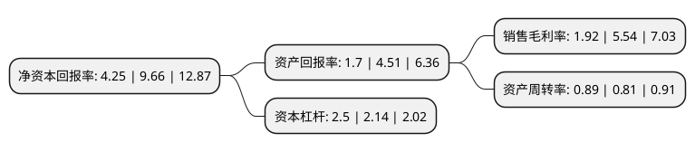

> 本页面由自动化程序生成于 2022年5月20日 01:12
> 内容可能存在错误，如有bug请提交issue至：https://github.com/Eroleice/doc-pi/issues
{.is-warning}

# 上市公司基本情况

## 基本资料

广东英联包装股份有限公司（以下简称“英联股份”）成立于2006年01月11日，汕头市。于2017年02月07日在深交所中小板上市。

英联股份注册资本31,839.365万元，专业从事“安全，环保，易开启”金属包装产品研发，生产和销售。公司主要产品为干粉易开盖。以下是详细信息：

- 公司名称: 广东英联包装股份有限公司
- 股票代码: 002846.SZ
- 所在地: 广东 - 汕头市
- 成立日期: 2006年01月11日
- 注册资本: 31,839.365万元
- 法定代表人: 翁伟武
- 主营业务: 专业从事“安全，环保，易开启”金属包装产品研发，生产和销售公司主要产品为干粉易开盖
- 公司官网: www.enpackcorp.com\www.stpack.com
- 公司介绍: 公司是一家以快速消费品为核心领域，专业从事“安全、环保、易开启”金属包装产品研发、生产和销售的国家级高新技术企业,是中国易开盖国家标准制定单位之一，中国包装联合金属容器委员会副主任单位。自成立以来，公司一直致力于为客户提供产品设计、功能研究、模具开发、涂布印刷、生产制造及物流配送等全方位综合服务。经过多年发展，公司现已形成覆盖食品(含干粉)、饮料、日化用品等多应用领域，是产品品类齐全、能够满足客户多样化需求及一站式采购的快速消费品金属包装产品提供商。

## 股东及高管情况

上市公司第一大股东为翁伟武，持股92,467,200股，占比29.04%，**疑似为**上市公司实际控制人。

截至2022年03月31日，上市公司的前十大股东中，共有10名自然人股东，其中5%以上大股东共有5名。上市公司前十大股东明细如下：

> 未能通过持股比例判定出上市公司实际控制人（持股30%以上）
> 可能存在通过间接持股、联合持股、协议控制等方式拥有实际控制权的主体，具体请参考上市公司定期公告！
{.is-warning}

> 截至2022年03月31日，上市公司前十大股东信息如下：

| 股东名称 | 持股数量（股） | 持股比例 |
| --- | --- | --- |
| 翁伟武 | 92,467,200 | 29.04% |
| 翁伟炜 | 38,194,760 | 12% |
| 翁伟嘉 | 27,955,200 | 8.78% |
| 翁伟博 | 22,579,200 | 7.09% |
| 蔡沛侬 | 21,026,500 | 6.6% |
| 柯丽婉 | 6,451,200 | 2.03% |
| 王进南 | 3,630,000 | 1.14% |
| 蔡希擎 | 3,182,900 | 1% |
| 尹定洪 | 1,856,460 | 0.58% |
| 王洁 | 1,791,963 | 0.56% |

## 利润表分析

上市公司2021年总收入为18.29亿元，净利润为0.35亿元，实现盈利。

## 杜邦分析

> 数据列示周期：2021年 | 2020年 | 2019年
{.is-info}

上市公司的净资产收益率在近一年有所下降，下降幅度为-56%，其变化情况分解如下：
- 上市公司的销售毛利率在近一年下降了-65.34%，可能是生产效率的下降、商品原材料价格上涨或商品价格的下跌所致。
- 上市公司的资产周转率在近一年上升了9.88%，可能是源自于更快的销售回款或库存管理效果提升。
- 上市公司的财务杠杆比率在近一年上升了16.82%，可能是增加负债扩大生产规模。

